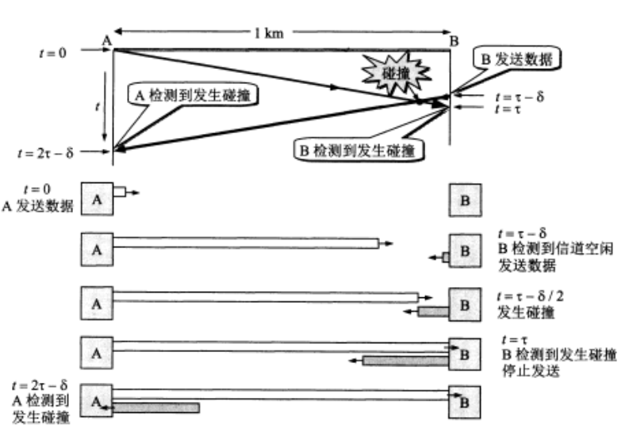
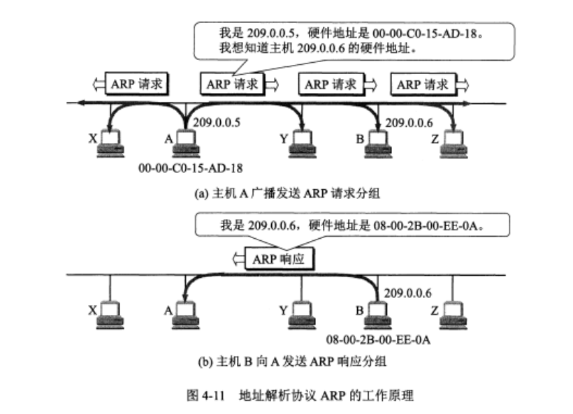
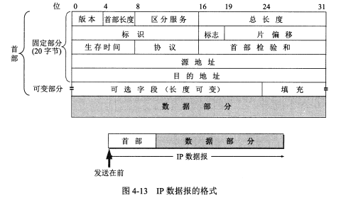
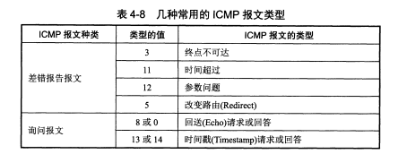
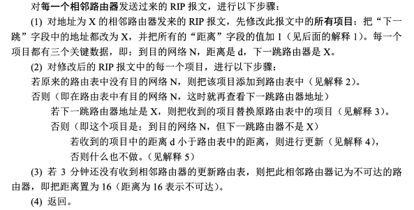
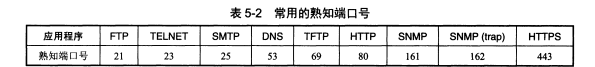

# 计算机网络
## 陌生知识点
### 信噪比
信噪比就是信号的平均功率和噪声的平均功率之比。常记为S/N，用分贝(dB)作为度量单位。（S:信道内信号平均功率，N:高斯噪声功率） $$ 信噪比(dB)=10 \log_{10}(S/N) $$ 香农公式，信道的极限传输速率C为(W:信道带宽，单位hz)： $$ C=W \log_2(1 + S/N)(bit/s) $$
### 传输介质
传输媒体可分为两大类
#### 导引型传输媒体
双绞线
同轴电缆
光缆
#### 非导引型传输媒体
短波通信
无线电微波通信
卫星通信
红外通信、激光通信(近距离)

铜线传输快一点约为230000km/s 光缆是200000km/s
### 频分复用、时分复用和统计时分复用
#### 频分复用(FDM:Frequency Division Multiplexing)
这是一种在同一通信信道上同时传输多个信号或数据流的技术。每个信号在信道上占据一个特定的频率带宽。这些频率带宽被称为子带，它们被设计成互不重叠，从而可以同时在同一信道上进行多个独立的信号传输。
#### 时分复用(TDM:Time Division Multiplexing)
这是一种允许多个信号或数据流在同一通信信道上交替传输的技术。每个信号或数据流在时间上占据一个特定的时隙，从而可以在同一信道上进行多个独立的信号传输。
#### 统计时分复用(STDM:统计时分复用)
它根据通信信道上的数据流的需求动态地分配时间槽。如果某个数据流当前没有数据要发送，那么它的时间槽可以被其他数据流使用，从而提高了信道的利用率。
#### 码分复用(CDM:Code Division Multiplexing)
各用户使用不同码型，最初用于军事通信，有很强的抗干扰能力。每个比特时间划分为m个短的间隔，被称为码片。每个站会被指派一个m bit的码片序列。发送时该序列代表1，反码代表0。每个站被分配的码片序列都必须正交，即规格化内积为0。码片向量和本身规格化内积为1，和反码规格化内积为1.接收站接收该站信号时，就用该站码片序列和收到的信号计算规格化内积，结果为1表示1，-1表示0，0表示为其他站发送的信号。
### ADSL技术(Asymmetric Digital Subscriber Line)
非对称数字用户线ADSL(Asymmetric Digital Subscriber Line)技术是对现有的模拟电话用户需进行改造，把没有被利用的高频部分给用户上网使用。在用户线两端各安装一个调制解调器，采用自适应调制技术选择尽可能高的数据率，不能保证固定的数据率。
ADSL 技术的主要特点是$$非对称$$这意味着下载速度（从互联网到用户）和上传速度（从用户到互联网）是不同的。在大多数情况下，下载速度远高于上传速度，这是因为大多数用户的互联网使用模式是下载数据（如浏览网页，下载文件）比上传数据（如上传文件）更多。
### PPP(MAC帧)
1500B的最大传输单元(MTU)再加上固定首部和尾部(8个字节) 实际上一个MAC帧最大(1508B)

然后一个MAC帧的数据部分(1500B)可以拆成IP数据报的头部(最短20字节,最大60字节)+数据部分(加一起叫IP数据报)

IP数据报里面的数据部分又可以拆出
$$TCP(Transmission Control Protocol)报文段$$
$$UDP(User Datagram Protocol)报文段$$
$$ICMP(Internet Control Message Protocol)报文
$$
TCP报文段可以拆成TCP首部(20到60字节)和TCP报文段的数据部分

所以实际上一个TCP报文段最长可能有1400多个字节,但实际运用的MSS(最大报文段长度 Maximum Segment Size)为536B(太小会导致网络利用率不高,太大会导致IP数据报分段)

UDP报文段,包括一个8字节的头部和数据部分。UDP不提供可靠性保证

ICMP报文,通常用于网络差错报告,网络诊断和网络配置,最为常见的就是发送一条PING命令后IP数据报里面的数据部分就会带上ICMP报文段首部(8字节)和剩下的数据部分(PING命令后面自带接着的数字)

例如/ping baidu -l 600 

实际上IP数据报大小为600字节(数据部分)+20字节(IP数据报头部)+8字节(ICMP首部)==628字节

### CSMA/CD协议
中文名载波监听多点接入/碰撞检测

全称:Carrier Sense Multiple Access with Collision Detection

在数据帧的首部写明接收站的地址来在广播特性的总线上实现一对一的通信。

以太网采用较为灵活的无连接的工作方式，以太网不对发送的数据编号也不要求发回确认，提供不可靠的交付。而这些工作以及重传等是否进行就交给上层协议，例如tcp协议会完成这些工作。

总线上同一时间只能允许一台计算机发送数据，为了进行协调和监控，使用的协议是CSMA/CD，意为载波监听多点接入/碰撞检测。

CSMA/CD协议要点：

多点接入
载波监听：不管在发送前，还是发送中，每个站都不停地监听信道
碰撞检测：边发送边监听
一旦检测到了碰撞，就要立即停止发送。在碰撞后，最迟经过2倍的端到端传播时延才能被检测到。

现代以太网已经很少使用CSMA/CD协议，主要原因是网络设备和技术的发展。

交换技术的发展：早期的以太网是基于共享媒体的，所有设备都连接到同一条电缆上，因此需要CSMA/CD协议来避免数据冲突。但现在，大多数以太网都使用交换机来连接设备。交换机可以同时处理多个数据包，每个端口都有自己的带宽，因此不会发生数据冲突，也就不需要CSMA/CD协议。

全双工通信的普及：CSMA/CD协议是为半双工通信设计的，即在任何时刻，数据只能在一个方向上流动。但现在的以太网设备通常支持全双工通信，即数据可以同时在两个方向上流动，这也消除了数据冲突的可能，因此不需要CSMA/CD协议。

网络速度的提高：随着网络速度的提高，数据冲突的可能性越来越小，因为设备可以在很短的时间内发送和接收大量的数据。此外，高速网络对延迟的容忍度更低，而CSMA/CD协议中的冲突检测和重试机制会增加延迟。

### 网际协议IP
网际协议IP是TCP/IP体系中两个最主要的协议之一。使用的版本有IPv4和IPv6。

与IP配套使用的还有三个协议：

地址解析协议ARP(Address Resolution Protocol)

网际控制报文协议ICMP(Internet Control Message Protocol)

网际组管理协议IGMP(Internet Group Management Protocol)

### IP地址
A类地址1600多万主机,B类地址65536台主机,C类地址256台主机,实际上问这个IP子网掩码或者IP段有多少个C类地址只需要看一共包含多少台主机,比如包含4096个主机,那就相当于有16个C类地址,这时候的C类地址换算并不需要用到二叉树求解(110这样的东西)

实际意义上的A类地址第一个数为0,后面不管,1-126.$***$.$***$.$***$实际上都是A类地址,(0和127太特殊被排除了)

B类二进制10(点分十进制为128-191)开头

C类二进制110(点分十进制为192-223)开头

D类二进制1110(点分十进制为224-239)开头

E类二进制1111(淀粉二进制为240-255)开头

### ARP

ARP:Address Resolution Protocol 地址解析协议

从网络层使用的IP地址，解析出在数据链路层使用的硬件地址。

地址解析ARP在主机的ARP高速缓存中存放一个从IP地址到硬件地址的映射表，并且这个映射表还经常动态更新。

当主机A向B发送数据报时，如果ARP缓存内有B的IP地址，就查出对应硬件地址。如果没有，就会广播一个ARP请求分组，原理如下图。

### IP数据报首部

IP数据报的各个字段：

版本：通信双方使用的版本必须一致(ipv4,ipv6)

首部长度 一般为20,最大为60字节,表示自己最大有多长

区分服务，一般情况下都不使用

总长度：理论最大长度为65535字节，实际中不可超过数据链路层规定的MTU值

标识：超过MTU而分片时使用

标志：占3位但仅仅有两位有意义，最低位MF=1表示后面还有分片，中间为DF=0表示允许分片

片偏移：以8个字节为偏移单位(当前数据报(被分片)的数据部分第一个字节在整个数据报中下标为几,比如1400,1400,0的分片,片偏移分别为0,1400/8==175,2800/8==350)

生存时间(TTL)：Time to Live，表明数据包在网络中寿命，路由器每跳转一次，TTL减一，防止无法到达的数据包在网络中兜圈子。最大数值255。设置TTL为1，表名该数据报仅在局域网中传输。(又称调数,Windows跳数一般为128,Linux跳数一般为64,可以根据跳数检验对方是什么系统)

首部检验和 只检验数据报的首部部分,不包括数据部分

源地址 32位二进制

目的地址 32位二进制 不需要讲的

### 无分类编址CIDR

无分类域间路由选择CIDR

Classless Inter-Domain Routing

CIDR消除了ABC类地址和划分子网的概念，IP地址回到两级编址，分为网络前缀和主机号.CIDR记法/斜线记法，标记网络前缀所占的位数.CIDR的32位地址掩码，一串1就是网络前缀位
数，剩余部分为一串0.一个单位划分到一个CIDR地址块，仍可以分出子网，网络前缀位数增加.
CIDR在路由匹配时，使用最长前缀匹配。

### ICMP
ICMP(Internet Control Message Protocol)允许主机或路由器报告差错情况。ICMP报文作为IP数据包的数据发送。

### 互联网路由选择

#### 内部网关协议RIP

Routing Information Protocol

分布式的基于距离向量的路由选择协议。

每一个路由器都维护它到其他每一个目的网络的距离(跳数)的记录。RIP协议中跳数为16时表示不可达，只适用于小型互联网。

三个要点：

仅和相邻路由器交换信息

交换的信息是当前本路由器所知道的全部信息，即现在的路由表

按固定时间间隔交换路由信息

距离向量算法

#### 内部网关协议OSPF

Open Short Path First

开放最短路径优先

是为克服RIP的缺点(坏消息传的慢)开发出来的。实现较为复杂。使用了Dijkstra提出的最短路径算法。

三个要点：

向本自治系统所有路由器发送信息(洪泛法 flooding)

发送的信息是与本路由器相邻的所有路由器的链路状态

链路状态发生变化时才发送此信息

互联网规模大时，比RIP好的多。

#### 外部网关协议BGP

Border Gateway Protocol

边界网关协议

RIP和OSPF在自治系统之间由于规模大、性能不定等原因不合适。

因此，BGP力求寻找一条能够到达目的网络且比较好的路由，而不需要找最佳路由。

采用了路径向量(path vector)路由选择协议。

### 运输层端口

在运输层使用协议端口号(protocol port number)来解决报文要传输给哪个进程的问题。

通常简称端口，把传送的报文交到目的主机的合适的端口，剩下的工作由TCP或UDP来完成。

16位的端口号允许有65535个不同的端口号。

运输层端口号分为以下两类：

服务器端使用的端口号

熟知端口号(0-1023)，这些端口号指派给了一些最重要的应用程序，让所有的用户都知道。

登记端口号(1024-49151)，为没有熟知端口号的应用程序使用

客户端使用的端口号，49152-65535，客户进程运行时才短暂选择
