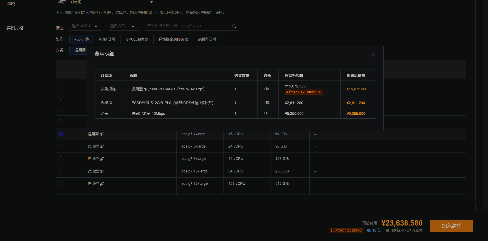

### 写在前头的话

前几天各大云服务器厂都在降价,阿里云平均商品降价20%,根据阿里云官方的说法,以后上云变成了常态化,随着云计算技术的发展和普及，越来越多的企业和个人开始选择使用云服务器。云服务器提供了强大的计算能力，高度的可扩展性，以及灵活的付费方式，使得用户可以根据自己的需求灵活地使用和支付计算资源。

云服务器的降价趋势反映了云计算市场的竞争激烈。各大云服务提供商为了吸引更多的用户，不断优化自己的服务并降低价格。这对于消费者来说无疑是一件好事，他们可以以更低的价格享受到更好的服务。

然而，选择云服务器时，价格并不是唯一需要考虑的因素。用户还需要考虑云服务提供商的服务质量，包括服务器的稳定性，网络的速度，以及技术支持的质量等。此外，不同的云服务提供商可能会提供不同的服务，用户需要根据自己的需求选择最合适的服务。

总的来说，云服务器的降价趋势预示着云计算的未来将更加光明。无论你是企业用户还是个人用户，现在都是进入云计算世界的好时机。

不过本文先暂时不考虑国外云服务器厂商,因为其购买方式困难和使用方式不便于用户操作暂不在本文的谈论范围之内
### 什么是云服务器

云服务器，也被称为虚拟专用服务器（VPS），是一种在云计算环境中提供的虚拟化计算资源。它结合了共享主机的易用性和专用服务器的强大性能。

云服务器通过将物理服务器的资源（如处理器、内存和存储）划分为多个虚拟服务器来工作。每个虚拟服务器都可以运行自己的操作系统，并且可以独立重启。用户可以完全控制自己的虚拟服务器，就像控制自己的专用服务器一样。

云服务器的主要优点是它的可扩展性和灵活性。用户可以根据需要增加或减少资源，而不需要购买和维护物理硬件。此外，由于用户只需为实际使用的资源付费，因此云服务器通常比传统的专用服务器更具成本效益。

云服务器广泛应用于网站托管、数据存储、应用程序运行、数据处理等多种场景。无论你是个人开发者，还是大型企业，云服务器都可以为你提供强大、灵活、经济的计算资源。

### 优势

**1.价格优势**

对于中小型开发者和玩家来说费用较低

刚入门的开发者可以花一两百块钱去买一台2核2GB的云服务器玩玩,然后在上面跑一些小应用都是可以的

**2.易用性**

买了就能用,还要什么自行车
### 劣势

**1.价格劣势**

对于大型企业和hardcore用户来说,成本太高,买一年服务器的费用
以阿里云 云服务器G7来说,16核心 64GB内存 512GB SSD存储空间 10Mbps带宽 价格已经达到两万多了 实在是贵 

但如果拿两万可以去组一台1U服务器 可以得到什么? AMD R9 7950X+128GB内存+8TB存储空间, 剩下的钱可以拿去找个本地服务器机房进行托管,价格大概在5000-10000不等

**2.续费高昂**

前一年便宜买的服务器,现在再续一年却变成了原先的十倍

**3.安全性**

在云端的服务器可能会受到提供商的内容审查,就拿建网站来说,不备案,开不了80 443端口,如果用其他端口开网站,如果访问量过高(能直接抓到HTTP的包,很简单)就会自动封端口甚至封机器
### 现状分析
国内大多数云服务器厂商对待最为敬爱的**老用户**那态度就是不当人看,任何产品做活动那就是**老用户与狗不得入内**

民用带宽便宜 但国内**商业带宽**费用高昂,主要原因就是商业补贴民用和水电差不多的道理,然后这部分带宽费用转移到了服务器上面就显得带宽十分的珍贵,想要高带宽又便宜的服务器,就先暂时不要考虑国呢的云服务器了吧
