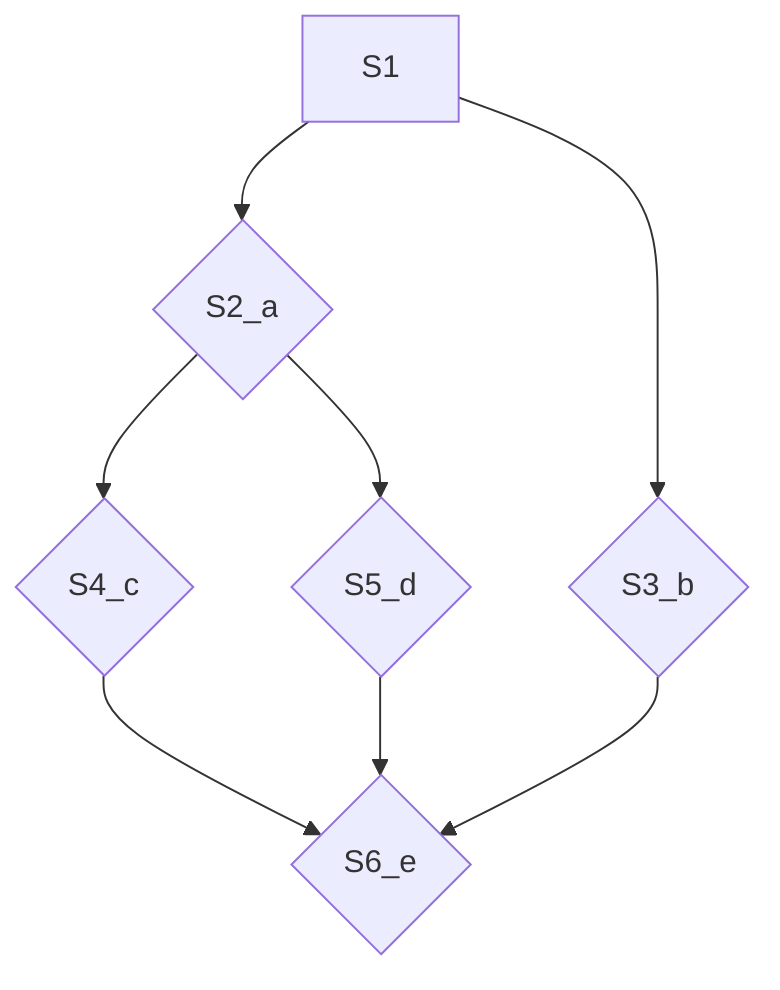

### 为什么要进程管理

### 进程死锁问题

### 对于进程死锁,常见的几种算法
* 

* 

* 信号量的应用

利用信号量来描述前驱关系
利用前驱图

一开始S1先给S2,S3压力(a,b)(signal(S3),signal(S3))

S1压力完了后

S2 S3可以开始活动,

S2开始给S4,S5压力(c,d)

S2压力结束 S4 S5可以活动

最后S3,S4,S5同时给S6压力

S6,这个人太懒了,他的的启动需要同时有三个人给压力才行,不打不行,所以在b执行完结束后不能立马去执行

必须同时等待三个人(具有前驱关系的三个人)给压力才能执行(等待wait(S3,S4,S5))

* 

