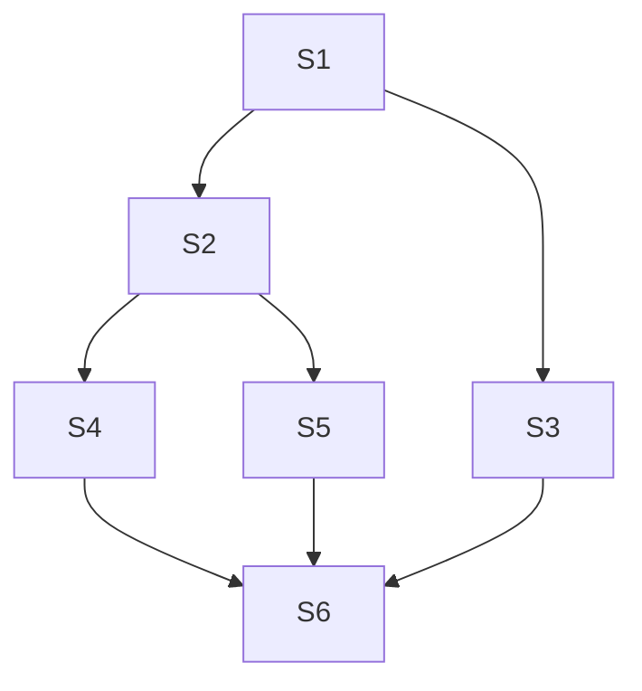
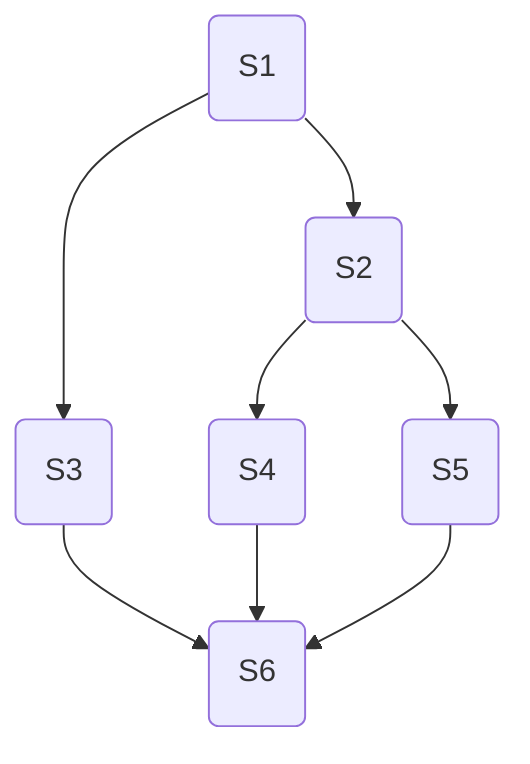

### 为什么要进程管理

### 进程死锁问题

### 对于进程死锁,常见的几种算法
* 

* 

* 信号量的应用

利用信号量来描述前驱关系
利用前驱图

一开始S1先给S2,S3压力(a,b)(signal(S3),signal(S3))

S1压力完了后

S2 S3可以开始活动,

S2开始给S4,S5压力(c,d)

S2压力结束 S4 S5可以活动

最后S3,S4,S5同时给S6压力

S6,这个人太懒了,他的的启动需要同时有三个人给压力才行,不打不行,所以在b执行完结束后不能立马去执行

必须同时等待三个人(具有前驱关系的三个人)给压力才能执行(等待wait(S3,S4,S5))

* 

### 几个经典的问题

**1.生产者-消费者问题**
1. 用记录型信号量解决生产者-消费者问题
在生产者和消费者之间具有n个公用缓冲区

2. 定义三个信号量：
mutex：用于保护共享资源的互斥访问，初始值为 1。
empty：表示空闲缓冲区的数量，初始值为缓冲区的容量。
full：表示已满缓冲区的数量，初始值为 0。

3. 生产者线程执行以下操作：
对 empty 进行 P 操作，表示生产者想要占用一个空闲缓冲区。
对 mutex 进行 P 操作，表示生产者开始访问共享资源。

4. 将数据放入缓冲区。
对 mutex 进行 V 操作，表示生产者结束访问共享资源。
对 full 进行 V 操作，表示已满缓冲区的数量增加 1。

5. 消费者线程执行以下操作：
对 full 进行 P 操作，表示消费者想要从一个已满缓冲区中取出数据。
对 mutex 进行 P 操作，表示消费者开始访问共享资源。

6. 从缓冲区中取出数据。
对 mutex 进行 V 操作，表示消费者结束访问共享资源。
对 empty 进行 V 操作，表示空闲缓冲区的数量增加 1。

