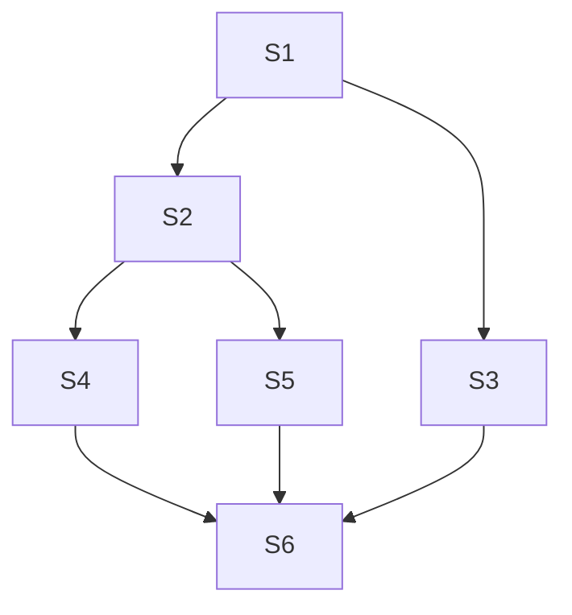

# 烂尾中 等待后续填坑更新

### 为什么要进程管理

### 进程死锁问题

### 对于进程死锁,常见的几种算法
* 

* 

* 信号量的应用

利用信号量来描述前驱关系
利用前驱图

一开始S1先给S2,S3压力(a,b)(signal(S3),signal(S3))

S1压力完了后

S2 S3可以开始活动,

S2开始给S4,S5压力(c,d)

S2压力结束 S4 S5可以活动

最后S3,S4,S5同时给S6压力

S6,这个人太懒了,他的的启动需要同时有三个人给压力才行,不打不行,所以在b执行完结束后不能立马去执行

必须同时等待三个人(具有前驱关系的三个人)给压力才能执行(等待wait(S3,S4,S5))



### 几个经典的问题

**1.生产者-消费者问题**
1. 用记录型信号量解决生产者-消费者问题
在生产者和消费者之间具有n个公用缓冲区

2. 定义三个信号量：
mutex：用于保护共享资源的互斥访问，初始值为 1。
empty：表示空闲缓冲区的数量，初始值为缓冲区的容量。
full：表示已满缓冲区的数量，初始值为 0。

3. 生产者线程执行以下操作：
对 empty 进行 P 操作，表示生产者想要占用一个空闲缓冲区。
对 mutex 进行 P 操作，表示生产者开始访问共享资源。

4. 将数据放入缓冲区。
对 mutex 进行 V 操作，表示生产者结束访问共享资源。
对 full 进行 V 操作，表示已满缓冲区的数量增加 1。

5. 消费者线程执行以下操作：
对 full 进行 P 操作，表示消费者想要从一个已满缓冲区中取出数据。
对 mutex 进行 P 操作，表示消费者开始访问共享资源。

6. 从缓冲区中取出数据。
对 mutex 进行 V 操作，表示消费者结束访问共享资源。
对 empty 进行 V 操作，表示空闲缓冲区的数量增加 1。
```c
#include <stdio.h>
#include <stdlib.h>
#include <pthread.h>

#define BUFFER_SIZE 10

pthread_mutex_t mutex;
sem_t empty, full;

void *producer(void *arg) {
  int i;
  for (i = 0; i < 100; i++) {
    sem_wait(&empty);
    pthread_mutex_lock(&mutex);

    // 生产数据
    printf("生产者生产数据 %d\n", i);

    pthread_mutex_unlock(&mutex);
    sem_post(&full);
  }
  return NULL;
}
void *consumer(void *arg) {
  int i;
  for (i = 0; i < 100; i++) {
    sem_wait(&full);
    pthread_mutex_lock(&mutex);

    // 消费数据
    int data;
    printf("消费者消费数据 %d\n", data);

    pthread_mutex_unlock(&mutex);
    sem_post(&empty);
  }
  return NULL;
}

int main() {
  pthread_t producer_tid, consumer_tid;

  // 初始化信号量
  sem_init(&empty, 0, BUFFER_SIZE);
  sem_init(&full, 0, 0);
  pthread_mutex_init(&mutex, NULL);

  // 创建生产者和消费者线程
  pthread_create(&producer_tid, NULL, producer, NULL);
  pthread_create(&consumer_tid, NULL, consumer, NULL);

  // 等待线程结束
  pthread_join(producer_tid, NULL);
  pthread_join(consumer_tid, NULL);

  // 销毁信号量和互斥锁
  sem_destroy(&empty);
  sem_destroy(&full);
  pthread_mutex_destroy(&mutex);

  return 0;
}
```

7. 优化?

利用AND型信号量解决

```c
#include <stdio.h>
#include <stdlib.h>
#include <pthread.h>

#define BUFFER_SIZE 10

pthread_mutex_t mutex;
sem_t buffer;

void *producer(void *arg) {
  int i;
  for (i = 0; i < 100; i++) {
    sem_wait(&buffer);
    pthread_mutex_lock(&mutex);

    // 生产数据
    printf("生产者生产数据 %d\n", i);

    pthread_mutex_unlock(&mutex);
  }
  return NULL;
}

void *consumer(void *arg) {
  int i;
  for (i = 0; i < 100; i++) {
    sem_wait(&buffer);
    pthread_mutex_lock(&mutex);

    // 消费数据
    int data;
    printf("消费者消费数据 %d\n", data);

    pthread_mutex_unlock(&mutex);
  }
  return NULL;
}

int main() {
  pthread_t producer_tid, consumer_tid;

  // 初始化信号量
  sem_init(&buffer, 0, BUFFER_SIZE);
  pthread_mutex_init(&mutex, NULL);

  // 创建生产者和消费者线程
  pthread_create(&producer_tid, NULL, producer, NULL);
  pthread_create(&consumer_tid, NULL, consumer, NULL);

  // 等待线程结束
  pthread_join(producer_tid, NULL);
  pthread_join(consumer_tid, NULL);

  // 销毁信号量和互斥锁
  sem_destroy(&buffer);
  pthread_mutex_destroy(&mutex);

  return 0;
}
```
buffer AND 型信号量表示缓冲区的状态，如果值为 BUFFER_SIZE，表示所有缓冲区都空闲，如果值为 0，表示所有缓冲区都已满。
生产者线程执行流程

生产者想要生产数据时，需要对 buffer 进行 P 操作，表示占用一个空闲缓冲区。只有当缓冲区有空闲空间时，P 操作才会成功。
生产者生产数据后，需要对 buffer 进行 V 操作，表示释放一个空闲缓冲区。
消费者线程执行流程

消费者想要消费数据时，需要对 buffer 进行 P 操作，表示占用一个已满缓冲区。只有当缓冲区有已满数据时，P 操作才会成功。
消费者消费数据后，需要对 buffer 进行 V 操作，表示释放一个已满缓冲区。
优化效果

使用 AND 型信号量可以优化生产者-消费者问题，提高效率。因为：

生产者和消费者可以同时尝试操作缓冲区，而不是互斥操作。
只有当缓冲区有空闲空间时，生产者才能生产数据，避免了生产者生产数据后等待空闲空间的情况。
只有当缓冲区有已满数据时，消费者才能消费数据，避免了消费者消费数据后等待已满数据的情况。

**2.哲学家进餐问题**
1. 定义一个信号量 mutex，用于保护餐桌的互斥访问，初始值为 1。
2. 定义一个信号量数组 forks，用于表示每个叉子的状态，初始值为 1。
3. 哲学家拿起左边的叉子：
对 mutex 进行 P 操作，表示哲学家想要开始进餐。
对 forks[i] 进行 P 操作，表示哲学家想要拿起左边的叉子。
对 mutex 进行 V 操作，表示哲学家已经拿起左边的叉子。
4. 哲学家拿起右边的叉子：
对 forks[i + 1] 进行 P 操作，表示哲学家想要拿起右边的叉子。
5. 哲学家吃完饭：
对 forks[i] 进行 V 操作，表示哲学家放下左边的叉子。
对 forks[i + 1] 进行 V 操作，表示哲学家放下右边的叉子。
```c
#include <stdio.h>
#include <stdlib.h>
#include <pthread.h>

#define NUM_PHILOSOPHERS 5

pthread_mutex_t mutex;
sem_t forks[NUM_PHILOSOPHERS];

void *philosopher(void *arg) {
  int i = (int)arg;
  while (1) {
    // 思考
    printf("哲学家 %d 正在思考\n", i);

    // 拿起左边的叉子
    pthread_mutex_lock(&mutex);
    sem_wait(&forks[i]);
    pthread_mutex_unlock(&mutex);

    // 拿起右边的叉子
    sem_wait(&forks[(i + 1) % NUM_PHILOSOPHERS]);

    // 进餐
    printf("哲学家 %d 正在进餐\n", i);

    // 放下右边的叉子
    sem_post(&forks[(i + 1) % NUM_PHILOSOPHERS]);

    // 放下左边的叉子
    sem_post(&forks[i]);
  }
  return NULL;
}

int main() {
  pthread_t philosopher_tids[NUM_PHILOSOPHERS];

  // 初始化信号量
  pthread_mutex_init(&mutex, NULL);
  for (int i = 0; i < NUM_PHILOSOPHERS; i++) {
    sem_init(&forks[i], 0, 1);
  }

  // 创建哲学家线程
  for (int i = 0; i < NUM_PHILOSOPHERS; i++) {
    pthread_create(&philosopher_tids[i], NULL, philosopher, (void *)i);
  }

  // 等待线程结束
  for (int i = 0; i < NUM_PHILOSOPHERS; i++) {
    pthread_join(philosopher_tids[i], NULL);
  }

  // 销毁信号量和互斥锁
  pthread_mutex_destroy(&mutex);
  for (int i = 0; i < NUM_PHILOSOPHERS; i++) {
    sem_destroy(&forks[i]);
  }

  return 0;
}
```
AND型信号量优化
```c
#include <stdio.h>
#include <stdlib.h>
#include <pthread.h>

#define NUM_PHILOSOPHERS 5

pthread_mutex_t mutex;
sem_t forks;

void *philosopher(void *arg) {
  int i = (int)arg;
  while (1) {
    // 思考
    printf("哲学家 %d 正在思考\n", i);

    // 拿起所有叉子
    pthread_mutex_lock(&mutex);
    sem_wait(&forks);
    pthread_mutex_unlock(&mutex);

    // 进餐
    printf("哲学家 %d 正在进餐\n", i);

    // 放下所有叉子
    sem_post(&forks);
  }
  return NULL;
}

int main() {
  pthread_t philosopher_tids[NUM_PHILOSOPHERS];

  // 初始化信号量
  pthread_mutex_init(&mutex, NULL);
  sem_init(&forks, 0, 1);

  // 创建哲学家线程
  for (int i = 0; i < NUM_PHILOSOPHERS; i++) {
    pthread_create(&philosopher_tids[i], NULL, philosopher, (void *)i);
  }

  // 等待线程结束
  for (int i = 0; i < NUM_PHILOSOPHERS; i++) {
    pthread_join(philosopher_tids[i], NULL);
  }

  // 销毁信号量和互斥锁
  pthread_mutex_destroy(&mutex);
  sem_destroy(&forks);

  return 0;
}
```
forks AND 型信号量表示所有叉子的状态，如果值为 1，表示所有叉子都可用，如果值为 0，表示至少有一个叉子不可用。
哲学家进餐流程

哲学家想要开始进餐时，需要对 forks 进行 P 操作，表示占用所有叉子。只有当所有叉子都可用时，P 操作才会成功。
哲学家吃完饭后，需要对 forks 进行 V 操作，表示释放所有叉子。
优化效果

使用 AND 型信号量可以优化哲学家进餐问题，提高效率。因为：

哲学家可以同时尝试拿起所有叉子，而不是逐个拿起。
只有当所有叉子都可用时，哲学家才能开始进餐，避免了哲学家拿着一个叉子等待另一个叉子的情况。

**3.读者-写者问题**
1. 定义两个记录型信号量：

read_sem：表示当前正在读数据的读者数量，初始值为 0。
write_sem：表示当前正在写数据的写者数量，初始值为 0。

2. 读者线程执行流程：

读者想要开始读数据时，需要对 read_sem 进行 P 操作，表示增加正在读数据的读者数量。
读者读完数据后，需要对 read_sem 进行 V 操作，表示减少正在读数据的读者数量。

3. 写者线程执行流程：

写者想要开始写数据时，需要对 write_sem 进行 P 操作，表示增加正在写数据的写者数量。
写者写完数据后，需要对 write_sem 进行 V 操作，表示减少正在写数据的写者数量。
```c
#include <stdio.h>
#include <stdlib.h>
#include <pthread.h>

#define BUFFER_SIZE 10

pthread_mutex_t mutex;
sem_t read_sem, write_sem;

void *reader(void *arg) {
  int i;
  for (i = 0; i < 100; i++) {
    sem_wait(&read_sem);
    pthread_mutex_lock(&mutex);

    // 读数据
    printf("读者 %d 正在读数据\n", i);

    pthread_mutex_unlock(&mutex);
    sem_post(&read_sem);
  }
  return NULL;
}

void *writer(void *arg) {
  int i;
  for (i = 0; i < 100; i++) {
    sem_wait(&write_sem);
    pthread_mutex_lock(&mutex);

    // 写数据
    printf("写者 %d 正在写数据\n", i);

    pthread_mutex_unlock(&mutex);
    sem_post(&write_sem);
  }
  return NULL;
}

int main() {
  pthread_t reader_tids[10], writer_tids[5];

  // 初始化信号量
  sem_init(&read_sem, 0, 0);
  sem_init(&write_sem, 0, 1);
  pthread_mutex_init(&mutex, NULL);

  // 创建读者和写者线程
  for (int i = 0; i < 10; i++) {
    pthread_create(&reader_tids[i], NULL, reader, NULL);
  }
  for (int i = 0; i < 5; i++) {
    pthread_create(&writer_tids[i], NULL, writer, NULL);
  }

  // 等待线程结束
  for (int i = 0; i < 10; i++) {
    pthread_join(reader_tids[i], NULL);
  }
  for (int i = 0; i < 5; i++) {
    pthread_join(writer_tids[i], NULL);
  }

  // 销毁信号量和互斥锁
  sem_destroy(&read_sem);
  sem_destroy(&write_sem);
  pthread_mutex_destroy(&mutex);

  return 0;
}
```
优化:
```c
#include <stdio.h>
#include <stdlib.h>
#include <pthread.h>

pthread_mutex_t mutex;
sem_t rw_sem;

void *reader(void *arg) {
  int i;
  for (i = 0; i < 100; i++) {
    sem_wait(&rw_sem);
    pthread_mutex_lock(&mutex);

    // 读数据
    printf("读者 %d 正在读数据\n", i);

    pthread_mutex_unlock(&mutex);
    sem_post(&rw_sem);
  }
  return NULL;
}

void *writer(void *arg) {
  int i;
  for (i = 0; i < 100; i++) {
    sem_wait(&rw_sem);
    pthread_mutex_lock(&mutex);

    // 写数据
    printf("写者 %d 正在写数据\n", i);

    pthread_mutex_unlock(&mutex);
    sem_post(&rw_sem);
  }
  return NULL;
}

int main() {
  pthread_t reader_tids[10], writer_tids[5];

  // 初始化信号量
  sem_init(&rw_sem, 0, 1);
  pthread_mutex_init(&mutex, NULL);

  // 创建读者和写者线程
  for (int i = 0; i < 10; i++) {
    pthread_create(&reader_tids[i], NULL, reader, NULL);
  }
  for (int i = 0; i < 5; i++) {
    pthread_create(&writer_tids[i], NULL, writer, NULL);
  }

  // 等待线程结束
  for (int i = 0; i < 10; i++) {
    pthread_join(reader_tids[i], NULL);
  }
  for (int i = 0; i < 5; i++) {
    pthread_join(writer_tids[i], NULL);
  }

  // 销毁信号量和互斥锁
  sem_destroy(&rw_sem);
  pthread_mutex_destroy(&mutex);

  return 0;
}
```
rw_sem AND 型信号量表示读写操作的状态，如果值为 1，表示所有读写资源都可用，如果值为 0，表示所有读写资源都被占用。
读者线程执行流程

读者想要开始读数据时，需要对 rw_sem 进行 P 操作，表示占用一个读写资源。只有当读写资源可用时，P 操作才会成功。
读者读完数据后，需要对 rw_sem 进行 V 操作，表示释放一个读写资源。
写者线程执行流程

写者想要开始写数据时，需要对 rw_sem 进行 P 操作，表示占用所有读写资源。只有当所有读写资源都可用时，P 操作才会成功。
写者写完数据后，需要对 rw_sem 进行 V 操作，表示释放所有读写资源。
