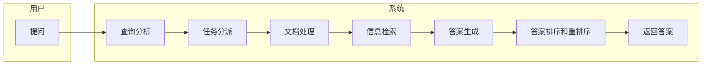

### Knowledge is all you need

一般来说 参数量越大的模型运行结果越好,但是越大的参数量就越是烧钱,训练烧钱,,微调烧钱,运行烧钱.

同时市面上的大模型也不敢保证覆盖到了人类的每一个知识方面,在这一点上,有人提出了低秩微调(LoRA),相比于训练,只需要更少的资源就可以获得某一个方面特化的模型,但这还不够节省,于是RAG出现了

### RAG是什么

RAG，全称为Retrieval-Augmented Generation，是一种混合了检索和生成的模型。它结合了大规模预训练的生成模型（如GPT）和检索模型，以提供更准确和详细的回答。

RAG模型的工作流程大致如下：

用户提出问题。
RAG模型首先使用检索系统从大规模的知识库中找到与问题相关的文档或信息。
然后，这些检索到的文档被用作生成模型的上下文，生成模型根据这些上下文生成回答。
RAG模型的优点是，它可以利用大规模的知识库，提供更准确和详细的回答。同时，由于生成模型只需要处理检索到的文档，而不是整个知识库，所以RAG模型的计算效率也比较高。


上面的流程大致可以简化如下


### RAG实现方法

**1.langchain+余弦相似度prompts工程**
```python
import pandas as pd
from sklearn.feature_extraction.text import TfidfVectorizer
from sklearn.metrics.pairwise import cosine_similarity
from langchain.callbacks.manager import CallbackManager
from langchain.callbacks.streaming_stdout import StreamingStdOutCallbackHandler
from langchain_community.llms.ollama import Ollama

# 读取CSV文件
df = pd.read_csv('filtered_fish.csv')

# 使用fillna方法将缺失值替换为空字符串
df = df.fillna('')

# 选择多列并将它们连接成一个字符串
df['text'] = df['name'] + ' ' + df['bio_kingdom_cn'] + ' ' + df['bio_phylum_cn'] + ' ' + df['bio_class_cn'] + ' ' + df['bio_order_cn'] + ' ' + df['bio_family_cn'] + ' ' + df['bio_genus_cn'] + ' ' + df['bio_introduction']

# 使用TfidfVectorizer将文本数据转换为向量
vectorizer = TfidfVectorizer()
X = vectorizer.fit_transform(df['text'])

# 定义一个函数来计算余弦相似度
def cosine_similarity_func(vector1, vector2):
    return cosine_similarity(vector1, vector2)

# 对查询进行分词并转换为向量
query = '辐鳍鱼纲'  # 替换'your_query'为你的查询
query_vector = vectorizer.transform([query])

# 计算查询向量与数据库中每个向量的余弦相似度
similarity_scores = cosine_similarity_func(query_vector, X)

# 根据相似度排序并返回前100个最相似的向量
top_100_indexes = similarity_scores.argsort()[0][-100:]

# 使用iloc方法获取原始的文本
top_100_texts = df['text'].iloc[top_100_indexes]

# 将所有的最相似的文本连接成一个长字符串
texts_string = ' '.join(top_100_texts)

# 初始化大模型
llm = Ollama(base_url="http://localhost:11434",model="gemma:2b",)

# 定义一个函数来获取大模型的输出
def get_completion_ollama(prompt):
    return llm.invoke(prompt)

# 将查询和最相似的文本一起发送给大模型
prompt = '我正在寻找一些关于"' + query + '"的信息。以下是我找到的一些相关信息：' + texts_string
res = get_completion_ollama(prompt=prompt)
print(res)
```

上述用到了ollama跑本地大模型gemma:2b,然后同时从csv中获取数据
数据大致格式如下:
```csv
:ID(鱼),:LABEL,name,fish_name_en,fish_img_url,fish_imgs_url,bio_kingdom_cn,bio_kingdom_en,bio_phylum_cn,bio_phylum_en,bio_class_cn,bio_class_en,bio_order_cn,bio_order_en,bio_family_cn,bio_family_en,bio_genus_cn,bio_genus_en,bio_is_toxic,bio_is_economy,bio_is_food,bio_is_view,bio_other_name_url,bio_introduction
0,鱼,尼罗口孵非鲫,Oreochromis niloticus,1/cover.jpg_400.jpg,1.html,动物界,Animalia,脊索动物门,Chordata,辐鳍鱼纲,Actinopterygii,鲈形目,Perciformes,丽鱼科,Cichlidae,口孵非鲫属(Oreochromi,口孵非鲫属(Oreochromis,否,是,是,否,/fish_id/common_names/1.html,繁殖期的雄鱼的生殖乳突没有方格斑纹。  成熟雄鱼的颚不明显增大 (下颌 29-37% 的头长长度) 。  此鱼种的最显着特性是那在尾鳍的深度各处有规则的垂直斑纹.  背鳍的边缘灰色或黑色的。  在尾鳍 7-12 中的纵带.
1,鱼,莫三比克口孵非鲫,Oreochromis mossambicus,2/cover.jpg_400.jpg,2.html,动物界,Animalia,脊索动物门,Chordata,辐鳍鱼纲,Actinopterygii,鲈形目,Perciformes,丽鱼科,Cichlidae,口孵非鲫属(Oreochromi,口孵非鲫属(Oreochromis,否,是,是,否,/fish_id/common_names/2.html,鉴别: 吻长的; 具有大的鳞片前额， 出发有两个跟随着 9个鳞片的在眼之间的鳞片向上到背鳍. 雄性成鱼发育一个尖又像 duckbill 一样的吻。 描述: 中等深度-身体. 在稚鱼与雌性中的头部轮廓直线. 成熟雄性的颚增大了， 造成一个凹的上面轮廓 ， 但是在较小的标本中的凸状. 嘴大的. 下頜突出的; 唇厚的. 嘴延伸到眼  的前緣下面或稍微超過. 在頰上的 2-3個成列的鱗片. 鱗片圓形的. 在腹面上的鱗片小的， 胸部鱗片甚至比較小的. 在鰓蓋  上的大的鱗片， 在 3 列中. 在上半部側線中的 17-23個鱗片， 在較下面的部位中的 10-17. 鰓耙短的  與厚的. 背鰭棘幾乎相等的從第六的; 背鰭軟條稍微長度超過長的棘. 持續背棘最長的。  軟棘的部位背部的與臀鰭長而尖的 ， 尤其在雄性中. 胸鰭 (幾乎) 長達頭部 ， 尖的 ， 延伸到排洩孔  或到稍微超過臀鰭起點. 腹鰭的外部鰭條些微地生產， 延伸到排洩孔  或超過臀鰭起點. 尾鰭不濃密地覆有鱗片的 ， 有鱗的在基部的一半  中，角有時圓的.體色 基本身體顏色銀灰色的到灰綠色， 有時一個更多的 blusih 色彩頭部. 腹面略灰色的. 背鰭光的刺狀部份有深色的雜斑。  軟的背鰭與臀鰭， 與尾部的與腹鰭黑色的. 胸鰭無色的. 不明顯又深色的鰓蓋斑點呈現。  垂直的鰭均勻的 ， 黑色的具有約略明顯的微白色的斑點  或者有大的或者在被把一個較深色的面給這些鰭的灰白的背景  上的小﹐融合的或非融合又深色的斑點.雌性與非繁殖期的雄魚: 銀色的有 2-5個側面中央的斑塊與一些比較背部系列。  有時一系列的約略明顯的斑點沿著身體上面與下面的側邊上面的側線。  繁殖期的雄魚: 均勻的深黃褐色 ， 或黑色， 有白色的，頭部下半部 ，包括咽喉，下唇 ， 頰與 oppercles 的下部， 但是有深藍色到黑色的基底到咽喉 ， 與紅色的邊緣到背鰭與尾鰭鰭. 尾鰭有時可以完全地出現紅色。  頂端背部的與尾葉的末端淡黃色的. 臀鰭深灰色， 有時有細的紅色邊緣; 不成對的鰭通常展現呈綠色到銀彩虹色的點。  雌性: 基本上銀灰色在身體上有一些深色又不規則的點或區塊.稚魚: 身體銀色的  或黃褐色的， 在腹面上的光. 鱗片有深色的外部邊緣。  在身體  上的 6-8個或更多不明顯的深色交叉的橫帶， 常見於附加到 2 列黑色的斑點中. 不明顯的深色鰓蓋斑點. 在前面鰭條的基底的黑色斑點軟的背部與 1-2 微白色的斑點被深色條紋隔絕了; 肛門的深色在基底有一淡的外部一半的; 尾部的深色在基底， 在中心中的光， 一個黑色的外部脊. 橫過的在軟的背鰭與臀鰭與 2-3條橫帶上的斜的條紋尾部的. 幼魚有在最後背棘的基底後面的一個卵形的黑色斑點。
```
完整的数据文档可以在OpenKG上面[找到](http://data.openkg.cn/dataset/ocean)

**2.langchain+faiss嵌入**

我在上面使用的方法并不高明,只是利用简单的余弦相似度提取出对应的top100文本 在丢给大模型,
实际生产生活中 使用faiss嵌入是更好的选择

[faiss](https://github.com/facebookresearch/faiss)是什么?

**FAISS**，全称为 Facebook AI Similarity Search，是由 Facebook AI Research 开发的一个用于高效相似度搜索和聚类的库。它主要用于处理大规模向量数据，并能快速找出与给定向量最相似的向量。

FAISS 提供了一种高效的方式来计算向量之间的相似度，特别是在处理大规模数据时，它的性能优于传统的线性扫描方法。FAISS 支持在 CPU 和 GPU 上运行，并且可以处理数十亿级别的向量。

在信息检索、推荐系统、自然语言处理等领域，FAISS 都有广泛的应用。例如，在你的文档中提到的 langchain+faiss 嵌入中，FAISS 可能被用于计算不同文本的嵌入向量之间的相似度，以实现更高效的文本检索。

下面一个是一个简单的实现脚本
```python
import os, dotenv 
from langchain.embeddings.openai import OpenAIEmbeddings 
from langchain.vectorstores import FAISS 
from langchain.chat_models import ChatOpenAI 
from langchain.chains import RetrievalQA 
from langchain import PromptTemplate 
 
dotenv.load_dotenv() 
 
chatbot = RetrievalQA.from_chain_type( 
    llm=ChatOpenAI( 
        openai_api_key=os.getenv("OPENAI_API_KEY"), 
        temperature=0, model_name="gpt-3.5-turbo", max_tokens=50 
    ),
    chain_type="stuff", 
    retriever=FAISS.load_local("faiss_midjourney_docs", OpenAIEmbeddings())          
        .as_retriever(search_type="similarity", search_kwargs={"k":1}) 
    ) 
 
template = """ 
respond as succinctly as possible. {query}? 
""" 
 
prompt = PromptTemplate( 
    input_variables=["query"], 
    template=template, 
) 
 
print(chatbot.run( 
    prompt.format(query="what is --v") 
))
```
**这个需要openai同时开启gpt3.5和tune嵌入的api,实现较难**

---
### 总结
没有总结 惊喜吧!!!
---
#### 相关项目
[ChatGPT-Next-Web](https://github.com/ChatGPTNextWeb/ChatGPT-Next-Web)

[langchain-rag-tutorial](https://github.com/pixegami/langchain-rag-tutorial)
