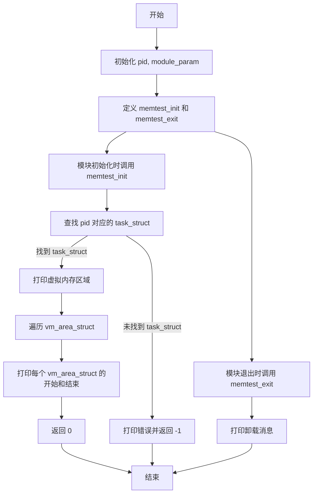

### 前提

切换到root用户,只有管理员才有权限进行内核编程,
关于内核编程的定义可以看看我之前的[帖子](https://moeary.github.io/posts/LINUX_MODULE_INIT/)

**然后本实验使用为Ubuntu20.04.05LTS**

原先教材上的find_task_by_vpid()函数在较新的Linux内核版本中已经被移除,还得使用pid_task(find_vpid(pid), PIDTYPE_PID)来代替

### 步骤
切换管理员
```bash
su root
```
新建一个文件夹然后进入
```bash
mkdir test3
cd ./test3
```
创建一个名叫memtest.c文件
```bash
vim memtest.c
```
然后里面输入
```c
#include<linux/module.h>
#include<linux/init.h>
#include<linux/interrupt.h>
#include<linux/sched.h>
#include<linux/pid.h>
static int pid=5025; //pid自己找,我自己使用之前fork实验创建的子进程号进行实验的
module_param(pid,int,0644); //0644不能改,0544只有当前用户可读,其他用户不可读

static int __init memtest_init(void);
static void __exit memtest_exit(void);

static int __init memtest_init(void){
        struct task_struct * p;
        struct vm_area_struct * temp;
        printk("virtual memory areas are:\n");
        p=pid_task(find_vpid(pid), PIDTYPE_PID);
        if(p == NULL){
            printk("Can't find the task with pid %d\n", pid);
            return -1;
        }
        temp=p->mm->mmap;
        while(temp){
                printk("start:%p\n",(unsigned long *)temp->vm_start);
                printk("end:%p\n",(unsigned long *)temp->vm_end);
                temp=temp->vm_next;
        }
        return 0;
}
static void __exit memtest_exit(void){
        printk("unloading!!!!\n");
        return ;
}
module_init(memtest_init);
module_exit(memtest_exit);
MODULE_LICENSE("GPL");
```
然后退出vim
```vim
esc
:wq
```

上面程序的流程图如下:


然后在相同文件夹下新建一个Makefile
```Makefile
obj-m := memtest.o
KERNELBUILD :=/lib/modules/`uname -r`/build
default:
	make -C $(KERNELBUILD) M=$(shell pwd) modules
clean:
	rm -rf *.o *.ko *.mod.c .*.cmd .tmp_versions
```
然后找个能够打印pid的程序或者直接把上面的static int pid=5025;修改一下比如修改成pid=1(pid=1必定存在)

我这里新建一个终端,跑之前的fork实验命令,得到一个pid=5025;

然后回退到memtest.c里面修改一下pid号就好;

然后运行
```bash
make #编译
sudo insmod memtest.ko #加载模块
dmesg #显示内核模块打印信息 注意够仔细的话会发现前面几秒都是Linux系统启动时打印的东西
```
等待终端打印信息
```bash
[  262.696680] virtual memory areas are:
[  262.696681] Can't find the task with pid 0
[  270.443820] virtual memory areas are:
[  270.443823] Can't find the task with pid 0
[  280.689915] virtual memory areas are:
[  280.689918] Can't find the task with pid 0
[  339.037970] virtual memory areas are:
[  339.037974] start:0000000072dddc50
[  339.037975] end:00000000ba1d24fc
[  339.037976] start:00000000ba1d24fc
[  339.037976] end:00000000279eef33
[  339.037977] start:00000000279eef33
[  339.037977] end:00000000af5d275e
[  339.037978] start:00000000af5d275e
[  339.037978] end:00000000215adbbc
[  339.037978] start:00000000215adbbc
[  339.037979] end:0000000089e936ab
[  339.037979] start:000000009b8d9553
[  339.037980] end:0000000078ceb2d1
[  339.037980] start:000000004647d4ed
[  339.037981] end:0000000069905ea5
[  339.037981] start:0000000069905ea5
[  339.037981] end:00000000a412c238
[  339.037982] start:000000004e9e9296
[  339.037982] end:000000002b8d23ef
[  339.037982] start:000000002b8d23ef
[  339.037983] end:00000000c90213cc
[  339.037983] start:000000005f89ed29
[  339.037984] end:0000000039d68fc2
[  339.037984] start:0000000039d68fc2
[  339.037985] end:00000000e4e781b5
[  339.037985] start:00000000e4e781b5
[  339.037985] end:00000000987319d8
[  339.037986] start:00000000987319d8
[  339.037986] end:00000000bcf4f0a1
[  339.037986] start:00000000bcf4f0a1
[  339.037987] end:00000000bde1b7ad
[  339.037987] start:00000000bde1b7ad
[  339.037988] end:000000007811ba52
[  339.037988] start:000000007811ba52
[  339.037988] end:0000000084225ee5
[  339.037989] start:0000000084225ee5
[  339.037989] end:000000000760e0cb
[  339.037989] start:000000000760e0cb
[  339.037990] end:00000000641493f8
[  339.037990] start:00000000641493f8
[  339.037990] end:000000009d91d81c
[  339.037991] start:000000009d91d81c
[  339.037991] end:000000002e28f9a9
[  339.037991] start:000000002e28f9a9
[  339.037992] end:000000002c1b7be1
[  339.037992] start:000000002c1b7be1
[  339.037993] end:00000000f39e0617
[  339.037993] start:00000000f39e0617
[  339.037993] end:00000000c9a89aa1
[  339.037994] start:00000000c9a89aa1
[  339.037994] end:00000000fe8f0c2f
[  339.037994] start:00000000fe8f0c2f
[  339.037995] end:0000000092225282
[  339.037995] start:0000000092225282
[  339.037996] end:00000000ef8e149a
[  339.037996] start:00000000ef8e149a
[  339.037996] end:00000000a656c152
[  339.037997] start:00000000a656c152
[  339.037997] end:000000003b3d0d4d
[  339.037997] start:000000003b3d0d4d
[  339.037998] end:00000000a319e4f6
[  339.037998] start:00000000a319e4f6
[  339.037999] end:0000000007f4b200
[  339.037999] start:0000000007f4b200
[  339.037999] end:000000001b944bb9
[  339.038000] start:000000001b944bb9
[  339.038000] end:00000000f3e1db67
[  339.038000] start:00000000f3e1db67
[  339.038001] end:00000000b4843862
[  339.038001] start:00000000b4843862
[  339.038001] end:00000000d9baf261
[  339.038002] start:00000000d9baf261
[  339.038002] end:0000000081adc2c5
[  339.038002] start:0000000081adc2c5
[  339.038003] end:00000000da7abe55
[  339.038003] start:00000000da7abe55
[  339.038003] end:000000008829e5a2
[  339.038004] start:000000008829e5a2
[  339.038004] end:0000000004bac8ac
[  339.038004] start:0000000004bac8ac
[  339.038005] end:0000000085d89ed1
[  339.038005] start:0000000085d89ed1
[  339.038005] end:00000000ef1b198a
[  339.038006] start:00000000ef1b198a
[  339.038006] end:0000000040158b5f
[  339.038006] start:0000000040158b5f
[  339.038007] end:00000000fb0a0a1a
[  339.038007] start:00000000fb0a0a1a
[  339.038007] end:00000000442bf9e6
[  339.038008] start:00000000442bf9e6
[  339.038008] end:000000005e9f2f4b
[  339.038008] start:000000005e9f2f4b
[  339.038009] end:000000006e330bfa
[  339.038009] start:000000006e330bfa
[  339.038009] end:00000000c40765ac
[  339.038010] start:00000000c40765ac
[  339.038010] end:00000000a0a87977
[  339.038010] start:00000000a0a87977
[  339.038011] end:00000000b018a233
[  339.038011] start:00000000b018a233
[  339.038011] end:0000000008134606
[  339.038012] start:0000000008134606
[  339.038012] end:000000006546a789
[  339.038013] start:000000006546a789
[  339.038013] end:00000000f21c4b2e
[  339.038013] start:00000000f21c4b2e
[  339.038014] end:00000000fa3a7b3a
[  339.038014] start:00000000fa3a7b3a
[  339.038014] end:000000003af99d10
[  339.038015] start:000000003af99d10
[  339.038015] end:00000000e5363f6b
[  339.038015] start:00000000e5363f6b
[  339.038016] end:00000000e5ef7b80
[  339.038016] start:00000000e5ef7b80
[  339.038016] end:00000000b7126e15
[  339.038017] start:00000000b7126e15
[  339.038017] end:00000000c048cadd
[  339.038017] start:00000000c048cadd
[  339.038018] end:000000008fe173e7
[  339.038018] start:000000008fe173e7
[  339.038018] end:000000003174a5df
[  339.038019] start:000000003174a5df
[  339.038019] end:00000000d31f4ad2
[  339.038019] start:00000000d31f4ad2
[  339.038019] end:0000000059ccbc3f
[  339.038020] start:0000000059ccbc3f
[  339.038020] end:000000001c9df677
[  339.038020] start:000000001c9df677
[  339.038021] end:00000000d390e2eb
[  339.038021] start:00000000d390e2eb
[  339.038021] end:0000000026c0486f
[  339.038022] start:0000000026c0486f
[  339.038022] end:00000000273a0620
[  339.038022] start:00000000273a0620
[  339.038023] end:00000000dc2e405c
[  339.038023] start:00000000dc2e405c
[  339.038023] end:0000000048463276
[  339.038024] start:0000000048463276
[  339.038024] end:0000000056fadd62
[  339.038024] start:0000000056fadd62
[  339.038025] end:00000000009c9139
[  339.038025] start:00000000009c9139
[  339.038026] end:000000004ad17016
[  339.038026] start:000000004ad17016
[  339.038027] end:0000000029df1890
[  339.038027] start:0000000029df1890
[  339.038027] end:00000000654412fb
[  339.038028] start:00000000654412fb
[  339.038028] end:0000000020756794
[  339.038028] start:0000000020756794
[  339.038029] end:00000000f05da210
[  339.038029] start:00000000f05da210
[  339.038030] end:00000000c271530d
[  339.038030] start:00000000c271530d
[  339.038031] end:0000000098ec9465
[  339.038031] start:0000000098ec9465
[  339.038031] end:00000000ad328695
[  339.038032] start:00000000ad328695
[  339.038032] end:00000000d3d13b5e
[  339.038032] start:00000000d3d13b5e
[  339.038033] end:000000007ae3ef98
[  339.038033] start:000000007ae3ef98
[  339.038033] end:00000000b0491bed
[  339.038034] start:00000000b0491bed
[  339.038034] end:000000001764cc89
[  339.038034] start:000000001764cc89
[  339.038035] end:00000000dee57f5b
[  339.038035] start:00000000dee57f5b
[  339.038035] end:000000009aab1bb8
[  339.038036] start:000000009aab1bb8
[  339.038036] end:000000001307fc25
[  339.038036] start:000000001307fc25
[  339.038037] end:00000000701b2f5a
[  339.038037] start:00000000701b2f5a
[  339.038037] end:00000000ffbc47b6
[  339.038038] start:00000000ffbc47b6
[  339.038038] end:000000009c5819e2
[  339.038038] start:000000009c5819e2
[  339.038039] end:000000009843b795
[  339.038039] start:000000009843b795
[  339.038040] end:0000000061a6014a
[  339.038040] start:0000000061a6014a
[  339.038040] end:00000000c916d152
[  339.038040] start:00000000c916d152
[  339.038041] end:0000000020544210
[  339.038041] start:0000000020544210
[  339.038041] end:00000000a20c926d
[  339.038042] start:00000000a20c926d
[  339.038042] end:00000000443dc18d
[  339.038042] start:00000000443dc18d
[  339.038043] end:00000000a8304885
[  339.038043] start:00000000a8304885
[  339.038043] end:0000000081faa463
[  339.038044] start:0000000081faa463
[  339.038044] end:00000000f852da84
[  339.038044] start:00000000f852da84
[  339.038045] end:00000000a5c76d75
[  339.038045] start:00000000a5c76d75
[  339.038046] end:00000000d341d682
[  339.038046] start:00000000d341d682
[  339.038047] end:0000000008f66d7d
[  339.038047] start:0000000008f66d7d
[  339.038047] end:0000000068facd9c
[  339.038048] start:0000000068facd9c
[  339.038048] end:0000000072662693
[  339.038048] start:0000000072662693
[  339.038049] end:0000000033010256
[  339.038049] start:0000000033010256
[  339.038050] end:000000001249fb9e
[  339.038050] start:000000001249fb9e
[  339.038051] end:00000000b5b2fa9f
[  339.038051] start:00000000b5b2fa9f
[  339.038051] end:000000000d49b830
[  339.038052] start:000000000d49b830
[  339.038052] end:00000000bbc18d47
[  339.038052] start:00000000bbc18d47
[  339.038053] end:000000004bd722e4
[  339.038053] start:000000004bd722e4
[  339.038054] end:00000000332812ea
[  339.038054] start:00000000332812ea
[  339.038054] end:00000000e7fb3127
[  339.038055] start:00000000e7fb3127
[  339.038055] end:00000000324e2701
[  339.038055] start:00000000324e2701
[  339.038056] end:000000004ae41fd2
[  339.038056] start:000000004ae41fd2
[  339.038056] end:0000000099c3d0b7
[  339.038057] start:0000000099c3d0b7
[  339.038057] end:00000000353505ae
[  339.038057] start:00000000353505ae
[  339.038058] end:000000006989fc66
[  339.038058] start:000000006989fc66
[  339.038058] end:000000003877117e
[  339.038059] start:000000003877117e
[  339.038059] end:00000000c5d39b2d
[  339.038059] start:00000000c5d39b2d
[  339.038060] end:000000001e080303
[  339.038060] start:000000001e080303
[  339.038060] end:0000000044cc8a68
[  339.038061] start:0000000044cc8a68
[  339.038061] end:00000000d54ca046
[  339.038061] start:00000000d54ca046
[  339.038062] end:00000000e335b20d
[  339.038062] start:00000000e335b20d
[  339.038062] end:000000003d6ade18
[  339.038063] start:000000003d6ade18
[  339.038063] end:00000000ee68e3eb
[  339.038063] start:00000000ee68e3eb
[  339.038064] end:00000000e746c3b8
[  339.038064] start:00000000e746c3b8
[  339.038065] end:000000003140d8ed
[  339.038065] start:000000003140d8ed
[  339.038066] end:00000000f81c429e
[  339.038066] start:00000000f81c429e
[  339.038066] end:00000000a2c812ae
[  339.038067] start:00000000a2c812ae
[  339.038067] end:00000000b10bb183
[  339.038067] start:00000000b10bb183
[  339.038068] end:00000000259dc8cb
[  339.038068] start:00000000259dc8cb
[  339.038068] end:000000005970abfb
[  339.038069] start:000000005970abfb
[  339.038069] end:00000000adcca9ff
[  339.038069] start:00000000adcca9ff
[  339.038070] end:00000000648e56ea
[  339.038070] start:00000000648e56ea
[  339.038071] end:0000000012005cde
[  339.038071] start:0000000012005cde
[  339.038071] end:00000000bc7b8cbf
[  339.038071] start:00000000bc7b8cbf
[  339.038072] end:000000008714a43b
[  339.038072] start:000000008714a43b
[  339.038073] end:00000000737e1682
[  339.038073] start:00000000737e1682
[  339.038073] end:00000000f8e7db13
[  339.038074] start:00000000f8e7db13
[  339.038074] end:0000000041c80de8
[  339.038074] start:0000000041c80de8
[  339.038075] end:000000002b192971
[  339.038075] start:000000002b192971
[  339.038075] end:00000000e62896be
[  339.038076] start:00000000e62896be
[  339.038076] end:000000005602afab
[  339.038076] start:000000005602afab
[  339.038077] end:00000000f042c218
[  339.038077] start:00000000f042c218
[  339.038077] end:0000000026d50d0f
[  339.038078] start:0000000026d50d0f
[  339.038078] end:000000004a4b89bf
[  339.038079] start:000000004a4b89bf
[  339.038079] end:00000000e793fdbb
[  339.038079] start:00000000e793fdbb
[  339.038080] end:00000000bbe05c3e
[  339.038080] start:00000000bbe05c3e
[  339.038081] end:00000000c76dc77e
[  339.038081] start:00000000c76dc77e
[  339.038081] end:00000000db9a6bbb
[  339.038082] start:00000000db9a6bbb
[  339.038082] end:0000000033cf57f7
[  339.038082] start:0000000033cf57f7
[  339.038083] end:0000000097b72f49
[  339.038083] start:0000000097b72f49
[  339.038083] end:00000000d8653a7b
[  339.038083] start:00000000d8653a7b
[  339.038084] end:00000000d5eafd18
[  339.038084] start:00000000d5eafd18
[  339.038084] end:00000000fb156635
[  339.038085] start:00000000fb156635
[  339.038085] end:00000000e9a1accf
[  339.038085] start:00000000e9a1accf
[  339.038086] end:00000000e1f9f3ea
[  339.038086] start:00000000e1f9f3ea
[  339.038087] end:00000000638c586e
[  339.038087] start:00000000638c586e
[  339.038087] end:0000000044c17690
[  339.038087] start:0000000044c17690
[  339.038088] end:0000000037e6c8f9
[  339.038088] start:0000000037e6c8f9
[  339.038088] end:00000000179576bf
[  339.038089] start:00000000179576bf
[  339.038089] end:000000003fa1964b
[  339.038089] start:000000003fa1964b
[  339.038090] end:000000001d81b548
[  339.038090] start:000000001d81b548
[  339.038090] end:0000000042e203f6
[  339.038091] start:0000000042e203f6
[  339.038091] end:000000001d942efb
[  339.038091] start:000000001d942efb
[  339.038092] end:0000000007541350
[  339.038092] start:0000000007541350
[  339.038093] end:0000000037188df9
[  339.038093] start:0000000037188df9
[  339.038093] end:00000000f793c045
[  339.038094] start:00000000f793c045
[  339.038094] end:00000000b25cd667
[  339.038095] start:00000000b25cd667
[  339.038095] end:000000006032856a
[  339.038095] start:000000006032856a
[  339.038096] end:0000000055587141
[  339.038096] start:0000000055587141
[  339.038097] end:00000000cd24b753
[  339.038097] start:00000000cd24b753
[  339.038097] end:000000008b964750
[  339.038098] start:000000008b964750
[  339.038098] end:0000000020e6a7c3
[  339.038098] start:0000000020e6a7c3
[  339.038099] end:000000008fb36927
[  339.038099] start:000000008fb36927
[  339.038099] end:00000000f314698f
[  339.038100] start:00000000f314698f
[  339.038100] end:000000000c58712f
[  339.038100] start:000000000c58712f
[  339.038101] end:0000000035c90937
[  339.038101] start:0000000035c90937
[  339.038102] end:000000005f1e02a5
[  339.038102] start:000000005f1e02a5
[  339.038102] end:00000000d94f342b
[  339.038103] start:00000000d94f342b
[  339.038103] end:000000009d91a0e0
[  339.038103] start:000000009d91a0e0
[  339.038104] end:0000000078ff1e28
[  339.038104] start:0000000078ff1e28
[  339.038105] end:000000009db6b574
[  339.038105] start:000000009db6b574
[  339.038105] end:00000000eca06fb0
[  339.038106] start:00000000eca06fb0
[  339.038106] end:000000005612e363
[  339.038106] start:000000005612e363
[  339.038106] end:00000000777d0a53
[  339.038107] start:00000000777d0a53
[  339.038107] end:00000000a93ce193
[  339.038107] start:00000000a93ce193
[  339.038108] end:000000002bdb1240
[  339.038108] start:000000002bdb1240
[  339.038108] end:00000000022db707
[  339.038109] start:00000000022db707
[  339.038109] end:00000000715cd2b4
[  339.038109] start:00000000715cd2b4
[  339.038110] end:000000002b7816d5
[  339.038110] start:000000002b7816d5
[  339.038110] end:000000002f05ca4e
[  339.038111] start:000000002f05ca4e
[  339.038111] end:00000000109dfba4
[  339.038112] start:00000000109dfba4
[  339.038112] end:00000000990f0c76
[  339.038113] start:00000000990f0c76
[  339.038113] end:00000000c61b6780
[  339.038113] start:00000000c61b6780
[  339.038114] end:000000004de6f42d
[  339.038114] start:000000004de6f42d
[  339.038114] end:000000000dfd60e2
[  339.038115] start:000000000dfd60e2
[  339.038115] end:00000000ddca1e01
[  339.038116] start:00000000ddca1e01
[  339.038116] end:00000000c4897089
[  339.038116] start:00000000c4897089
[  339.038117] end:000000004cd79a70
[  339.038117] start:000000004cd79a70
[  339.038117] end:000000009cadb5c3
[  339.038118] start:000000009cadb5c3
[  339.038118] end:00000000fb508ad1
[  339.038118] start:00000000fb508ad1
[  339.038119] end:00000000d81409fe
[  339.038119] start:00000000d81409fe
[  339.038119] end:00000000ef957ad7
[  339.038120] start:00000000ef957ad7
[  339.038120] end:00000000f1dc9f89
[  339.038120] start:00000000f1dc9f89
[  339.038121] end:00000000f485a9db
[  339.038121] start:00000000f485a9db
[  339.038121] end:00000000b24a0872
[  339.038122] start:00000000b24a0872
[  339.038122] end:00000000e39204db
[  339.038122] start:00000000e39204db
[  339.038123] end:00000000d41cb35e
[  339.038123] start:00000000108fb1c3
[  339.038123] end:000000001efc14e4
[  339.038123] start:000000001efc14e4
[  339.038124] end:000000002855da0d
[  339.038124] start:000000002855da0d
[  339.038124] end:0000000097761b2c
[  339.038125] start:0000000015c95418
[  339.038125] end:00000000958936dc
[  339.038125] start:00000000958936dc
[  339.038126] end:00000000453c0582
[  339.038126] start:00000000453c0582
[  339.038126] end:00000000419a9ebc
[  339.038127] start:000000007441143f
[  339.038127] end:00000000d9de7db6
[  339.038127] start:00000000cbf05884
[  339.038127] end:000000000a3b6707
[  339.038128] start:000000000a3b6707
[  339.038128] end:0000000097fbeb90
[  366.825570] perf: interrupt took too long (3265 > 3150), lowering kernel.perf_event_max_sample_rate to 61250
[  439.207821] unloading!!!!
```
运行结束后别忘记了
```bash
make clean #清除编译结果
sudo rmmod hello #卸载模块
```

完结撒花!!!
