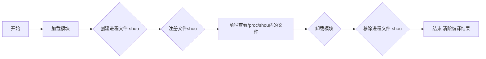

### 为什么说LINUX下一切皆文件

在Linux系统中，"一切皆文件"是一个基本的设计理念。这是因为Linux系统中的大多数事物，包括硬件设备、目录、网络套接字等，都被表示为文件。这种设计使得用户和程序可以使用统一且一致的接口（即文件系统API）来交互和操作系统中的各种资源。

硬件设备（如硬盘、鼠标、键盘等）在Linux中都有对应的设备文件，通常位于/dev目录下,比如可以通过。网络套接字和进程间通信管道也可以通过文件描述符来操作。此外，Linux系统的配置信息也通常存储在文件中，例如/etc目录下的各种配置文件。甚至是/proc/下的进程都可以以文件的方式进行查看,cat /proc/cpuinfo就可以看到cpu的信息

因此，当我们说"Linux下一切皆文件"时，意思是在Linux系统中，几乎所有的资源都可以通过文件的方式来访问和管理。

### 开始实验

开始实验之前,推荐大家先看看这个问题:[Linux 系统误将 chmod 权限改成 了 000，如何恢复?](https://www.zhihu.com/question/590661860/answer/3288127626)

这种情况下,chmod命令我们是不能用的,那么我们该如何去使用chmod命令呢?

这种情况下就可以通过编写代码直接运行usr/bin/chmod文件进行权限的修改修复死局,下面将通过一个简单的实验讲解一下内核文件管理的实现:

首先实验环境为VMware Ubuntu 20.04.5 LTS

内核版本为 5.15.0-101-generic

在搞之前 记得切换到管理员状态:
```bash
su root
```
至于原因,只有系统管理员才有power去insmod 模块

然后实验需要的材料是一个[文件系统实验（proc_fs)2024_.rar] 

外校的同学可以直接联系我,我邮箱发一份文件 cuvo@foxmail.com

把这个文件丢进Ubuntu里面然后解压
```bash
unrar x 文件系统实验（proc_fs)2024_.rar
```
如果提示没有unrar,记得下载
```bash
sudo apt-get install unrar
```
然后切目录
```bash
cd /文件系统实验（proc_fs)2024/proc2019@fc14/
```
进到代码目录后,可以自行跑一下make看看有没有错误,如果使用Ubuntu肯定会提醒相应的模块或者库函数没了
这是原先的代码
```c
/*
 * main.c -- the bare scull char module
 *
 * Copyright (C) 2001 Alessandro Rubini and Jonathan Corbet
 * Copyright (C) 2001 O'Reilly & Associates
 *
 * The source code in this file can be freely used, adapted,
 * and redistributed in source or binary form, so long as an
 * acknowledgment appears in derived source files.  The citation
 * should list that the code comes from the book "Linux Device
 * Drivers" by Alessandro Rubini and Jonathan Corbet, published
 * by O'Reilly & Associates.   No warranty is attached;
 * we cannot take responsibility for errors or fitness for use.
 *
 */

//#include <linux/config.h>
#include <linux/module.h>
#include <linux/moduleparam.h>
#include <linux/init.h>

#include <linux/kernel.h>	/* printk() */
#include <linux/slab.h>		/* kmalloc() */
#include <linux/fs.h>		/* everything... */
#include <linux/errno.h>	/* error codes */
#include <linux/types.h>	/* size_t */
#include <linux/proc_fs.h>
#include <linux/fcntl.h>	/* O_ACCMODE */
#include <linux/seq_file.h>
#include <linux/cdev.h>
#include <linux/sched.h>
#include <asm/system.h>		/* cli(), *_flags */
#include <asm/uaccess.h>	/* copy_*_user */

#include "scull.h"		/* local definitions */

MODULE_AUTHOR("Alessandro Rubini, Jonathan Corbet");
MODULE_LICENSE("Dual BSD/GPL");

/*
 * The proc filesystem: function to read and entry
 */

int scull_read_procmem(char *buf, char **start, off_t offset,
                   int count, int *eof, void *data)
{
  //      printk("<0> hello i'm a proc file builded by you\n");
//        printk("<0> hello i'm %d \n",current->pid);
        int len = sprintf(buf,"%s\n","hello world"); 
	return len;
}


/*
 * Now to implement the /proc file we need only make an open
 * method which sets up the sequence operators.

static int scull_proc_open(struct inode *inode, struct file *file)
{
	return 0;
}
 */
/*
 * Create a set of file operations for our proc file.
 
static struct file_operations scull_proc_ops = {
	.owner   = THIS_MODULE,
	.open    = scull_proc_open,
	.read    = scull_read_procmem,
	.llseek  = seq_lseek,
	.release = seq_release
};


 * Actually create (and remove) the /proc file(s).
 */

static void scull_create_proc(void)
{
	
	create_proc_read_entry("shou", 0 /* default mode */,
			NULL /* parent dir */, scull_read_procmem,
			NULL /* client data */);
	
}

static void scull_remove_proc(void)
{
	/* no problem if it was not registered */
	remove_proc_entry("shou", NULL /* parent dir */);
//	remove_proc_entry("scullseq", NULL);
}


void scull_cleanup_module(void)
{

	scull_remove_proc();

}
```
这个代码是给fc14编写的,他的内核版本为2.6

这时候肯定需要修改main.c文件了,这样才能在较新的内核上跑起来,首先还得了解一下之前模块是干什么的，之前的模块创建了一个名为"shou"的proc文件。当你读取这个文件时，它会显示"Hello, world! [当前进程的PID]"。根据之前的内容和功能,我们对此进行修改
```c
/*
 * main.c -- the bare scull char module
 *
 * Copyright (C) 2001 Alessandro Rubini and Jonathan Corbet
 * Copyright (C) 2001 O'Reilly & Associates
 *
 * The source code in this file can be freely used, adapted,
 * and redistributed in source or binary form, so long as an
 * acknowledgment appears in derived source files.  The citation
 * should list that the code comes from the book "Linux Device
 * Drivers" by Alessandro Rubini and Jonathan Corbet, published
 * by O'Reilly & Associates.   No warranty is attached;
 * we cannot take responsibility for errors or fitness for use.
 *
 */

//#include <linux/config.h>
#include <linux/module.h>  // 包含了Linux内核模块需要的函数和符号
#include <linux/init.h>  // 包含了模块初始化和清理函数的宏
#include <linux/proc_fs.h>  // 包含了创建和删除proc文件的函数
#include <linux/seq_file.h>  // 包含了顺序文件接口的函数
#include <linux/sched.h>  // 包含了获取当前进程信息的函数
#include "scull.h"  // 包含了本地定义

// 模块的作者和许可证信息
MODULE_AUTHOR("Alessandro Rubini, Jonathan Corbet");
MODULE_LICENSE("Dual BSD/GPL");

// 当读取proc文件时，这个函数会被调用
static int scull_proc_show(struct seq_file *m, void *v) {
    seq_printf(m, "Hello, world! Current PID: %d\n", current->pid);  // 打印当前进程的PID
    return 0;
}

// 当打开proc文件时，这个函数会被调用
static int scull_proc_open(struct inode *inode, struct file *file) {
    return single_open(file, scull_proc_show, NULL);  // 使用单一打开，scull_proc_show作为显示函数
}

// 定义proc文件的操作
static const struct proc_ops scull_proc_fops = {
    .proc_open = scull_proc_open,  // 打开文件时的操作
    .proc_read = seq_read,  // 读取文件时的操作
    .proc_lseek = seq_lseek,  // 定位文件时的操作
    .proc_release = single_release,  // 释放文件时的操作
};

// 创建proc文件
static void scull_create_proc(void)
{
    proc_create("shou", 0, NULL, &scull_proc_fops);  // 创建名为"shou"的proc文件，使用scull_proc_fops作为文件操作
}

// 删除proc文件
static void scull_remove_proc(void)
{
    remove_proc_entry("shou", NULL);  // 删除名为"shou"的proc文件
}

// 模块清理函数
void scull_cleanup_module(void)
{
    scull_remove_proc();  // 删除proc文件
}

// 模块初始化函数
int scull_init_module(void)
{
    scull_create_proc();  // 创建proc文件
    return 0;
}

// 注册模块初始化和清理函数
module_init(scull_init_module);
module_exit(scull_cleanup_module);
```
修改完main.c文件后可以开始编译
```bash
make
```
然后insmod
```bash
insmod scull.ko
```
然后可以去proc里面看有没有shou文件了
```bash
ls /proc/
```
如果有:

那就可以
```bash
cat /proc/shou
```
那就会出现这样的内容

此时我们再把模块卸载掉看看
```bash
rmmod scull.ko
ls /proc/
```
就可以发现之前的shou文件没了

至此实验结束

整个实验流程图如下

