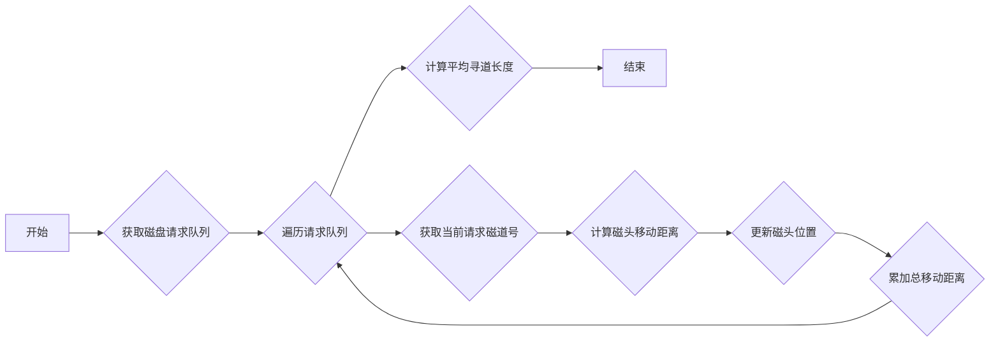
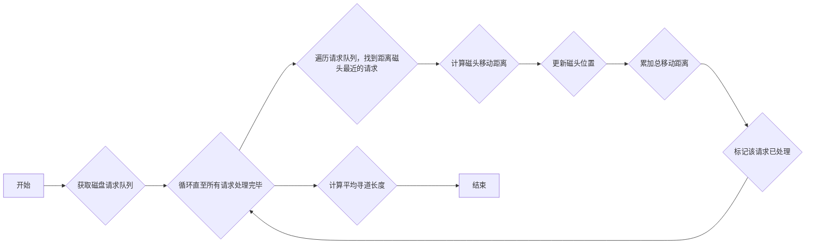
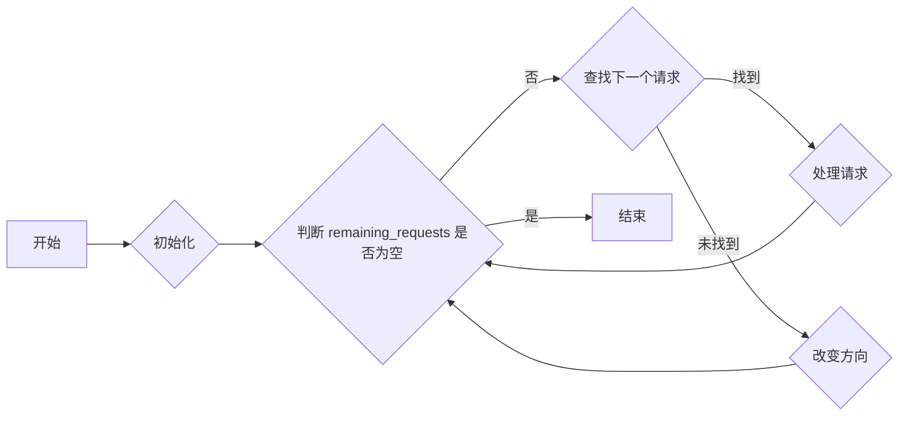
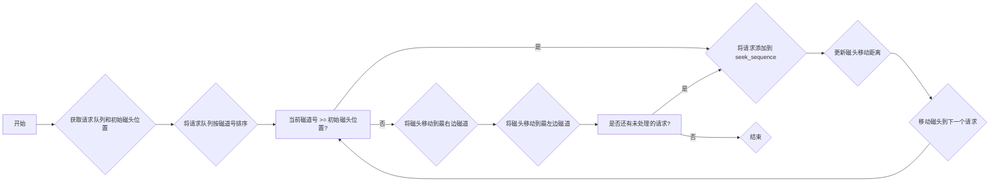
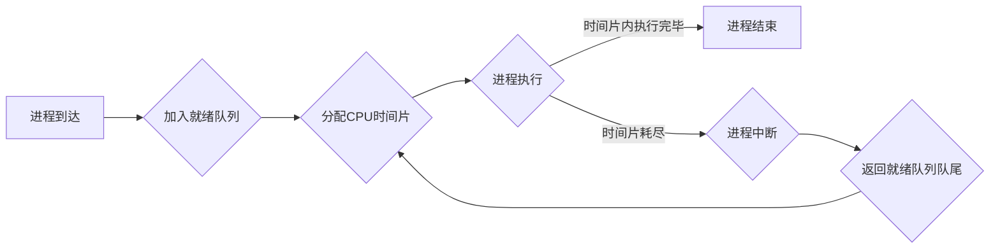

未完 待更新
# 前言
一旦到了学期末,看啥都是屎,尤其是浪费时间的大作业
想找个搭子一起做大作业,结果其中一个搭子也是屎,没办法只能自己一个人做了

这个大作业借鉴了一下两位的帖子

[Java 实现 磁盘调度算法的实现与分析（计算机操作系统课程设计）-----扫描磁道移动路径可视化实现](https://blog.csdn.net/qq_45914437/article/details/122200279)

[Java实现操作系统进程调度模拟程序+GUI图形化](https://blog.csdn.net/qq_41027897/article/details/122408282)

不过我使用的语言是python+tkinter库,代码要相对简洁很多,而且增加了一点之前没有的功能,也不能称作完全抄袭罢

所有的代码我都放在我的GitHub repo上了,需要的[可以去看看](https://github.com/Moeary/Operating_System_Homework),如果对您有用的话别忘了给颗**star**
# 磁盘调度

## 先来先服务

```python
def fcfs(self, requests, head):
        """
        先来先服务算法 (FCFS)
        """
        seek_sequence = [head] + requests
        total_head_movement = sum(
            abs(seek_sequence[i] - seek_sequence[i + 1])
            for i in range(len(seek_sequence) - 1)
        )
        return seek_sequence, total_head_movement
```

代码很简单,就是按照顺序访问磁道位置,先到的先访问



## 最短寻道时间优先

```python
def sstf(self, requests, head):
    """
    最短寻道时间优先算法 (SSTF)
    """
    seek_sequence = [head]
    total_head_movement = 0
    remaining_requests = set(requests)
    while remaining_requests:
        current_head = seek_sequence[-1]
        next_request = min(
            remaining_requests, key=lambda req: abs(req - current_head)
        )
        seek_sequence.append(next_request)
        total_head_movement += abs(next_request - current_head)
        remaining_requests.remove(next_request)
    return seek_sequence, total_head_movement
```

原理也没啥好说的,每次选择距离当前磁头位置最近的请求进行处理。



## 电梯调度算法 (SCAN)

```python
def scan(self, requests, head, direction="right"):
        """
        电梯调度算法 (SCAN)
        """
        seek_sequence = [head]
        total_head_movement = 0
        remaining_requests = set(requests)
        visited = set()
        current_track = head

        while remaining_requests:
            if direction == "right":
                next_track = None
                for track in sorted(remaining_requests):
                    if track > current_track and track not in visited:
                        next_track = track
                        break

                if next_track is not None:
                    seek_sequence.append(next_track)
                    total_head_movement += abs(next_track - current_track)
                    current_track = next_track
                    visited.add(current_track)
                    remaining_requests.remove(current_track)
                else:
                    seek_sequence.append(cylinder_count - 1)
                    total_head_movement += abs(cylinder_count - 1 - current_track)
                    current_track = cylinder_count - 1
                    direction = "left"
                    # 改变方向后，跳过已访问的磁道
                    while current_track in visited and current_track > 0:
                        current_track -= 1

            else:  # direction == "left"
                next_track = None
                for track in sorted(remaining_requests, reverse=True):
                    if track < current_track and track not in visited:
                        next_track = track
                        break

                if next_track is not None:
                    seek_sequence.append(next_track)
                    total_head_movement += abs(next_track - current_track)
                    current_track = next_track
                    visited.add(current_track)
                    remaining_requests.remove(current_track)
                else:
                    seek_sequence.append(0)
                    total_head_movement += abs(current_track - 0)
                    current_track = 0
                    direction = "right"
                    # 改变方向后，跳过已访问的磁道
                    while current_track in visited and current_track < cylinder_count - 1:
                        current_track += 1

        return seek_sequence, total_head_movement
```
磁头在一个方向上移动，处理所有该方向上的请求，到达边界后反向移动。



## 循环扫描算法 (C-SCAN)

```python
def cscan(self, requests, head):
        """
        循环扫描算法 (C-SCAN)
        """
        seek_sequence = [head]
        total_head_movement = 0
        remaining_requests = sorted(requests)

        # 向右移动到最右边
        for req in remaining_requests:
            if req >= head:
                seek_sequence.append(req)
                total_head_movement += abs(req - seek_sequence[-2])

        # 从最左边开始继续向右移动
        seek_sequence.append(cylinder_count - 1)
        total_head_movement += abs(cylinder_count - 1 - seek_sequence[-2])
        seek_sequence.append(0)
        total_head_movement += abs(seek_sequence[-2])

        for req in remaining_requests:
            if req < head:
                seek_sequence.append(req)
                total_head_movement += abs(req - seek_sequence[-2])

        return seek_sequence, total_head_movement
    # 绘制结果图形
    def draw_graph(self, sequence, total_distance):
        self.canvas.delete("all")

        # 绘制坐标轴
        self.canvas.create_line(50, 350, 950, 350, width=2)  # x轴
        self.canvas.create_line(50, 350, 50, 50, width=2)  # y轴

        # 绘制刻度
        for i in range(0, 221, 20):
            x = 50 + i * 4
            self.canvas.create_line(x, 350, x, 345, width=1)
            self.canvas.create_text(x, 360, text=str(i), anchor="n")

        # 绘制磁道序列和动画
        head_x = 50 + self.start * 4
        head_y = 350
        head_oval = self.canvas.create_oval(head_x - 3, head_y - 3, head_x + 3, head_y + 3, fill="red", outline="red")

        for i in range(len(sequence)):
            x = 50 + sequence[i] * 4
            y = 330 - i * 20
            self.canvas.create_line(
                x, y, x, y + 20, width=2, fill="blue"
            )
            self.canvas.create_text(
                x, y - 10, text=str(sequence[i]), anchor="s"
            )

            # 移动磁头动画
            self.canvas.move(head_oval, x - head_x, 0)
            self.canvas.update()
            time.sleep(0.5)  # 暂停0.5秒

            head_x = x

        # 显示结果
        avg_seek_length = total_distance / len(self.sequence)
        result_text = (
            f"磁道访问顺序: {sequence}\n"
            f"总共移动磁道数：{total_distance}\n"
            f"平均寻道长度: {avg_seek_length:.2f}"
        )
        self.result_label.config(text=result_text)
```
类似 SCAN 算法，但到达边界后不反转方向，而是直接回到起始端继续扫描。



运行图片大致如下


# 进程调度

没啥好说的 和之前磁盘调度都是差不多的道理

## FCFS

```python
def execute_fcfs(self):
    # 按照到达时间排序
    self.processes.sort(key=lambda x: x.arrive_time)
    # 计算每个进程的开始时间、结束时间、周转时间和带权周转时间
    current_time = 0
    for pcb in self.processes:
        pcb.begin_time = max(current_time, pcb.arrive_time)
        pcb.finish_time = pcb.begin_time + pcb.work_time
        pcb.tat = pcb.finish_time - pcb.arrive_time
        pcb.wtat = pcb.tat / pcb.work_time
        current_time = pcb.finish_time
```

## SJF

```python
def execute_sjf(self):
    # 按照到达时间排序
    self.processes.sort(key=lambda x: x.arrive_time)
    # 创建一个列表来存储已经完成的进程
    completed_processes = []
    # 初始化当前时间和就绪队列
    current_time = 0
    ready_queue = []
    # 循环执行，直到所有进程都完成
    while len(completed_processes) < len(self.processes):
        # 将到达时间小于等于当前时间的进程添加到就绪队列中
        for pcb in self.processes:
            if pcb.arrive_time <= current_time and pcb not in ready_queue and pcb not in completed_processes:
                ready_queue.append(pcb)
        # 按照服务时间对就绪队列进行排序
        ready_queue.sort(key=lambda x: x.work_time)
        # 如果就绪队列不为空，则选择服务时间最短的进程执行
        if ready_queue:
            # 获取就绪队列中的第一个进程
            pcb = ready_queue.pop(0)
            # 计算进程的开始时间、结束时间、周转时间和带权周转时间
            pcb.begin_time = current_time
            pcb.finish_time = pcb.begin_time + pcb.work_time
            pcb.tat = pcb.finish_time - pcb.arrive_time
            pcb.wtat = pcb.tat / pcb.work_time
            # 更新当前时间
            current_time = pcb.finish_time
            # 将进程添加到已完成进程列表中
            completed_processes.append(pcb)
        else:
            # 如果就绪队列为空，则将当前时间更新为下一个进程的到达时间
            next_arrive_time = min([pcb.arrive_time for pcb in self.processes if pcb not in completed_processes])
            current_time = next_arrive_time
```


## HRN

```python
def execute_hrn(self):
    # 按照到达时间排序
    self.processes.sort(key=lambda x: x.arrive_time)
    # 创建一个列表来存储已经完成的进程
    completed_processes = []
    # 初始化当前时间和就绪队列
    current_time = 0
    ready_queue = []
    # 循环执行，直到所有进程都完成
    while len(completed_processes) < len(self.processes):
        # 将到达时间小于等于当前时间的进程添加到就绪队列中
        for pcb in self.processes:
            if pcb.arrive_time <= current_time and pcb not in ready_queue and pcb not in completed_processes:
                ready_queue.append(pcb)
        # 按照响应比对就绪队列进行排序
        ready_queue.sort(key=lambda x: ((current_time - x.arrive_time) + x.work_time) / x.work_time, reverse=True)
        # 如果就绪队列不为空，则选择响应比最高的进程执行
        if ready_queue:
            # 获取就绪队列中的第一个进程
            pcb = ready_queue.pop(0)
            # 计算进程的开始时间、结束时间、周转时间和带权周转时间
            pcb.begin_time = current_time
            pcb.finish_time = pcb.begin_time + pcb.work_time
            pcb.tat = pcb.finish_time - pcb.arrive_time
            pcb.wtat = pcb.tat / pcb.work_time
            # 更新当前时间
            current_time = pcb.finish_time
            # 将进程添加到已完成进程列表中
            completed_processes.append(pcb)
        else:
            # 如果就绪队列为空，则将当前时间更新为下一个进程的到达时间
            next_arrive_time = min([pcb.arrive_time for pcb in self.processes if pcb not in completed_processes])
            current_time = next_arrive_time
```

软件运行结果大致如下


# 时间片轮转

这个本来应该算在进程调度里面,作为一个子算法出现的,但是嗯是给单独提出来了,说明时间片轮转算法的重要性了(虽然但是,LINUX操作系统用的可不是RR算法,而是用的CFS完全公平调度器,具体的自己去查 了解一下)

```python
def round_robin(processes, time_quantum):
    ready_queue = []
    time = 0
    finished_processes = []

    print("时间片轮转调度算法演示:")

    while processes or ready_queue:
        # 将到达的进程添加到就绪队列
        for p in processes:
            if p.arrival_time <= time:
                ready_queue.append(p)
                processes.remove(p)

        if ready_queue:
            current_process = ready_queue.pop(0)
            print(f"时间: {time}  进程 {current_process.pid} 正在运行...")

            # 执行一个时间片
            execution_time = min(current_process.remaining_time, time_quantum)
            current_process.remaining_time -= execution_time
            time += execution_time

            if current_process.remaining_time == 0:
                # 进程完成
                current_process.turnaround_time = time - current_process.arrival_time
                current_process.waiting_time = current_process.turnaround_time - current_process.burst_time
                finished_processes.append(current_process)
                print(f"时间: {time}  进程 {current_process.pid} 完成.")
            else:
                # 进程未完成，放回就绪队列末尾
                ready_queue.append(current_process)
        else:
            # CPU 空闲
            time += 1

    return finished_processes
```

简单描述就是给每个进程分配一个固定的时间片（Time Quantum），进程在时间片内占用 CPU 执行任务。当时间片用完后，即使进程还没执行完毕，也会被系统强制挂起，CPU 会被分配给队列中的下一个进程。

流程图大致描述如下



其实这个算法实现起来很简单,跑的时候也没用tkinter库了,直接就纯控制台输出+matplotlib甘特图输出,因为实在没时间做了

说实话做的并不算太好:(
但是确实没时间了 我还得复习其他的科目 不能把时间都浪费在这上面
  
# 结束了?
TBC
