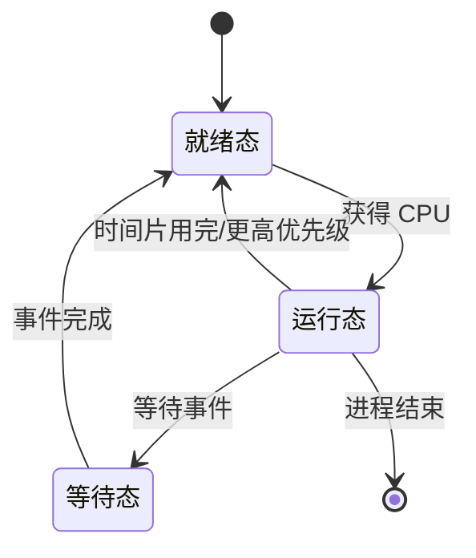

# 前言
本文不是LINUX操作系统的复习,请不要和LINUX操作系统弄混了,两者侧重点不同,LINUX操作系统讲的是具体的X86 Linux Kernel 2.*版本下的LINUX操作系统对应的内存管理 文件管理 中断管理,而本文更侧重操作系统中一些具体的名词解释

# 复习提纲

## 第一部分：基础原理篇

### 什么是操作系统？操作系统的主要功能？操作系统的基本特性（并发和共享）？

操作系统是计算机中负责**管理计算机软硬件资源的一种特殊的系统软件**,主要负责的功能有**处理机管理,文件管理,设备管理,存储器管理以及以及用户接口**

操作系统拥有四个特征:**并发 共享 虚拟 异步**

并发是指计算机中不同的进程可以在某个时间刻内”同时执行”

共享是指计算机不同进程之间可以使用相同的系统资源,比如调用临界区中的资源

虚拟是指可以把计算机原本一些无法做到的操作通过操作系统给实现,比如虚拟存储器可以超过物理内存的上限,再或者是SPOOLing技术能把像是打印机这样的设备进行虚拟化 使其可以同时有多个进程进行访问

异步是指操作系统在进行进程时,前后的进程顺序都会影响到当前进程的执行情况,最后会有意想不到的结果

### 操作系统的几个发展历程，及每类操作系统的基本特征？

无操作系统时代 打孔编程

单道批处理操作系统 现代操作系统的前身 **自动性 顺序性 单道性**

多道批处理操作系统 多个作业按照来的先后进行执行

分时操作系统 多个用户在同一时间内使用相同的计算机像是每人都独立使用一台计算机一样 **特征多路性 独立性 及时性 交互性**

实时操作系统 对时间的要求更高 特征**可靠性, 多路性 独立性 及时性 交互性**

## 第二部分：进程管理及处理机调度

### 单道编程与多道编程的概念？比较？多道编程的效率、优点？

单道编程是指操作系统中最多同时只有一个进程在跑

多道编程是指操作系统中根据系统进程调度同一时刻内可以有多个进程在跑,

多道编程相比于单道编程能够更好的利用到计算机的各种资源,相比单道编程效率更高

### 什么是进程？为什么引入进程？进程与程序的区别与联系？

进程是操作系统中拥有资源的,可以执行各种任务的基本单位

引入进程是为了方便操作系统/用户管理各种需要完成的任务,从而将其细化为一种进程,统一由PCB进程控制块进行管理

进程是动态的,在内存中,而程序是静态的,一般存在磁盘中,一个程序可以对应多个进程,比如用户可以同时打开两个浏览器

### 进程的状态？状态之间的转化？进程的管理，手段（进程表、进程控制块）？

进程有三个状态,就绪态,执行态,阻塞态(等待态)

就绪态是不可能到等待态

等待态不能到运行态

然后可以在就绪和等待态上面再加对应的挂起状态

进程的管理主要由PCB进行管理,PCB能够使得进程成为独立运行的模块和其他程序并发执行

### 进程与线程的比较？线程的实现？从内核角度看，用户级线程与内核及线程的比较？

进程是拥有资源的最小单位

线程是能够独立分派 调度的最小单位

线程相当于是轻量级的进程

用户级线程在用户态,调度快 较为灵活 可以选择最好的算法

内核级线程在内核态,资源分配更加合理,阻塞进程不会阻塞线程,同时支持操作系统的各种骚操作,但是效率低下,内核实现需要占用内存

### 传统的进程间通信方式？概念和特点，高级进程通信方式（共享内存、信号量和消息队列）

信号量 低效

共享存储器 :相互通信的进程共享某些数据结构或共享存储区，进程之间能够通过这些空间进行通信。

共享数据结构，需要设置公用数据结构，处理进程同步。是低效的，只适用于传递相对少量数据。

共享存储区，在存储器中划分出一块共享存储区，进程通过对共享存储区中的读/写实现通信。

消息传递系统:消息传递系统(message passing system)是当前应用最广泛的一种进程间的通信机制。该机制中，进程间的数据交换以格式化的消息(message)为单位，计算机网络中又把消息称为报文。程序员直接利用系统提供的通信命令(原语)即可传递大量数据。

直接通信方式(直接发送) 间接通信方式(通过信箱发送)

管道通信系统:用于连接一个读进程和一个写进程以实现它们之间通信的一个共享文件，又名pipe文件。

### 临界资源，临界区的概念,什么是进程同步？同步准则？高级进程同步机制,关于锁、睡觉与叫醒、信号量和管程。每种机制的基本操作及含义,什么是原语？在信号量中，P 和 V 操作相当于 Wait 和 Signal

并发进程中与共享变量有关的程序段称为临界区,共享变量代表的资源称为临界资源

进程同步指两个以上进程基于某个条件来协调他们的活动 逐次使用互斥的共享资源,应遵循**空闲让进 忙则等待 有限等待 让权等待**

把标志看成一把锁 使用时上锁 不用时解锁

生产者问题 生产满了睡觉 生产商品不够了就叫醒生产者

信号量用来描述计算机临界区共享资源的一种抽象概念

为了避免凡是要使用临界资源的进程都自备同步操作P和V，将同步操作的机制和临界资源结合到一起，形成一种新的同步工具，管程(monitors)。目的是避免PV过多以及使用不当引起死锁。
管程是一个数据结构和能够为并发进程所执行的在该数据结构上的一组操作。

### 处理机调度的概念、类别、特点、目标，每一种调度算法的含义及计算。

低级调度(进程调度) 根据算法决定就绪队列中的那个进程或者内核级线程能够获得CPU

中级调度(内存调度) 根据算法决定那个进程可以获得内存 

高级调度(作业调度) 根据算法把外存上处于后备队列的作业调入内存

### 死锁的定义，产生死锁的原因？死锁发生的条件，防止死锁的方法及相关算法？

死锁是指两个进程在作业时因为互相抢夺共享资源导致导致陷入的一种僵局

产生原因有两个:进程间次序推进不当,竞争共享资源

条件:互斥,不可剥夺,持有等待,环路等待

防止方法:

不予理睬

静态预防(消除四个基本条件中的一个就行了)

动态避免(银行家算法)

解除死锁

## 第三部分：存储器管理

### 存储器的层次架构的概念

最高层为CPU寄存器 中间为内存 最底层为辅存

### 连续分配方式：单一连续分配、固定分区分配、动态分区分配和交换的管理模式实现方式、优缺点。

单一连续:分为用户区  系统区 分配简单

固定分区:按照内存中可分配的用户区域预先分成若干那个连续区,等长时缺乏灵活性,不等长又会有碎片问题

动态分区:根据作业需要的内存大小和当前空间使用情况来决定内存的分配,根据分配的算法的不同有不同的优缺点,但还是没办法避免碎片问题

交换分区:进程在不需要执行时可以从内存交换到辅存上,需要时可以换回来,交换需要时间,还要备份存储

### 地址翻译过程、使用基址与极限

地址翻译就是把逻辑地址转成物理地址的过程

假设基址寄存器的值为1000，极限寄存器的值为300。当程序试图访问其逻辑地址为120的内存时，操作系统会进行以下步骤的地址翻译：

地址转换：逻辑地址120加上基址1000得到物理地址1120。

边界检查：检查转换后的物理地址是否在允许的范围内（即基址1000到基址+极限1300之间）。在这个例子中，1120是在允许的范围内的。

访问内存：CPU使用物理地址1120访问内存

### 基本分页管理模式的概念，地址翻译过程及实现，分页系统的优缺点、多级页表的概念

分页存储管理就是把内存分成大小相等的许多区,每个区分一块. 逻辑地址分成页 页的大小等于块的大小 页号+页内地址==逻辑地址

### 快表的概念，如何用快表实现地址转换。

快表是一段Cache缓存器 在分页管理系统中进行页表翻译时 在快表中找到了之前找到过的页号就直接能够得到物理地址

### 基本分段管理系统的概念、实现及优缺点

在分段存储管理方式中,作业的地址空间被划分为若干个段

使用段表和地址变换机构进行管理实现

方便编程 信息共享 信息保护 动态增长 分段链接

### 虚拟存储管理的引入、概念及内涵及实现，请页式存储管理方式概念及内涵

在具有层次结构存储器的系统中,采用自动实现部分装入和部分对换功能,为用户听一个比物理内存大的多的的可寻址的一种内存储器,虚拟存储系统是为了扩大内存而设计的

采用分页存储管理+页面置换算法进行实现

请页式存储管理是将作业信息的副本放到磁盘中,当作业被调度太投入运行时并不把作业的程序和数据全部装入内存,而仅仅装入即将使用的那些页面中,在执行过程中不在内存的页面时,再把他们动态的装入

### 几种页面更换算法的含义及实现

最佳置换算法OPT:把未来最长时间不再访问的页面淘汰掉

先进先出页面置换算法FIFO:总是淘汰最先调入内存的那一页

最近最久未使用页面置换算法LRU:把最近一段时间内没有使用过的页面给淘汰掉

时钟置换算法:像时钟一样扫描 访问到访问位0的页面清除掉

### 缺页中断的特点，与一般中断的区别与联系

缺页中断是一种特殊的中断,涉及到系统函数的调用,在系统在内存中找不到这个页面时发生,此时会将在磁盘上的需要的对应页面划转到内存空间中,并且如果页面已经满了,则还需要进一步进行页面置换,

| 特征       | 缺页中断                        | 一般中断                                               |
| ---------- | ------------------------------- | ------------------------------------------------------ |
| 触发原因   | 访问不在内存中的页面              | 外部设备请求、指令错误、程序调用等                      |
| 触发方式   | 硬件（MMU）                     | 硬件或软件                                             |
| 处理方式   | 操作系统自动处理                 | 操作系统根据中断向量表调用相应的中断处理程序                |
| 处理速度   | 较慢，涉及磁盘 I/O               | 较快                                                    |
| 对用户程序 | 透明                             | 用户程序可以通过中断处理程序进行处理                       |

联系:都是中断,都需要操作系统处理,目的都是为了处理异常

### 请求分段管理方式的概念、实现及优缺点、段页式管理的概念。

请求分段管理也能够为用户提供比内存实际空间大得多的虚拟内存空间,请求分段虚拟存储系统把作业的所有分段的副本都存放在辅存中,当作业被调度投入运行时,需要吧当前的需要的一段或者几段放入内存,在执行过程中访问到不存在在内存的段时才把他装入内存

便于实现分段的共享与保护,实现存储保护也很简单

段式存储是基于用户程序结构的存储管理技术,有利于模块化设计,便于段的扩充,动态链接,共享和保护,但是往往会生成段之间的碎片浪费空间,页式存储是基于系统存储区结构的存储管理系统,存储利用率高,便于系统管理,但不易是想存储共享,保护和动态扩充,

段页式结合了两者的优点

## 第四部分：设备管理

### 设备、设备控制器、通道的基本概念。

设备是指计算机中用于实现输入输出和存储的外部设备 如磁盘 键盘等

设备控制器是用来连接设备和系统总线之间的接口,负责设备的控制以及数据的传输

通道是一种特殊的设备控制器,独立于CPI专控IO控制的处理机,控制设备与内存之间进行数据交换

### I/O 数据传输的控制方式，原理？

程序直接控制,是由用户进程直接控制内存或CPU与IO设备之间的数据传送,也称忙等待方式

中断方式 发送中断请求 然后传送数据

DMA: 完全由硬件控制 直接在内存和IO之间交换

通道控制方式:以内存为中心 实现设备与内存直接交换数据的控制方式

### 缓冲管理的概念以及为什么引入缓冲机制？

为了让CPU和设备(相互之间速度不匹配)之间能够更好的实现并发操作,引入一个缓冲区,使得io设备的速度能够追上CPU的速度一点点

### I/O 软件分层

底层软件实现与硬件相关的操作

高层软件向用户提供一个简介友好规范的接口

### 设备分配涉及的数据结构、考虑的因素及分配流程

设备控制表(DCT):设备类型,设备标识,设备状态,指向控制器的指针,重复执行次数,设备队列队首指针

系统设备表,控制器控制表,通道控制表

原则:尽可能让设备忙 又不要造成死锁,还要把程序和具体物理设备隔离开来

先请求先分配 优先级高者先分配

### 磁盘基本概念，磁柱、磁道、扇区，磁盘读写过程

磁盘由一组旋转的盘面组成
每个盘面的上下表面有一个个的同心圆
称为磁道
具有相同半径的磁道称为磁柱
每个磁道被进一步划分为扇区
扇区是磁盘I/O的基本单位
扇区可以是连续的(逻辑临近=物理临近)或是交错的(逻辑临近!=物理邻近)
磁盘读写过程
将磁头移动到正确的磁道-寻道
等待磁头到达所在删去-旋转
读写数据-数据传输
### 磁盘访问速度相关的几个概念：寻道时间、旋转时间和传输时间

寻道时间:

读写磁头移动到所要求的磁道位置的平均时间——依赖于磁头和磁道的距离

磁道到磁道的访问时间——磁头移动到相邻磁道所需时间

平均寻道时间——随机存取中到达要求磁道的平均时间

旋转延迟/等待时间：到达磁道后等待要求扇区转到磁头下方的平均时间

通常是旋转时间的一半：对于7200RPM的磁盘，旋转一周时间为1min/7200转=60000ms/7200转=8.3ms,则旋转延迟约为4.2ms

传输时间：数据从磁盘读出或者向磁盘写入数据需要的时间

爆发速度：磁盘到达扇面后磁盘驱动器输出或接受数据的最大速度

### 磁盘调度算法（每种算法的含义及计算）

先来先服务FCFS

最短寻道时间优先算法SSTF

扫描算法SCAN

循环扫描算法CSCAN

## 第五部分：文件管理

### 文件系统的基本概念、基础知识。

文件系统是用来适应系统管理和用户使用软件资源的需要

文件系统的管理功能是通过把它所管理的程序和数据组织成一系列文件的方法来实现的

### 文件系统的实现，数据存放的方式：连续存放、链表方式和索引方式，如何实现。

连续存放方式

存储在一片连续的磁盘空间

链表方式

保存每个文件的所有磁盘块的链表

索引方式

为每个文件建立索引表

### 目录的作用及实现、闲置空间管理的方法、含义及特点。

目录是文件系统建立和维护所包含文件的清单,每个文件的文件目录项又称文件控制块 作用: 实现按名存取 提高对目录的检索速度 文件共享 允许文件重名

空闲表:适合连续文件

空闲链表:适合离散文件

位示图法:看图说话

# 练习题

## 操作系统引论
### 选择题
1．以下_______操作系统中的技术是用“时间”来换取“空间”的。

`A．	虚拟存储器`  B．缓冲技术  C．SPOOLing技术  D．快表

虚拟存储器利用磁盘空间来扩充内存容量,运行程序来使用比物理内存空间更大的地址空间,当程序需要访问不在物理内存中的数据时，操作系统会将部分内存数据交换到磁盘(Swaped)，并将所需数据从磁盘加载到内存中。这种“页面调度”操作需要时间，但它允许运行需要更大内存的程序，有效地用“时间”换取了“空间”。

2．设计实时操作系统必须首先考虑系统的_______。

A．效率  B．可移植性  `C．可靠性`   D．使用的方便性

实时操作系统 (RTOS) 的主要特点是能够在确定的时间内对事件做出响应。 这对于许多应用来说至关重要，例如工业控制系统、医疗设备和航空电子设备，因为在这些应用中，延迟或错误可能会导致严重的后果。

3．一个作业第一次执行时用了5MIN,而第二次执行时用了6MIN，这说明了操作系统的_______特点。

A．并发性  B．共享性  C．虚拟性  `D．不确定性`

操作系统的不确定性是指系统的性能和行为可能会受到各种因素的影响，例如系统负载、资源竞争和外部事件，从而导致执行时间和资源使用情况的波动。前后两次执行时间不一样,很可能是因为第二次执行时吃不到资源.

4．下述操作系统类型中，哪个操作系统一定是由多台计算机组成的系统？

A．实时  B．批处理  C．分时  `D．分布式`

分布式操作系统的设计目标是管理多台独立的计算机，并使它们作为一个单一的系统协同工作。这些计算机通过网络连接，共享资源并协同完成任务。

5．操作系统中，以下_______采用了以“空间”换取“时间”的技术。

A．中断技术 `B.缓冲技术`  C．通道技术  D。虚拟存储技术

以“空间”换取“时间”: 虚拟存储技术使用更大的磁盘空间（“空间”）来弥补物理内存的不足，从而避免了程序因内存不足而频繁地进行数据交换，提高了程序的运行速度（“时间”）。

6．按照所起的作用和需要的运行环境，操作系统属于_______。

A支撑软件 B．用户软件  C．应用软件 `D．系统软件`

系统软件: 系统软件是管理和控制计算机硬件，并为应用软件提供运行环境的软件。操作系统是系统软件的核心，它负责管理计算机的资源（如CPU、内存、外设等），并为用户提供各种服务。

7．操作系统的主要功能是存储器管理、设备管理、文件管理、用户接口和_______。

`A．进程管理` B．用户管理 C．信息管理 D．操作系统管理

没啥 好说的 忘记的话去看书

8．操作系统的最基本的两个特征是资源共享和_______。

A．多道程序设计 `B．程序的并发执行` C．中断  D．程序顺序执行

并发性和共享性是操作系统的两个最基本的特征
操作系统的基本特征:并发性、共享性、虚拟性、异步性。

9．采用多道程序设计技术可以提高CPU和外部设备的_______。

A．稳定性 B．可靠性  `C．利用率` D．兼容性

多道程序设计: 允许多个程序同时加载到内存中，并允许CPU交替地执行这些程序的指令。 当一个程序在等待I/O操作完成或其他资源时，CPU可以切换到另一个程序执行，从而避免了CPU的空闲等待，提高了CPU的利用率。 同样，外部设备也可以被多个程序交替使用，提高了外部设备的利用率。

10．在计算机系统中，操作系统是_______。

`A．处于裸机之上的第一层软件` B．处于硬件之下的低层软件 C．处于应用软件之上的系统软件 D．处于系统软件之上的用户软件

裸机: 指没有安装任何软件的计算机硬件系统。
操作系统: 是管理和控制计算机硬件与软件资源的程序，是用户和计算机硬件之间的桥梁。它直接运行在裸机之上，为应用程序提供运行环境，并管理计算机系统的各种资源。

11．操作系统是对_______进行管理的软件。

A．软件 B。硬件 `C．计算机资源` D．程序

操作系统的五大主要功能 里面有处理机管理,存储器管理,文件管理,设备管理,用户接口,基本都是管理类的

12．从用户的观点，操作系统是_______。

A．用户与计算机之间的接口B．控制和管理计算机资源的软件C．合理的组织计算机工作流程的软件`D．是扩充裸机功能的软件，是比裸机功能更强、使用方便的虚拟机。`

比裸机功能更强、使用方便的虚拟机: 操作系统将底层硬件抽象成一个虚拟的机器，为用户提供了统一的接口和操作方式，使得用户无需关心具体的硬件细节。

13．操作系统的基本类型是_______。
A．批处理系统、分时系统和多任务系统
`B．实时系统、分时系统和批处理系统`
C．单用户系统、多用户系统和批处理系统
D．实时系统、分时系统和多用户系统

没啥好说的 

14．为了使系统中的所有用户都得到及时的响应，操作系统应该是_______。

`A．实时系统`  B．批处理系统 C．分时系统  D．网络系统
 
实时操作系统(real time operating system)是指当数据或事件产生时，能够接受并以足够快的速度处理，其处理的结果又能在规定的时间内来控制生产过程或对处理系统做出快速响应，并控制所有实时任务协调一致运行的操作系。提供及时响应和高可靠性是其特点。

15．如果分时系统的时间片一定，那么_______会使响应时间越长。

A．用户数越少 `B．用户数越`多 C．内存越少  D．内存越多

在分时系统中，时间片是固定的。用户越多，每个用户获得的时间片就越短，因此响应时间就会越长。

16_______类型的操作系统允许在一台主机上同时连接多台终端，多个用户可以通过多台终端同时交互地使用计算机。

A．实时系统  B．批处理系统 `C．分时系统` D．网络系统

17_______类型的操作系统允许用户把多个作业同时提交给计算机。

A．实时系统  `B．批处理系统` C．分时系统 D．网络系统

18、在_______操作系统的控制下计算机系统能及时处理由过程控制反馈的数据并做出及时响应。

`A．实时系统` B．批处理系统  C．分时系统  D．网络系统

19．一个计算机系统采用多道程序设计技术后，使多道程序实现了_______。

A．微观上并行 B．微观和宏观上均串行
`C．宏观上并行` D．微观和宏观上均并行

20．用户程序要将一个字符送到显示器上显示，要使用操作系统提供的_______。

A．用户接口 B．函数  C．原语  `D．系统调用`

### 二．判断题

1. 自从有了计算机，就有了操作系统。( `F` )  
 
早期的计算机并没有操作系统，程序员需要直接与硬件打交道。直到20世纪50年代中期，为了提高计算机的利用效率，才出现了早期的操作系统。

2. 多道程序设计技术引入后，不仅使得CPU与外设的工作可以并行，也使得设备与设备之间的工作可以并行。( `T` ) 

在该系统中，用户所提交的作业都先存放在外存上并排成一个队列，称为”后备队列“；然后，由作业调度程序按一定的算法从后备队列中选择若干个作业调入内存，使他们共享CPU和系统中的各项资源。

3. SPOOLing技术是用“空间”换取“时间”。( `T` ) 

SPOOLing技术利用磁盘空间来缓冲输入输出数据，使得CPU与外设能够并行工作，从而缩短作业的执行时间。

4. 操作系统是用来管理计算机软件的一种软件。( `F` ) 

操作系统不仅管理软件，更重要的是管理计算机的硬件资源，为用户程序提供一个方便易用的平台。

5. 多道程序设计就是多个程序在某一时刻同时运行( `F` )  

多道程序设计允许多个程序同时进入内存，并发执行，但在单CPU系统中，每个时刻只有一个程序真正运行。

6. 多道程序设计技术将一台物理CPU虚拟为多台逻辑的CPU；SPOOLing技术将一台物理上的I/O设备虚拟为多台逻辑上的I/O设备。( `T` )  

这两项技术都属于虚拟技术，通过虚拟化技术，可以提高资源的利用率。

7. 顺序执行的程序具有可再现性。( `T` ) 

顺序执行的程序每次执行的结果都是相同的，因为程序的执行顺序是固定的。

8. 多道程序的引入主要是为了提高CPU的利用率。( `T` )  

在单道程序环境下，CPU经常处于等待I/O操作完成的状态，而多道程序可以充分利用CPU的空闲时间。

9. 操作系统是一种通用软件。( `F` )  

操作系统属于系统软件，而不是通用软件。通用软件是指能够满足各种用户需求的软件，例如办公软件、游戏软件等。

10. 操作系统是管理程序的软件。( `F` )  

操作系统不仅管理程序，更重要的是管理计算机的硬件资源，为用户程序提供一个方便易用的平台。

### 三．填空题
1．计算机系统是由_______和______两部分组成的。

`硬件 软件`

2．采用多道程序设计技术能够充分发挥_______和_______并行工作的能力。

`CPU 外设`

3．多道程序环境下的各道程序，宏观上它们是在_______运行，微观上它们是在_______运行。

`并行 串行(交替)`

4． _______和共享是操作系统的两个最基本的特征，两者之间互为存在条件。

`并发`

5．顺序执行的程序，具有_______性、_______性和可再现性。

`顺序 封闭 `

6．操作系统功能包括_______管理、_______管理、_______管理、_______管理，除此之外，操作系统还为用户使用计算机提供了用户接口。

`处理机管理 存储器管理 文件管理 设备管理`

7．批处理系统按内存中同时存放的运行程序的数目可分为_______和_______。

`单道批处理程序 多道批处理程序`

8．分时系统的主要特征有_______、_______、_______和及时性。

`多路性 独立性 交互性`

9．实时系统分为两种类型：_______和_______。

`实时信息处理系统  实时控制系统`

10_______是衡量分时系统性能的一项重要指标。

`响应时间`

11_______系统不允许用户干预自己的程序。

`批处理`

12．采用批处理系统，用户提交作业前必须使用_______编写_______，以指出作业加工的步骤。

`作业控制语言(Job Control Language) 作业说明书`

13．操作系统为程序员提供的是_______，为一般用户提供的是_______。

`程序接口(系统调用) 命令接口`

14．在操作系统的发展过程中，_______和_______的出现，标志着操作系统的正式形成。

`多道 分时`

15．如果一个系统在用户提交作业后，不提供交互能力，则属于_______类型；如果一个系统可靠性很强，时间响应及时且具有交互能力，则属于_______类型；如果一个系统具有很强的交互性，可同时供多个用户使用，时间相应比较及时，则属于_______类型。

`批处理系统 实时系统 分时系统  `

## 进程与线程 

### 选择题
1.并发执行的程序具有________特征。

A.顺序性 B.封闭性 C.可再现性 `D.间断性`

对于并发来说，宏观上似乎同一时刻在进行多个进程，实际上同一时刻仍只能进行同一进程(微观上)。特征：间断性.失去封闭性：多个程序共享系统中的各种资源，会使程序的运行受到其他程序的影响.不可再现性：由于失去了封闭性，两个进程以不同的速度运行，可能出现很多不同的情况。

2.在操作系统中，要想读取文件中的数据，通过什么来实现？

`A.系统调用` B.原语  C.文件共享 D.中断

系统调用是用户程序和操作系统内核之间的接口。当用户程序需要访问操作系统提供的服务（例如读取文件）时，就需要使用系统调用。操作系统内核会提供相应的系统调用函数，用户程序可以通过调用这些函数来实现对文件系统的访问。

3.在进程状态转换图中，________是不可能的。

A.运行态→就绪态  B.运行态→等待态
`C. 等待态→运行态`  D.等待态→就绪态

看图说话 等待/阻塞态不可能直接到运行态,必须转到就绪态后才能继续操作

4.操作系统对进程进行管理与控制的基本数据结构是________。

A.JCB   `B.PCB`   C.PMT  D.DCT

PCB（Process Control Block，进程控制块） 是操作系统用于管理和控制进程运行的基本数据结构。每个进程都有一个 PCB，其中包含了操作系统调度和管理该进程所需的所有信息，例如：进程标识符 (PID)进程状态、程序计数器、 CPU 寄存器状态、内存管理信息、打开文件列表...

5.一个进程当前处于等待状态，则________。

A.它可以被调度而获得处理机
`B.当I/O完成后，它将变成就绪状态`
C.它永远不会被执行
D.它可能变成就绪状态，也可能直接获得处理机

进程处于等待状态，表示它正在等待某个事件的发生（例如 I/O 操作完成），而无法继续执行。在事件发生之前，进程无法被调度运行，也不会永远停滞。当等待的事件完成后，进程会从等待状态转换到就绪状态，等待被 CPU 调度执行。

6．进程和程序的本质区别是________。

`A.动态或静态` B.分时使用或独占计算机资源
C.顺序或非顺序的执行其指令 D.存储在内存和外存

进程!=程序，程序是静态的，而进程是动态的。

| 特性 | 进程 | 程序 |
|---|---|---|
| 状态 | 动态 | 静态 |
| 执行 | 并发 | 顺序 |
| 生命周期 | 暂时 | 永久 | 

7.进程和线程的区别是________。

A.大小不同  B.独立调度的单位
`C.是否拥有资源`  D.对应的分别是程序和过程

进程是资源分配的基本单位，拥有独立的地址空间和其他资源（如文件描述符、信号处理程序）。
线程是调度的基本单位，共享所属进程的资源，包括地址空间、打开的文件等。

| 特性 | 进程 | 线程 |
|---|---|---|
| 调度性 | 传统操作系统中作为独立分派、调度的基本单位。 | 引入线程的操作系统中独立分派、调度的基本单位，而进程则作为资源拥有的基本单位。 |
| 并发性 | 进程之间可以并发执行，但若没有引入线程，当进程阻塞时，整个进程都无法完成其他任务。 | 线程之间同样可以并发执行，进程的一个线程阻塞，其他线程仍可提供服务。 |
| 拥有资源 | 是系统中拥有资源的一个基本单位。 | 虽然拥有一点关键资源，但不算拥有资源的单位。共享进程的资源。 |
| 系统开销 | 创建或撤销进程时系统需要为之创建和回收PCB，分配或回收资源。 | 远小于进程的开销，线程的切换也仅需保存和设置少量寄存器内容。同一个线程中的进程共享地址空间，因此同步和通信也较为容易。 | 

8.建立进程就是________。

A.建立进程的目标程序  `B.为其建立进程控制块`
C.将进程挂起   D.建立进程及其子孙的进程控制块

创建进程的核心操作就是创建对应的PCB。操作系统根据PCB对进程进行调度和管理。

9.对进程的管理和控制使用________。

A.指令  `B.原语`  C.信号量  D.信箱通信

原语 (Primitive) 是操作系统提供的一种不可分割的操作，其执行过程不允许中断。原语通常用于实现对资源的访问和管理，例如进程的创建、销毁、阻塞、唤醒等。

10．下面对进程的描述，错误的是________。

A.进程是一个动态的概念 B.进程的执行需要处理机
C.进程是有生命期的  `D.进程是指令的集合`

进程是程序的一次执行过程，而不仅仅是指令的集合。 进程包含了程序代码、数据、堆栈以及操作系统为其分配的各种资源，是一个动态的概念。

11.多道程序环境中，操作系统分配资源是以________为单位。

A.程序 B.指令 `C.进程` D.作业

进程是资源分配的基本单位， 操作系统会为每个进程分配独立的内存空间、CPU时间片等资源，以保证进程能够独立运行。

12.并发程序失去了封闭性是指________。

A.多个相对独立的进程以各自的速度向前推进
B.并发进程执行时，在不同时刻发生的错误
C.并发进程执行结果与速度无关
`D.并发进程共享变量，其执行结果与速度有关`

并发程序失去封闭性的主要原因是共享变量的访问没有进行合理的同步控制，导致进程的执行结果受到其他进程执行速度的影响。

13.下面关于进程的描述，________不正确。
`A.进程是多道程序环境中的一个程序`
B.进程由程序、数据、栈和PCB组成
C.线程是一种特殊的进程
D.进程是程序在一个数据集合上的执行过程，它是系统进行资源分配的单位

进程是程序的一次执行过程，而不是程序本身。 在多道程序环境下，多个进程可以并发执行同一个程序，每个进程拥有自己独立的执行状态和资源。

14.当一个进程处于________状态时，不属于等待状态。

A.进程正等待着输入一批数据
B.进程正等待着打印输出
C.进程正等待着另一个进程发来的消息
`D.进程正等待着给它一个时间片`

D算是就绪状态

15.以下关于进程的说法，________正确。

A.进程就是程序，它是程序的另一种叫法。
B.进程被创建后，在它消亡之前，任何时刻总是处于运行、就绪或阻塞三种状态之一
`C.多个不同的进程可以包含相同的程序`
D.两个进程可以同时处于运行状态

人们可以开启多个浏览器

16.进程的并发执行是指若干个进程________。

A.同时执行  `B.在执行时间上是重叠的`
C.在执行时间上是不重叠的  D.共享系统资源

进程的并发执行指的是多个进程在时间段上重叠执行，这意味着它们可能在宏观上看起来是“同时”进行的，但在微观上，CPU 资源可能在不同进程间快速切换。

17.进程是一个具有一定独立功能的程序在其数据集合上的一次________。

A.等待活动 `B.运行活动` C.单独活动  D.关联操作

进程的定义强调它是程序的动态执行过程，而不仅仅是程序代码本身。因此，进程是程序在其数据集合上的一次运行活动。

18.以下进程控制块中的四项内容，________主要是由处理机各种寄存器中的内容组成的。

A.进程标识信息   B.进程调度信息
C.进程控制信息    `D.处理机状态信息`

处理机状态信息 记录了进程在CPU上执行时的状态，包括程序计数器、累加器、状态寄存器等内容，这些信息都存储在CPU的寄存器中。

19.以下四项内容，________不是进程创建过程所必需的。

`A.为进程分配CPU`  B.建立进程控制块
C.为进程分配内存    D.将进程链入就绪队列

进程创建时，只需要为其分配必要的资源并使其具备运行条件，而不必立即获得CPU开始执行。进程创建后，通常会被放入就绪队列，等待调度程序分配CPU。

20.一个进程被唤醒意味着________。

A.进程重新得到CPU  `B.进程变为就绪状态`
C.进程的优先级变为最大 D.将进程移至等待队列首部

进程被唤醒是指它从阻塞状态转变为就绪状态，等待被调度程序选中并分配CPU。

21.在单处理机系统中有n(n＞2)个进程，________情况不可能发生。

A.没有进程运行，没有就绪进程，N个等待进程
B.有1个进程运行，没有就绪进程，N-1个等待进程
`C.有2个进程运行，有1个就绪进程，N-3个等待进程`
D.有1个进程运行，有N-1个就绪进程，没有等待进程

单处理机系统同一时刻只能有一个进程占用CPU运行，所以不可能出现2个进程同时运行的情况。

22.在单处理机系统实现并发后，以下说法________正确。

A.各进程在某一时刻并行运行，CPU与外设之间并行工作
B.各进程在某一时间段并行运行，CPU与外设之间串行工作
`C.各进程在某一时间段并行运行，CPU与外设之间并行工作`
D.各进程在某一时刻并行运行，CPU与外设之间串行工作

单处理机系统中，进程并发执行是通过CPU快速切换进程实现的，宏观上看像多个进程同时执行，但微观上CPU在不同进程间快速切换。
CPU与外设可以并行工作，例如CPU向打印机发送打印指令后，可以继续执行其他任务，而打印机则独立完成打印工作

23.进程的数目主要受________的限制

`A.CPU速度` B.用户数目  C.终端数目  D.打开文件数目

进程数量主要受系统资源的限制，CPU速度是其中一个方面。

24________必定引起进程切换。

A.一个进程被创建 `B.一个进程变为等待状态`
C.一个进程变为就绪状态   D.一个进程被撤销

当一个进程需要等待某个事件（例如 I/O 操作完成、信号量获取）才能继续执行时，它会从运行状态变为等待状态。此时，操作系统必须进行进程切换，将 CPU 资源分配给其他可运行的进程。

25.________不是线程的实现方式。

A.用户级线程  B.内核级线程  C.用户级线程与内核级线程组合的方式
`D．轻量级线程`

轻量级进程（Lightweight Process，LWP）是内核支持的线程机制，有时也被称为内核线程，它是线程的一种实现方式，而不是与线程并列的概念。

### 判断题
1.用户态和核心态是由操作系统设定的。（  `F`  ）
用户态和核心态是由 CPU 硬件设定的，操作系统只是利用这种机制来管理系统资源和保护系统安全。

2.只有处在阻塞状态的进程才可能被挂起。（  `F`  ）

就绪态的进程也可能被挂起 

3.进程控制块是进程存在的唯一标识。（  `T`  ）

PCB记录了进程的所有信息,操作系统通过PCB来管理和控制进程

4.线程所占有的存储空间一定比进程小。（ `F`   ）

谷歌浏览器的网页渲染线程比大多数程序要的存储空间要大

5.不同进程所执行的程序必定不同。（  `F`  ）

多个用户可能打开同一个浏览器

6．并发执行的程序具有可再现性。（ `F`   ）

并发的程序具有不可再现性,只有顺序执行的程序才具有可再现性

7.原语在执行时不能被中断。（ `T`   ）

原语是操作系统内核中不可分割的一部分

8.任一时刻，若有执行状态的进程，就一定有就绪状态的进程。（  `F`  ）

单核系统 就一个进程在跑 阁下又改如何应对呢

9.进程既是拥有资源的单位，又是独立调度和分派的单位。（  `F`  ）

虽然进程是资源分配的基本单位，但 独立调度和分派的单位是线程，而不是进程。

10.特权指令只能在核心态下运行，而不能在用户态下执行。（ `T`   ）

为了安全起见 特权指令只能在核心态执行 

11.创建原语用来创建一个新进程，并将此新进程投入等待队列。（  `F`  ）

原语创建会将进程加入就绪队列 而不是等待队列

12．进程是一段独立的程序。（  `F`  ）

进程是动态的 程序是静态的 两者不等价

13.操作系统对进程的管理和控制主要是通过PCB来实现的。（  `T`  ）

PCB是操作系统管理进程的唯一根据

14.并发是指若干事件在不同时刻发生。（ `F`   ）

F 并发是指在同一时刻内发生

15.一个程序在执行过程中可能产生多个进程。（ `T`   ）

打开两个浏览器程序

16.进程获得处理机而运行是自己能决定的。（ `F`   ）

进程获得CPU资源是由操作系统的调度实现的

17.线程无论采用什么方式实现，同一进程内或不同进程的线程都可以并发执行。（  `F`  ）
同一进程内的线程可以并发执行。不同进程的线程不一定能够并发执行，需要满足操作系统支持和线程同步机制的要求。

### 填空题
1.	计算机处于________态时，不能执行特权指令。

`用户`

2.	单道程序执行时，具有________、________和可再现性的特点。

`顺序性 封闭性`

3.	多道程序执行时，具有间断性，将失去________和________的特点。

`封闭性 可再现性`

4.	进程的三种基本状态是________、________和________。

`就绪态 执行态 阻塞态`

5.	判断一个进程是否处于挂起状态，要看该进程是否在________，挂起状态又分为________和________。

`内存 阻塞挂起 就绪挂起`

6.	进程映像通常由________、________、________和PCB这四部份组成。

`代码 数据 栈`

7.	通常将处理机的执行状态分成________和________。

`用户态 系统态`

8.	根据线程的切换是否依赖于内核把线程分成________和________。

`用户态线程 内核级线程`

9.	进程是一个________的概念，而程序是一个________的概念。

`动态 静态`

## 进程同步
### 选择题
1.以下________操作系统中的技术是用来解决进程同步的。

A.管道  `B.管程`  C.通道  D.DMA

管程是一种高级同步机制，提供了一种更结构化和安全的方式来管理共享资源和实现进程同步。

2.以下________不是操作系统的进程通信手段。

A.管道 `B.原语` C.套接字  D.文件映射

原语是操作系统提供的一种不可中断的操作，用于实现对系统资源的访问和管理，本身不是进程通信手段。

3.如果有三个进程共享同一程序段，而且每次最多允许两个进程进入该程序段，则信号量的初值应设置为________。

A.3  `B.2`  C.1  D.0

信号量的值表示可供进程使用的资源数量。

4.下面有关进程的描述，________是正确的。

`A.进程执行的相对速度不能由进程自己来控制`
B.进程利用信号量的P、V操作可以交换大量的信息
C.并发进程在访问共享资源时，不可能出现与时间有关的错误
D.P、V操作不是原语操作

进程的执行顺序和速度由操作系统调度决定，进程自身无法控制。

5.信号可以用来实现进程之间的________

A.调度  `B.同步与互斥`  C.同步  D.互斥

信号量可以用于进程同步，例如生产者-消费者问题,也可以用于进程互斥，例如对临界资源的访问控制。

6.对于两个并发进程都想进入临界区，设互斥信号量为S,若某时S=0，表示________。

A.没有进程进入临界区
`B.有1个进程进入了临界区`
C.有2个进程进入了临界区
D.有1个进程进入了临界区并且另一个进程正等待进入

互斥信号量 S 的值为 0 表示有一个进程已经持有该信号量并进入临界区。

7.信箱通信是一种________方式。

A.直接通信 `B.间接通信` C.低级通信  D.信号量

信箱通信中，进程通过操作系统提供的信箱进行消息传递，而不是直接进行交互。

8.以下关于临界区的说法，________是正确的。

A.对于临界区，最重要的是判断哪个进程先进入
B.若进程A已进入临界区，而进程B的优先级高于进程A，则进程B可以打断进程A而自己进入临界区
`C.信号量的初值非负，在其上只能做P、V操作`
D.两个互斥进程在临界区内，对共享变量的操作是相同的

信号量是用于进程同步和互斥的机制，其初值表示可用资源数量，P 操作用于申请资源，V 操作用于释放资源。

9.并发是指________。

A.可平行执行的进程   B.可先后执行的进程  `C.可同时执行的进程`  D.不可中断的进程

并发是指多个进程在时间上重叠执行，宏观上看像是同时执行。

10.临界区是________。

A.一个缓冲区  B.一段数据区  `C.一段程序`  D.栈

临界区是进程中访问共享资源的代码段，需要进行互斥访问。

11.进程在处理机上执行，它们的关系是________。

A.进程之间无关，系统是封闭的
B.进程之间相互依赖、相互制约
`C.进程之间可能有关，也可能无关`
D．以上都不对

进程之间可以是独立的，也可以是相互协作的。

12.在单处理机中，如果系统中有N个进程，则就绪队列中的进程个数最多的是________。

A.1个   B.N+1  C.N个  `D.N-1个`

在单处理机系统中，只有一个进程可以运行，其他进程处于就绪或等待状态。

13.对临界区的正确论述是________。

A.临界区是指进程中用于实现进程互斥的那段代码
B.临界区是指进程中用于实现进程同步的那段代码
C.临界区是指进程中用于实现进程通信的那段代码
`D.临界区是指进程中访问临界资源的那段代码`

看第十题

14.________不是进程之间的通信方式。

`A.过程调用` B.消息传递  C.共享存储器  D.信箱通信

过程调用是一种程序设计机制，用于模块化程序设计，不是进程间通信方式。

15.同步是指进程之间逻辑上的________关系。

`A.制约`  B.调用  C.联接  D.排斥

进程同步是为了协调进程之间的执行顺序和速度，使其按照一定的规则进行。

16.在单处理机中，如果系统中有N个进程，则等待队列中的进程个数最多的是________。

A.1个  B.N+1个  `C.N个`  D.N-1个

在最坏情况下，所有进程都可能因为等待资源而进入等待队列。

17.在单处理机中，如果系统中有N个进程，则运行队列中的进程个数最多的是________。

`A.1个` B.N+1个  C.N个  D.N-1个

在单处理机系统中，只有一个 CPU 核心，因此同一时刻只能有一个进程在运行。

### 判断题
1．信号量是解决进程同步与互斥问题的唯一手段。 （  `F`   ）

信号量是一种常用的同步机制，但不是唯一的手段。还有其他方法可以实现同步和互斥，例如：互斥锁（Mutex）： 一次只允许一个线程访问共享资源，实现互斥访问。

2.进程A、B共享资源X，需要互斥执行，进程B、C共享资源Y，也需要互斥执行，因此进程A、C必须互斥执行。（  `F`   ）

只有当多个进程竞争访问同一个共享资源时才需要互斥。

3.信号只能描述进程之间的同步关系。 （ `F`    ）

信号量还可以用来描述进程之间的互斥关系。

4.P、V操作中信号量的值永远代表着某类可用资源的数量。（ `F`    ）

虽然信号量通常用于表示可用资源的数量，但在某些情况下，它也可以用于表示更抽象的条件，例如某个事件是否发生。例如，可以使用信号量来表示一个线程是否已经完成某个任务，另一个线程可以等待该信号量变为特定值，表示任务已完成。

5.一个进程正在临界区中执行时不能被中断。（   `F`  ）

进程在临界区中执行时可以被中断，只是中断处理程序不能访问临界资源。如果中断处理程序需要访问临界资源，就需要先获取相应的锁，否则会导致数据不一致的问题。

6.对临界区应采用互斥访问的方式来实现共享。（  `T`   ）

互斥访问是保证临界区安全访问的必要手段。

7.P、V操作既可以用来实现进程之间的同步，也可以实现互斥。（ `T`    ）

同上

8.进程的互斥是关于进程怎样使用共享资源的问题，因此只要系统中有空闲的共享资源，系统就不会有阻塞的进程。（   `F`  ）

即使系统中有空闲的共享资源，也可能会有进程阻塞,然后导致死锁

9.一个临界资源可以对应多个临界区。（  `T`   ）

一个程序中可能有多处代码需要访问同一个共享资源，每处代码都可以定义一个临界区来保护对该资源的访问。

10.所有的共享资源都是临界资源。（ `F`    ）

共享资源： 可以被多个进程/线程访问的资源。临界资源： 一次只能被一个进程/线程访问的共享资源。应该改成所有的临界资源都是共享资源

11.P、V操作是用原语实现的。（  `T`   ）

原语是由操作系统内核提供的不可中断的操作，可以保证 P、V 操作的原子性。

12.进入管程的互斥是由编译程序实现的。（  `T`   ）

管程是一种高级同步机制，它保证同一时间只有一个进程/线程可以进入管程。

13.管程中使用条件变量来实现同步。（  `T`   ）

条件变量允许线程在某个条件满足时被阻塞或唤醒，从而实现线程间的同步。

14.管程中的条件变量可以在管程外部对它进行访问。（ `F`    ）

条件变量是管程的内部机制，只能在管程内部使用。

15.信号量是一种高级进程通信方式，消息队列是一种低级进程通信方式。（  `F`   ）

信号量和消息队列都是进程间通信方式，没有高低级之分

### 填空题

1. 在利用信号量实现互斥时，应将________置于________和________之间。

`临界区 P操作 V操作`

2. 在实现了用户级线程的系统中，CPU调度的对象是________；在实现了内核级线程的系统中，CPU调度的对象是________。

`进程 线程`

3. 在一个单处理机系统中，若有6个用户进程，且假设当前时刻为用户态，则处于就绪队列的进程最多有________个，最少有________个。

`5 0`

4. 对信号量的操作，只能是________操作和________操作，________操作相当于进程申请资源，________操作相当于进程释放资源。如果________操作使用不当，可能导致系统死锁。

`P V P V P `[还是PVP大佬](https://www.bilibili.com/video/BV1qk4y1S7qR)

5. 在多道程序环境中，进程之间存在的相互制约关系可以分为两种，即________和________。其中________是指进程之间使用共享资源时的相互约束关系，而________是指进程之间的相互协作、相互配合关系。

`互斥 同步 互斥 同步`

6. 并发进程中涉及相同变量的程序段叫做________，对这段程序要________执行。

`临界区 互斥`

7. 为实现消息通信，应有________和________两条基本原语。

`发送 接受`

8. 对信号量S的P操作定义中，使进程进入等待队列的条件是________；V操作定义中，唤醒进程的条件是________。

`S<0 S<=0`

9. 管程由三部分组成________、________、对共享变量的初始化。

`共享变量的定义 能使进程并发执行的一组操作`

10. 高级通信机制可分为三大类：________、________和信号量。

`共享内存 消息队列`

## 死锁
### 选择题

1.预防死锁不可以去掉以下________条件。

`A.互斥`  B.持有等待 C.不可抢占  D.环路

产生死锁有四个条件:互斥访问 持有等待 不可抢占 环路等待 其中互斥条件是最重要的

2.设有4个作业同时到达，每个作业的执行时间是2min，它们在一台处理机上按单道方式运行，则平均周转时间为________。

A. 1min   `B. 5min`  C. 2.5min  D. 8min

周转时间是处理时间+等待时间
第一个作业2min 第二个4min 第三个6min 第四个8min 平均周转时间为20/4=5min

3.若系统中有8台绘图仪，有多个进程均需要使用两台，规定每个进程一次仅允许申请一台，则至多允许多少个进程参于竞争，而不会发生死锁________。

A.5  B.6  `C.7`  D.8

参考哲学家进餐问题 5个哲学家 5个筷子就会发生死锁,倘若只有4个哲学家就发生不了了

4.设有三个作业A,B,C，它们到达时间和执行时间如下表1所示。

| 作业名 | 到达时间 | 执行时间 |
|---|---|---|
| A | 8:00 | 2小时 |
| B | 8:00 | 1小时 |
| C | 8:30 | 0.25小时 | 

它们在一台处理器上按单道运行并采用短任务优先调度算法，则三个作业的执行次序是________。
A.A,B,C   `B.B,C,A`    C.C,B,A    D.B,A,C

A B 8点同时到 但是B的执行时间短 先给B用,B用完了C又来了 C时间紧迫,又让C先用,最后才是A在用

5.设有12个同类资源可供四个进程共享，资源分配情况如下表2所示。

| 进程 | 已占用资源数 | 最大需求数 |
|---|---|---|
| A | 2 | 5 |
| B | 3 | 5 |
| C | 4 | 7 |
| D | 1 | 4 | 

目前剩余资源数为2.当进程A,B,C, D又都相继提出申请要求，为使系统不致死锁，应先满足________进程的要求。

A.A        `B.B`          C. C            D.D

根据银行家算法,得达成安全序列,则优先选择还需要资源的数目最少的进程,B进程只要2个资源就够了,则先给B

6.产生系统死锁的原因可能是________。

A.一个进程进入死循环   `B.多个进程竞争资源出现了循环等待`
C.进程释放资源    D.多个进程竞争共享型设备

产生死锁有两个原因 竞争资源引起死锁 进程间推进次序不当

7.以下________方法可以解除死锁。

A.挂起进程  `B.剥夺资源`   C.提高进程优先级  D.降低进程优先级

把占了最多资源的那个程序删了 其他的程序就可以跑了(剥夺资源 杀死进程都可以解决死锁)

8.采用有序分配资源的策略可以破坏产生死锁的________。

A.互斥条件     B.请求与保持条件  C.不可剥夺条件  `D.环路条件` 

制定需要资源的顺序可以破坏环路等待的条件

9.预防死锁可以从破坏死锁的四个必要条件入手，但破坏________不太可能。

`A.互斥条件`   B.请求与保持条件  C.不可剥夺条件 D.环路条件

有的资源本身就必须要互斥访问 比如打印机设备的访问

10.以下解决死锁的方法中，属于预防策略的是________。

A.化简资源分配图  B.银行家算法 `C.资源的有序分配`  D.死锁检测法

静态预防:消除四个条件中的任何一个 资源的有序分配可以消除环路等待的条件

11.下面________说法是对可抢占系统的正确描述。

A.时间片轮转法是一种可抢占式调度
B.进程因等待某一事件而引起系统调度是一种可抢占式调度
C.实时系统采用可抢占式调度
`D.优先级低的进程放弃CPU，让优先级高的进程运行`

优先级低的给优先级高的磕头

12.以下关于调度的说法________正确。

`A.进程通过调度得到CPU`
B.优先级是进程调度的主要依据，一旦确定就不能改变
C.在单CPU的系统中，任何时刻都有一个进程处于运行状态
D.进程申请CPU得不到时，其状态为阻塞

调度是这样的 CPU只管优先级处理就好了 可是作为进程要考虑的就多了

13.作业从提交到完成的时间间隔称为作业的________。

`A.周转时间`  B.响应时间  C.等待时间  D.运行时间

周转时间==等待时间+运行时间==完成时间-到达时间

14.下述________调度算法要事先估计进程的运行时间。

A.响应比高者优先  `B.短进程优先` C.优先级调度  D.先来先服务

看第五题图

15.如果所有进程同时到达，下述________算法使进程的平均周转时间最短。

A.响应比高者优先  `B.短进程优先` C.优先级调度  D.先来先服务

看第五题

16.下述_________调度算法有利于CPU繁忙的进程，而不利于I/O繁忙的进程。

A.时间片轮转  B.短进程优先 C.优先级调度  `D.先来先服务`

先来先服务 (FCFS) 对 I/O 繁忙型进程不利，是因为如果一个 I/O 繁忙型进程先到达并占据了 CPU，它会在完成 CPU 任务之前一直占用 CPU，即使此时有 CPU 繁忙型进程到达也无法得到执行。这会导致 CPU 繁忙型进程等待时间过长，降低系统效率。

17.下述_________调度算法适用于分时系统。

`A.时间片轮转`  B.短进程优先 C.优先级调度  D.先来先服务

看名字就知道了

18.下面选择调度算法的准则中不正确的是________。

A.尽快响应交互式用户的请求  B.尽量提高处理机的利用率
C.尽可能提高系统的吞吐量    `D.尽量增加进程的等待时间`

D应该改成尽量减少进程的等待时间才对

19.以下关于死锁的叙述，________是正确的。

A.死锁的产生只与资源的分配策略有关
B.死锁的产生只与并发进程的执行速度有关
C.死锁是一种僵持状态，发生时系统中任何进程都无法继续执行
`D.竞争互斥资源是进程产生死锁的根本原因`

互斥是死锁的根本原因

20.以下关于优先级设定的说法，________正确。

A.用户进程的优先级应高于系统进程的优先级
B.资源要求多的进程优先级应高于资源要求少的进程的优先级
`C.随着进程的执行时间的增加，进程的优先级应降低`
D.随着进程的执行时间的增加，进程的优先级应提高

C对 你过关

21.以下关于安全状态的说法，________正确。

A.安全状态是没有死锁的，非安全状态是有死锁的状态
B.安全状态是可能有死锁的状态，非安全状态也是可能有死锁的状态
C.安全状态是可能没有死锁的状态，非安全状态是有死锁的状态
`D.安全状态是没有死锁的状态，非安全状态是可能有死锁的状态`

多做几道题就好了

22.关于死锁的现象，描述正确的是________。

A.多个进程共享某一资源
B.多个进程竞争某一资源
`C.每个进程等待着某个不可能得到的资源`
D.每个进程等待着某个可能得到的资源

一个大进程吃光了大部分资源 还要一点资源才能跑完 其他小进程吃了剩下一部分 等待大进程跑完释放资源 都在等待对方的资源, 可惜这个资源得不到了

### 判断题

1.死锁只发生在相互竞争资源的进程之间。（ `T`   ）

2.银行家算法是一种检测死锁的算法。（ `F`   ）

银行家算法是一种动态避免死锁的方法  

3.死锁的发生不仅与资源分配策略有关，还与并发进程的执行速度有关。（ `T`   ）

4.对系统资源分配图进行简化，可以检测死锁。（ `T`   ）

5.死锁是指系统中所有进程都处于阻塞状态。（  `F`  ）

死锁，是多个进程在运行过程中争夺资源而造成的一种僵局，当进程处于这种僵持状态时，若无外力作用，它们都将无法再向前推进。

6.当系统处于不安全状态时，就一定会产生死锁。（  `F`  ）

不安全状态可能产生死锁

7.当进程调度程序未能选中一个进程时，就绪队列和阻塞队列一定为空。（  `F`  ）

阻塞队列不一定为空

8.当进程调度程序未能选中一个进程时，就绪队列一定为空。（ `T`   ）

就绪队列肯定为空

9.死锁就是循环等待。（  `F`  ）

死锁，是多个进程在运行过程中争夺资源而造成的一种僵局，当进程处于这种僵持状态时，若无外力作用，它们都将无法再向前推进。

10.不存在只涉及一个进程的死锁。（  `T`  ）

死锁至少要两个进程以上才行

11.在分时系统中，当用户数一定时，影响响应时间的主要因素是时间片。（ `F`   ）

除了时间片，还有其他因素影响响应时间

12.多级反馈队列属于不可抢占调度算法，只有一个进程运行完毕时，其他进程才可运行。（  `F`  ）

多级反馈队列调度算法是一种可抢占的调度算法。 高优先级队列中的进程可以抢占低优先级队列中正在运行的进程。

13.死锁是多个进程之间竞争资源或彼此通信而引起的一种临时性的阻塞现象。（ `F`   ）

死锁是永久性的阻塞，而不是临时性的。 一旦发生死锁，除非外部干预（例如操作系统强制终止某个进程），否则死锁的进程将永远无法继续执行。

14.在引入了线程的系统中，进程调度程序负责将CPU分配给进程。（ `F`   ）

在引入了线程的系统中，进程调度程序仍然负责将 CPU 分配给进程，但线程调度程序负责将 CPU 分配给进程内的线程。

15.当进程数大于资源数时，进程竞争资源也不一定会产生死锁。（ `T`   ）

产生死锁需要满足四个条件（互斥、持有并等待、不可抢占、循环等待）。即使进程数大于资源数，只要不满足这四个条件中的任何一个，就不会发生死锁。

### 填空题
1. 产生死锁的原因是______和______。

`资源不足(竞争资源) 进程间推进次序不当`

2. 资源预先静态分配方法和资源有序分配方法分别破坏了产生死锁的______条件和______条件。

`持有等待 环路`

3. 解决死锁通常采用预防、避免、检测和解除等方法，其中银行家算法属于______，资源的有序分配属于______，抢占资源属于______。

`避免 预防 解除 `

4. ______调度是高级调度，______调度是中级调度，______调度是低级调度。

`作业调度 内外存对换 进程调度`

5. 在有N个进程的系统中，死锁进程个数K应满足的条件是______。

`2<=K<=N`

6. 产生死锁的四个必要条件是______、______、______和环路条件。

`互斥 持有等待 不能抢占`

7. 在银行算法中，当一个进程提出资源请求将导致系统从______进入______时，系统就拒绝它的资源请求。

`安全状态 不安全状态`

8. 在______算法中，系统按照进程进入就绪队列的先后次序来分配CPU。

`先来先服务`

9. 死锁是一个系统中多个______，无限期的等待永远不会发生的条件。

`进程`

10. 判断资源分配图是否可以简化是______死锁的方法。

`检测`

## 内存管理
### 选择题

1.以下_____不是段式存储管理系统的优点.

A.	方便编程   `B.方便内存管理`
C.	方便程序共享 D. 方便对程序保护

分页式存储管理系统有方便内存管理的优点

2.在可变分区分配方案中,最佳适应法是将空闲块按_____次序排序的

A.	地址递增 B. 地址递减
`C.	大小递增` D. 大小递减

空闲分区链按照分区大小递增的顺序组织,从分区链中挑选一个满足进程要求的最小分区进行分配

3.在分区存储管理方式中,如果在按地址升序排列的未分配分区表中顺序登记了下列未分配分区:1—起始地址17KB,分区长度为9KB;2—起始地址54KB,分区长度13KB,现有一个分区被释放,其起始地址为39KB,分区长度为15KB,则系统要________.

A. 合并第一个未分配分区   B. 合并第一个及第二个未分配分区
`C. 合并第二个未分配分区`   C. 不合并任何分区

区1 17KB->26KB 区2 54KB->67KB 被释放的分区39KB->54KB 和区2连起来了,要合并第二个分区 形成区2 39KB->67KB

区间合并的算法题可以看看这个[56. 合并区间](https://leetcode.cn/problems/merge-intervals/description/)

4.下列存储管理方案中,_______不存在碎片问题.

A. 可变分区管理   B. 段式管理
C. 可重定位分区管理   `D.段页式管理`

段页式性能最佳

5.固定分区存储管理中,处理器需设置下面________寄存器以保证作业在所在分区内运行.

A. 变址     `B. 基址与界限`   C. 段长   D. 空闲区

地址变换借助于下限寄存器和上限寄存器
进程的逻辑地址+下限寄存器中的基址为物理地址
若物理地址落入上下限寄存器地址中则有效，否则访问越界，拒绝分配分区

6.在固定分区存储管理中,每个分区的大小是_______.

A.相同     B.随进程的大小变化  `C.可以不同,需预定设定` D.可以不同,根据进程的大小设定

大小不等：多个较小分区，适量中等分区以及少量大分区

7.在可变分区中存储管理中,合并分区的目的是_______.

`A.合并空闲区`  B.合并分区  C.增加内存容量  D.便于地址变换

合并空闲区 变成更大的

8.在页式存储管理中,分页是由_______完成的.

A.程序员      `B.硬件`     C.编译程序    D.都不对

页表是分页系统的关键组成组件
是一个**硬件**数据结构，实现逻辑页面和物理块之间的映射关系

9.在段式存储管理中,分段是由以下______完成的.

`A.程序员 `     B.硬件      C.编译程序   D.都不对

分段系统把一个程序按照逻辑单元分成多个程序段,程序员负责分配

10.某系统采用基址、界限寄存器的方法来保护进程的存储信息,判断是否越界的公式为_____

   `A.0≤被访问的逻辑地址＜界限寄存器的内容`
   B.0≤被访问的逻辑地址≤界限寄存器的内容
   C.0≤被访问的物理地址＜界限寄存器的内容
   D.0≤被访问的物理地址≤界限寄存器的内容

固定分区管理,访问的逻辑地址不能越过界限 进程的逻辑地址+下限寄存器中的基址为物理地址

11.在段式存储管理系统中,若程序的逻辑地址用24位表示,其中8位表示段号,则每个段的最大长度是______.

   A.2^8                  
   `B.2^16`
   C.2^24
   D.2^32

24-8==16 端内偏移量为16 最大能表示2^16

12.把程序地址空间中的逻辑地址转换为内存的物理地址称为______.

  A.加载   `B.重定位`  C.物理化  D.链接

重定位就是把逻辑地址转成物理地址的过程

13.在以下存储管理方案中,不适用于多道程序设计系统的是______.

  `A.固定位置`  B.固定分区  C.可变分区   D.页式存储管理

固定位置不够灵活 只能适用于单道程序设计系统

14.动态重定位技术依赖于________.

   A.装入程序   B.地址变换机构  C.目标程序  `D.重定位寄存器`
    
看名字就知道了

15.有利于动态链接的内存管理方法是_______.

A.可变分区管理   `B.段式管理`  C.固定分区管理  D.页式管理

段式管理把程序分成多个段,不同的程序可以link上一些动态链接库来节省开销

16.静态重定位是在_______进行的

A.程序编译时  B.程序链接时  `C.程序装入时`   D.程序运行时

装入内存时就进行了静态重定位 然后物理内存地址就决定下来了

17.快表的作用是加快地址变换过程,它采用的硬件是_____.

A.通用寄存器  B.外存       C.内存      `D.Cache`

Cache相当于一层哈希表 快速翻译

18.在可变分区分配方案中,首次适应法是将空闲块按_____次序排序的.

 `A.地址递增 `   B.地址递减   C.大小递增   D.大小递减

首次适应法

空闲分区链按照地址递增的顺序组织 每次分配内存时，遍历分区链，找到满足大小分区时分割一部分给程序 找不到则分配失败

19.动态重定位在_________进行的
  A.程序编译时  B.程序连接时   C.程序装入时   `D.程序运行时`

动态重定位是在程序运行时装入
静态重定位是在程序装入内存时装入

### 判断题

1.动态重定位需要重定位寄存器的支持(`T`)

2.页是信息的物理单位,段是信息的逻辑单位(`T`)

3.存储管理就是管理存储设备的,包括内存和外存(`F`)

存储管理主要是管理内存， 优化内存使用，提高内存利用率。 外存管理通常由文件系统负责。

4.动态重定位就是动态链接(`F`)

动态重定位是指程序装入内存后，在执行过程中可以移动位置，每次访问内存时都需要进行地址转换。动态链接是指程序在运行时才加载所需的库函数，实现代码共享和模块化。

5.可变分区就是分区的大小和分区的数目在操作系统运行期间是变化的(`T`)

6.用户编制程序时使用虚拟地址,处理机访问存储器时使用物理地址(`T`)

7.为了减少内部碎片,页的大小越小越好(`T`)

8.可变分区可以有效地消除外部碎片,但不能消除内部碎片(`F`)

可变分区分配方案并不能消除外部碎片,也不能解决内部碎片问题

9.最佳适应算法比首次适应算法具有更好的内存利用率(`F`)

理论上最佳适应算法的内存利用率更高，但实际应用中，最佳适应算法需要遍历整个空闲分区列表，时间开销大，实际效率不一定比首次适应算法高。

10.在段式存储管理系统中,段的大小受内存空间的限制(`T`)

11.页式系统的优点是消除了外部碎片,更有效利用了内存(`T`)

12.页式系统的地址变化需要用户自己完成(`F`)

页式系统的地址转换由硬件(MMU)自动完成，对用户透明。

13.在段页式系统中,如果没有快表,逻辑地址变换到物理地址的过程需要访问三次内存(`T`)

14.段式系统中段的共享比页式系统中页的共享更方便(`T`)

15.缺页中断与一般的中断没有区别(`F`)
 
缺页中断是一种特殊的中断，由页面不在内存中引起，操作系统需要将页面调入内存才能继续执行程序。

### 填空题

1. 将程序地址空间中的逻辑地址变换成物理地址的过程称为___________.

`重定位`

2. 在可变分区中采用首次适应算法时,应将空闲区按________次序排列

`地址递增`

3. 在可变分区的分配算法中,倾向于优先使用低地址部分空闲区的是________,每次分配时,若内存中有和进程需要的分区的大小相等的空闲区,一定能分配给进程的是_____________

`首次适应算法 最佳适应算法`

4. 静态重定位是在___________进行,动态重定位是在_____________进行

`程序装入内存 程序运行`

5. 静态链接是在__________时进行,动态链接是在__________进行
 
`程序运行前 程序运行`

6. 在段式存储管理系统中,程序使用的最大段数和每段的最大长度是由___________解决的

`逻辑地址结构`

7. 进程有8页,页的大小为1KB,它被映射到共有64个存储块的物理地址空间中,则该进程的逻辑地址的有效位是___________,物理地址的有效位是_____________

`13位 16位`

8 * 1KB=8KB==2^13  1KB * 64=64KB=2^16

8. 在段页式系统中,先将程序分___________,________________内分____________.内存分配以__________为单位,如果不考虑使用快表的情况,每条访问内存的指令需要_________次访问内存,其中第_____次是查页表

`段 段 页 页 3 2`

9. 在段式存储管理系统中,如果有一个进程有15段,每段的大小不超过2KB,则该进程的逻辑地址空间的大小是_______________,其逻辑地址用________个二进制位表示

`30KB 15`

15 * 2KB=30KB <32KB==2^15

## 虚拟存储管理

### 选择题

1.页式虚拟存储管理的主要特点是__________

A.不要求动态重定位
`B.不要求将作业同时全部装入主存的连续区域`
C.不要求进行缺页中断处理
D.不要求进行页面置换

页式虚拟存储管理将物理内存分配成固定大小的块(或页框)固定单元易于分配任何空闲物理页可以存储任何逻辑页

2.设内存的容量为4MB,辅存的容量为40MB,计算机的地址线24位,则虚存的最大容量是___

A.40MB  B.4MB+40MB  `C.16MB`  D.24MB

2^24=16MB 真实物理内存只需要4MB,虚拟化的就看min(辅存,内存地址线对应的空间)

3.在请页式存储管理中,当所访问的页面不在内存时将产生缺页,缺页中断属于_____

A.I/O中断  B.内中断  C.外中断  `D.程序中断`

缺页中断是一种特殊的程序中断

4.虚拟存储管理策略可以_______

A.扩大逻辑外存容量  B.扩大物理外存容量  `C.扩大逻辑内存容量`  D.扩大物理内存容量

看第二题

5.请段式存储管理系统的特点是___________

A.不要求进行段的保护
`B.不要求将进程同时全部装入内存的连续区域`
C.不要求进行缺段中断处理
D.不要求进行动态连接

将段放入外存 在执行时调入内存

6.进程在执行过程中发生了缺页中断,操作系统处理后,应让其继续执行_________

`A.被中段的指令`  B.被中断指令的前一条  C.被中断指令的后一条  D.启动时的第一条指令

中断后就要保护现场,中断结束后就恢复原始状态,继续执行被中断的指令

7.在请页式存储管理中,若采用FIFO页面置换算法,则当分配给进程的页面增加时.缺页的次数__________

A.无影响  B.增加   C.减少  `D.可能增加也可能减少`

情况 1：局部性原理
如果程序的内存访问具有良好的局部性 (即访问的页面倾向于集中在一段时间内)，那么增加页面帧可以减少缺页次数。因为常用的页面可以一直保存在内存中，避免了频繁的置换。

情况 2：页面访问顺序
如果程序的页面访问顺序与 FIFO 算法的置换顺序相反，那么增加页面帧反而可能导致更多的缺页中断。这被称为 Belady 异常。

8.虚拟存储器的理论基础是___________

`A.局部性原理`  B.全局性原理  C.动态性  D.虚拟性

看上面

9.下面的页面置换算法中,引起抖动可能性最大的是_____

A. OPT  `B. FIFO`  C. LRU  D. CLOCK

FIFO最为随机,时好时坏

10.内存空间是______

  `A.一维的`  B.二维的  C.三维的  D.四维的

看看你计算机的内存 都是连续的 比如从0x00000000到0xffffffff

11.逻辑地址对应的是________

A.数据的地址  `B.模块的地址`  C.内存的基址  D.外存的基址

逻辑地址对应的是程序模块内部的地址，用于标识模块中的指令和数据，与实际的物理内存地址无关。

12.物理地址对应的是________

A.数据的地址   B.模块的地址   `C.内存的地址`   D.外存的地址

物理地址对应的是真实内存的地址

13.在页式存储管理中,页表的作用是实现从页号到物理块号的______

A.逻辑映射  B.物理映射  `C.地址映射`  D.逻辑地址映射

映射==翻译

14.虚拟存储器受到的限制除了外存的容量,还有_________

`A.指令中的地址长度`  B.内存的容量  C.硬件的好坏  D.以上观点都对

看第二题 地址线宽度影响了虚拟内存的大小

15.在页式存储管理系统中,每当CPU要形成一条有效地址时都要查页表,这一工作是由以下__________实现的

`A.硬件`  B.操作系统  C.查表程序   D.存取控制程序

硬件中MMU负责页表地址转化

16.系统抖动现象的发生是由________引起的

`A.置换算法选择不当`  B.交换的信息量过大  C.内存容量不足  D.请页式管理方案

FIFO最容易导致系统抖动 发生大量的缺页中断

17.在请页式存储管理系统中,若逻辑地址中的页号超过页表控制寄存器中的页表长度,则会引起_______

A.输入、输出中断  B.时钟中断  `C.越界中断`  D.缺页中断

超过就是越界中断

18.在请页式存储管理系统中,若所需的页不在内存,则会引起_____

A.输入、输出中断  B.时钟中断  C.越界中断  `D.缺页中断`

缺页中断就是把不在的页加载进内存

### 判断题

1.抖动是操作系统的特征之一(`F`)

抖动（Thrashing）是一种系统现象，而不是操作系统的特征。它指的是系统花费大量时间处理页面换入换出，导致 CPU 利用率低下的情况。

2.LRU页面置换算法总是选择在主存驻留时间最长的页面淘汰(`F`)

LRU（Least Recently Used）页面置换算法会淘汰最长时间未被使用的页面，而不是驻留时间最长的页面。

3.采用多道程序设计的系统中,系统的道数越多,系统的效率越高(`F`)

系统道数增加会提高 CPU 利用率，但当道数超过一定限度时，会导致资源竞争加剧，系统效率反而会下降。

4.页式存储管理方案易于实现用户使用内存空间的动态扩充(`T`)

5.交换技术采用的是以“时间”换取“空间”的策略(`T`)

6.在页面共享时,如果多个进程共享一个“程序页面”,则各个进程的逻辑地址中必须对该页使用相同的页号(`T`)

7.页式系统难以实现存储保护,是因为一个程序在内存中的页面往往很分散(`F`)

页式系统可以通过页表机制实现存储保护，每个页面都可以设置访问权限，与页面是否分散无关。

8.在请页式存储管理系统中,为了提高内存的利用率,允许用户使用不同大小的页面(`F`)

请求页式存储管理系统通常使用固定大小的页面(一般为4KB)，以简化内存管理和地址转换。

9.在支持虚拟存储器的系统中,CPU能运行比该计算机内存容量还要大的程序(`T`)

10.在请页式存储管理系统中,LRU置换策略总是优于FIFO置换策略(`F`)

不一样 看情况

11.为了减少缺页中断率,页应该小一些(`F`)

页面太小会导致页表过大，增加地址转换的开销，而且不一定能减少缺页中断率。页面大小需要根据具体情况进行权衡。

13.在请求段式系统中,分段的尺寸要受到内存空间的限制(`T`)

### 填空题

1. 在请页式存储管理中,地址变换过程可能会因为______、 ____、和________等原因产生中断

`地址越界 缺页 访问权限非法`

2. 交换技术获得的好处是以牺牲______为代价的

`CPU时间`

3. 在请页式存储管理系统的页面置换算法中,_________选择淘汰不再使用的页或最长时间不再使用的页;__________选择淘汰在内存驻留时间最长的页;________选择淘汰最近一段时间内使用最少的页

`最佳置换算法OPT FIFO LRU`

4. 在______系统中,操作系统必须为每个进程建立一张段表,且每一段都对应一张页表.

`段页式`

5. 页面置换算法是在内存中没有________时被调用,它的目的是选出一个被__________的页面,如果内存中有足够的________存放所调入的页,则不必使用页面置换算法

`空闲块 淘汰 空闲块`

6. 决定缺页中断所需时间的主要因素是_________、_________和________.

`中断处理时间 页面交换时间 重启进程的时间`

7. 多道程序设计技术的引入给存储管理系统提出了新的课题,需要考虑的三个问题是______、________和________.

`内存分配 地址重定位 内存保护`

8. 设一个计算机的CPU地址长度为32位,内存的大小是32MB,则该计算机的物理地址空间的大小为_________,逻辑地址空间的大小为______

`32MB 4GB`

内存大小==物理地址空间大小 逻辑地址看辅存和CPU地址线的最小值

9. 可以实现虚拟存储技术的管理方案有________、_______和______,其中________方案实现起来最复杂

`请页式 请段式 请求段页式 请求段页式`

10. 在虚拟存储管理系统中,要求硬件必须提供________,以保证地址变换的速度

`Cache`

Cache用以实现快表

11. ________算法是LRU置换算法的近似算法,它要求页表中的访问字段只需一位即可

`时钟置换`

12. 在请页式存储管理的页表中,状态位的作用是_________,__________的作用是判断某页是否要写回外存,访问字段是用于____的

`判断是否缺页 修改位 页面置换`

## 设备IO

### 选择题

1.为了实现设备无关性,应该________
  A.用户程序必须使用物理设备名进行I/O申请
  B.系统必须设置系统设备表
`  C.用户程序必须使用逻辑设备名进行I/O申请`
  D.用户程序必须指定设备名

设备无关性是为了让用户程序独立于具体的物理设备。使用逻辑设备名，操作系统才能根据需要灵活地将逻辑设备映射到不同的物理设备上

2.用于设备分配的数据结构有______

  `A.系统设备表`  B.存取控制表  C.设备开关表  D.文件控制表

系统设备表记录了系统中所有设备的信息，包括设备类型、状态、驱动程序入口等，是操作系统进行设备分配和管理的基础。

3.通过软件手段,把独占设备改造成若干个用户可共享的设备,这种设备称为____-

  A.系统设备  B.存储设备  C.用户设备  `D.虚拟设备`

虚拟设备技术通过软件手段将独占设备改造成多个用户可共享的设备，例如使用虚拟内存技术将磁盘空间虚拟成内存。

4.以下_____是CPU与I/O之间的接口,它接收从CPU发来的命令,并去控制I/O设备的工作,使CPU从繁杂的设备控制事务中解脱出来

A.	中断装置  B.系统设备表  C.逻辑设备表  `D.设备控制器`

设备控制器是CPU与I/O设备之间的接口，负责接收CPU的命令并控制I/O设备工作，减轻CPU的负担。

5.设备管理中的_________功能实现了使用户所编制的程序与实际使用的物理设备无关

`A.设备独立性`  B.设备分配  C.缓冲管理  D.虚拟设备

设备独立性使用户程序不需要关心具体的物理设备，提高了程序的可移植性和设备的利用率。

6.设备的打开、关闭、读、写等操作是由____________完成的

A.用户程序  B.编译程序  C.设备分配程序  `D.设备驱动程序`

设备驱动程序是操作系统的一部分，负责具体设备的操作，例如打开、关闭、读、写等。

7.引入缓冲的目的是___________

A.改善用户的编程环境  `B.提高CPU与设备之间的并行程度`
C.提高CPU的处理速度  D.降低计算机的硬件成本

缓冲技术利用内存的速度优势，协调CPU和I/O设备的速度差异，提高CPU与设备之间的并行程度，从而提高系统效率。

8.SPOOLing技术可以实现设备的_______

A.独占分配  B.共享分配  `C.虚拟分配`   D.物理分配

SPOOLing技术将独占设备虚拟成多个用户可共享的设备，实现了设备的虚拟分配。例如可以使用SPOOLing技术将打印机虚拟成多台 分配给不同的进程使用

9.以下_________是磁盘寻道调度算法

A.时间片轮转法  B.优先级调度法
C.最近最久未使用算法  `D.最短寻道时间优先算法`

最短寻道时间优先算法是一种磁盘调度算法，它优先选择寻道时间最短的请求进行服务，以减少磁盘的平均寻道时间。

10.通道对CPU的请求形式是________

A.陷入  `B.中断`  C.通道命令  D.跳转指令

通道完成CPU的请求后，会向CPU发出中断请求，通知CPU数据传输完成或出现异常。

11.缓冲技术的缓冲池是在_______

A.ROM  B.寄存器  `C.内存`  D.外存

缓冲池是内存中开辟的一块区域，用于存放临时数据，以提高数据传输效率。

12.为了使多个进程有效地同时处理输入/输出,最好使用以下______技术

`A.缓冲池`  B.循环缓冲  C.双缓冲  D.单缓冲

同上

13.中断发生后,应保留________

A.缓冲区的指针   `B.专用寄存器的内容`  C.被中断的程序  D.页表

中断发送后 保存现场 保存栈顶指针等寄存器的内容

14.在操作系统中,以下________是一种硬件机制

A.SPOOLing   `B.通道`  C. 文件   D.虚拟设备

通道是一种硬件机制，用于实现CPU与外设之间的数据传输。

15.以下关于缓冲的描述正确的是_________

`A.以空间换取时间`   B.以时间换取空间   C.提高外设的处理速度  D.提高CPU的处理速度

缓冲技术利用内存的空间来存储数据，减少了CPU等待外设的时间，从而提高了系统效率。

16.通道是一种_________

A.I/O端口  `B.I/O专用处理器`  C.数据通道  D.卫星机

通道是一种专门负责I/O操作的处理器，可以独立于CPU完成I/O操作，减轻CPU的负担。

17.在中断处理中，输入/输出中断是指_____________

A.设备出错  B.数据传输结束  `C.设备出错或数据传输结束`   D.数据传输开始

输入/输出中断是指由I/O设备引发的中断，包括设备出错和数据传输结束两种情况。

18.大多数低速设备都属于___________

A.SPOOLing   B.虚拟设备  C.共享设备  `D.独享设备`

大多数低速设备，例如打印机，在同一时间只能被一个进程使用，因此属于独享设备。

二、 判断题

1.DMA方式可以一次完成多个数据块的传送(`F`)

DMA方式一次只能传输一个数据块。需要CPU重新初始化DMA控制器才能进行下一个数据块的传输。

2.设备的独立性是指设备一段时间内只能供一个进程使用(`F`)

设备独立性是指用户程序可以使用逻辑设备名访问设备，而不需要关心具体的物理设备，与设备是否独占无关。

3.磁盘是共享设备,所以可由若干个进程同时与它交换信息(`T`)

4.在DMA控制器的控制下,可以完成多个不连续数据块的数据传送(`F`)

DMA通常只能传输连续的内存块。对于不连续的数据块，需要CPU进行额外的处理。

5.陷入就是软中断(`T`)

6.中断屏蔽是通过中断源设置一个中断屏蔽触发器来屏蔽它们的中断请求(`T`)

7.文件是存储在磁盘上的,所以从磁盘读取数据的工作是由文件系统来完成的(`F`)

文件系统负责文件的逻辑组织和管理，但实际的磁盘读写操作是由磁盘驱动程序完成的。

8.只有引入通道之后,CPU和I/O设备才能并行工作(`F`)

即使没有通道，CPU也可以通过中断和轮询的方式与I/O设备并行工作，只是效率较低。

9.在设备中引入缓冲区是为了节省内存(`F`)

引入缓冲区是为了协调CPU和I/O设备的速度差异，提高CPU和I/O设备的并行程度，从而提高系统效率。实际上是会占用一部分内存的

10.等待设备的进程队列有时不必以FCFS顺序排队(`T`)

11.与CPU相比,通道处理I/O的功能更强,但价格较高(`F`)

通道的处理能力通常比CPU弱，但它可以独立于CPU完成I/O操作，减轻CPU的负担。

12.系统允许一个用户进程同时使用多台I/O设备并行工作(`T`)

13.引入缓冲的目的是提高CPU的利用率(`F`)

引入缓冲的主要目的是提高CPU和I/O设备的并行程度，从而提高系统整体效率。

14.缓冲池一般是通过硬件实现的(`F`)

缓冲池通常是操作系统在内存中开辟的一块区域，由软件进行管理。

15.由于独占设备在一段时间内只允许一个进程使用,因此并发进程无法交叉访问这类设备(`F`)

操作系统可以通过SPOOLing等技术实现对独占设备的访问

16.磁盘仅仅是文件系统使用的设备(`F`)

磁盘可以用于存储各种数据，例如虚拟内存、数据库、日志等，不限于文件系统。

17.RAID技术不仅可以提高数据的访问速度,还可以通过数据冗余来提高数据的安全性(`T`)

RAID 0一时爽 数据火葬场 [raid技术详解](https://www.chinastor.com/baike/raid/)

三、 填空题

1. 在现代操作系统中,几乎所有的I/O设备与CPU交换数据时,都使用了________

`缓冲区`

2. 读/写磁盘时,一般把磁盘的访问时间分成_______、________和_______三部分

`寻道时间 旋转时间 数据传输时间`

3. 设备分配程序在分配设备时,先分配_______,再分配________,最后再分配______

`设备 控制权 通道`

4. 虚拟设备是通过_______技术把______设备变为能为若干用户的______设备

`SPOOLing 独占 共享`

5. 为实现CPU和设备之间的并行工作,系统引入了_______和_______硬件机制

`通道 中断`

6. 常用的I/O控制方式有程序直接控制方式、_________、________和_________

`中断 DMA 通道`

7. 通道是一个独立于_______而专门负责I/O的处理机,它控制_______与内存之间的信息交换

`CPU 外设`

8. 按设备固有属性,一般把设备分为_________、_________和________

`独占设备 共享设备 虚拟设备`

9. 设备分配时所需要的数据结构有设备控制表、__________、_________和__________

`控制器控制表 通道控制表 系统控制表`

10. 使用逻辑设备表(LUT)有两个好处,一是_________,二是_________

`增加了设备分配的灵活性 易于实现IO重定向`

11. 打印机是________设备,磁盘是________设备

`独占 共享`

12. 在存储设备中,磁带是一种________设备,它适合________存取,磁盘是一种_______设备,它适合________存取

`顺序存取 顺序 直接存取 随机`

13. 缓冲区的组织可分为_______、_________、循环缓冲和_________

`单缓存  双缓存 缓冲池`

14. 设备分配程序要保证设备有高的__________,并防止_______问题的产生

`利用率 死锁`

15. 在计算机系统中,CPU输出数据的速度远远高于打印机的打印速度,为了解决这一矛盾,可以采用___________技术

`缓冲`

16. 缓冲技术的缓冲池在_________-中

`内存`

17. 磁盘的物理地址为(B,F,C),其中B为柱面号,F为磁头号,C为扇区号.磁头从当前位置移动到所访问的柱面所用时间称为__________,磁头从访问的柱面移动到指定扇区所用时间称为________,读/写数据所用的时间称为________.进程P1访问(199,2,9)时,磁头是从0号柱面移动到199号柱面的,且在访问期间出现P2访问(299,1,7),P3访问(209,3,5),P4访问(199,2,8)的请求.试问:进程P1访问完毕后,如果采用先来先服务算法,将依次访问_____如果采用最短寻道时间优先算法,将依次访问________;如果采用扫描算法,将依次访问_______

`寻道时间 旋转时间 传输时间 P2P3P4 P4P3P2 P4P3P2`

18. ___________算法选择与当前磁头所在磁道距离最近的请求作为下一次服务的对象

`最短寻道时间优先`
