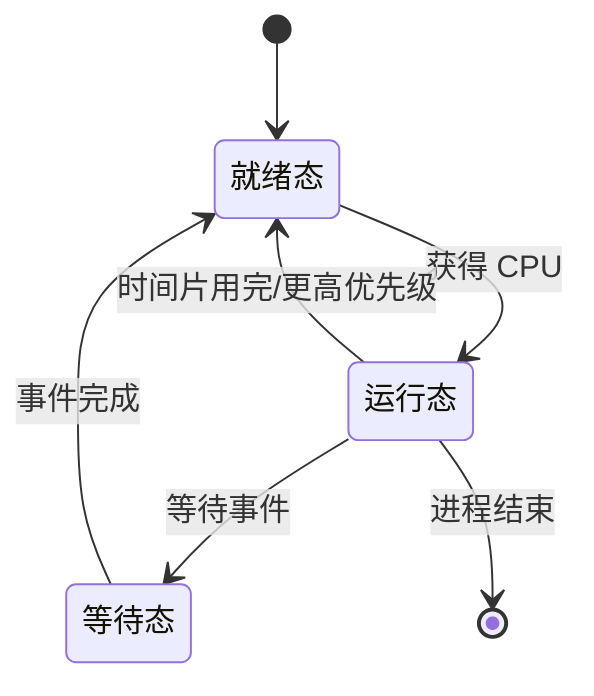

# 前言
本文不是LINUX操作系统的复习,请不要和LINUX操作系统弄混了,两者侧重点不同,LINUX操作系统讲的是具体的X86 Linux Kernel 2.*版本下的LINUX操作系统对应的内存管理 文件管理 中断管理,而本文更侧重操作系统中一些具体的名词解释

# 练习题

## 操作系统引论
### 选择题
1．以下_______操作系统中的技术是用“时间”来换取“空间”的。

**A．	虚拟存储器**  B．缓冲技术  C．SPOOLing技术  D．快表
* 虚拟存储器利用磁盘空间来扩充内存容量,运行程序来使用比物理内存空间更大的地址空间,当程序需要访问不在物理内存中的数据时，操作系统会将部分内存数据交换到磁盘(Swaped)，并将所需数据从磁盘加载到内存中。这种“页面调度”操作需要时间，但它允许运行需要更大内存的程序，有效地用“时间”换取了“空间”。
* 缓冲技术利用内存空间来存储临时数据,以减少对于较慢设备的访问次数.主要通过减少IO操作来提高性能
* SPOOLing技术 利用磁盘空间来缓冲对慢速外设（如打印机）的输入/输出操作。它主要用于提高效率和并行性，而不是用时间换空间。
* 快表 是一种特殊的缓存(Cache)，用于加速地址转换。它使用内存空间来存储最近使用的页面表项，从而减少访问内存中完整页面表的时间。它主要用于提高性能，而不是用时间换空间。

2．设计实时操作系统必须首先考虑系统的_______。

A．效率  B．可移植性  **C．可靠性**   D．使用的方便性

* 实时操作系统 (RTOS) 的主要特点是能够在确定的时间内对事件做出响应。 这对于许多应用来说至关重要，例如工业控制系统、医疗设备和航空电子设备，因为在这些应用中，延迟或错误可能会导致严重的后果。

3．一个作业第一次执行时用了5MIN,而第二次执行时用了6MIN，这说明了操作系统的_______特点。

A．并发性  B．共享性  C．虚拟性  **D．不确定性**

* 操作系统的不确定性是指系统的性能和行为可能会受到各种因素的影响，例如系统负载、资源竞争和外部事件，从而导致执行时间和资源使用情况的波动。前后两次执行时间不一样,很可能是因为第二次执行时吃不到资源.

4．下述操作系统类型中，哪个操作系统一定是由多台计算机组成的系统？

A．实时  B．批处理  C．分时  **D．分布式**

* 分布式操作系统的设计目标是管理多台独立的计算机，并使它们作为一个单一的系统协同工作。这些计算机通过网络连接，共享资源并协同完成任务。

5．操作系统中，以下_______采用了以“空间”换取“时间”的技术。

A．中断技术 **B.缓冲技术**  C．通道技术  D。虚拟存储技术

* 以“空间”换取“时间”: 虚拟存储技术使用更大的磁盘空间（“空间”）来弥补物理内存的不足，从而避免了程序因内存不足而频繁地进行数据交换，提高了程序的运行速度（“时间”）。

6．按照所起的作用和需要的运行环境，操作系统属于_______。

A支撑软件 B．用户软件  C．应用软件 **D．系统软件**

* 系统软件: 系统软件是管理和控制计算机硬件，并为应用软件提供运行环境的软件。操作系统是系统软件的核心，它负责管理计算机的资源（如CPU、内存、外设等），并为用户提供各种服务。

7．操作系统的主要功能是存储器管理、设备管理、文件管理、用户接口和_______。

**A．进程管理** B．用户管理 C．信息管理 D．操作系统管理

* 没啥 好说的 忘记的话去看书

8．操作系统的最基本的两个特征是资源共享和_______。

A．多道程序设计 **B．程序的并发执行** C．中断  D．程序顺序执行

* 并发性和共享性是操作系统的两个最基本的特征
* 操作系统的基本特征:并发性、共享性、虚拟性、异步性。

9．采用多道程序设计技术可以提高CPU和外部设备的_______。

A．稳定性 B．可靠性  **C．利用率** D．兼容性

* 多道程序设计: 允许多个程序同时加载到内存中，并允许CPU交替地执行这些程序的指令。 当一个程序在等待I/O操作完成或其他资源时，CPU可以切换到另一个程序执行，从而避免了CPU的空闲等待，提高了CPU的利用率。 同样，外部设备也可以被多个程序交替使用，提高了外部设备的利用率。

10．在计算机系统中，操作系统是_______。

**A．处于裸机之上的第一层软件** B．处于硬件之下的低层软件 C．处于应用软件之上的系统软件 D．处于系统软件之上的用户软件

* 裸机: 指没有安装任何软件的计算机硬件系统。
* 操作系统: 是管理和控制计算机硬件与软件资源的程序，是用户和计算机硬件之间的桥梁。它直接运行在裸机之上，为应用程序提供运行环境，并管理计算机系统的各种资源。

11．操作系统是对_______进行管理的软件。

A．软件 B。硬件 **C．计算机资源** D．程序

* 操作系统的五大主要功能 里面有处理机管理,存储器管理,文件管理,设备管理,用户接口,基本都是管理类的

12．从用户的观点，操作系统是_______。

A．用户与计算机之间的接口B．控制和管理计算机资源的软件C．合理的组织计算机工作流程的软件**D．是扩充裸机功能的软件，是比裸机功能更强、使用方便的虚拟机。**

* 比裸机功能更强、使用方便的虚拟机: 操作系统将底层硬件抽象成一个虚拟的机器，为用户提供了统一的接口和操作方式，使得用户无需关心具体的硬件细节。

13．操作系统的基本类型是_______。
A．批处理系统、分时系统和多任务系统
**B．实时系统、分时系统和批处理系统**
C．单用户系统、多用户系统和批处理系统
D．实时系统、分时系统和多用户系统

* 没啥好说的 

14．为了使系统中的所有用户都得到及时的响应，操作系统应该是_______。

**A．实时系统**  B．批处理系统 C．分时系统  D．网络系统
 
* 实时操作系统(real time operating system)是指当数据或事件产生时，能够接受并以足够快的速度处理，其处理的结果又能在规定的时间内来控制生产过程或对处理系统做出快速响应，并控制所有实时任务协调一致运行的操作系。提供及时响应和高可靠性是其特点。

15．如果分时系统的时间片一定，那么_______会使响应时间越长。

A．用户数越少 **B．用户数越**多 C．内存越少  D．内存越多

* 在分时系统中，时间片是固定的。用户越多，每个用户获得的时间片就越短，因此响应时间就会越长。

16_______类型的操作系统允许在一台主机上同时连接多台终端，多个用户可以通过多台终端同时交互地使用计算机。

A．实时系统  B．批处理系统 **C．分时系统** D．网络系统

17_______类型的操作系统允许用户把多个作业同时提交给计算机。

A．实时系统  **B．批处理系统** C．分时系统 D．网络系统

18、在_______操作系统的控制下计算机系统能及时处理由过程控制反馈的数据并做出及时响应。

**A．实时系统** B．批处理系统  C．分时系统  D．网络系统

19．一个计算机系统采用多道程序设计技术后，使多道程序实现了_______。

A．微观上并行 B．微观和宏观上均串行
**C．宏观上并行** D．微观和宏观上均并行

20．用户程序要将一个字符送到显示器上显示，要使用操作系统提供的_______。

A．用户接口 B．函数  C．原语  **D．系统调用**

### 二．判断题

1. **( × )  自从有了计算机，就有了操作系统。** 
   * 解释:  早期的计算机并没有操作系统，程序员需要直接与硬件打交道。直到20世纪50年代中期，为了提高计算机的利用效率，才出现了早期的操作系统。

2. **( √ ) 多道程序设计技术引入后，不仅使得CPU与外设的工作可以并行，也使得设备与设备之间的工作可以并行。**
   * 解释: 在该系统中，用户所提交的作业都先存放在外存上并排成一个队列，称为”后备队列“；然后，由作业调度程序按一定的算法从后备队列中选择若干个作业调入内存，使他们共享CPU和系统中的各项资源。

3. **( √ ) SPOOLing技术是用“空间”换取“时间”。**
   * 解释: SPOOLing技术利用磁盘空间来缓冲输入输出数据，使得CPU与外设能够并行工作，从而缩短作业的执行时间。

4. **( × ) 操作系统是用来管理计算机软件的一种软件。**
   * 解释: 操作系统不仅管理软件，更重要的是管理计算机的硬件资源，为用户程序提供一个方便易用的平台。

5. **( × )  多道程序设计就是多个程序在某一时刻同时运行。**
   * 解释:  多道程序设计允许多个程序同时进入内存，并发执行，但在单CPU系统中，每个时刻只有一个程序真正运行。

6. **( √ )  多道程序设计技术将一台物理CPU虚拟为多台逻辑的CPU；SPOOLing技术将一台物理上的I/O设备虚拟为多台逻辑上的I/O设备。**
   * 解释:  这两项技术都属于虚拟技术，通过虚拟化技术，可以提高资源的利用率。

7. **( √ )  顺序执行的程序具有可再现性。**
   * 解释:  顺序执行的程序每次执行的结果都是相同的，因为程序的执行顺序是固定的。

8. **( √ )  多道程序的引入主要是为了提高CPU的利用率。**
   * 解释:  在单道程序环境下，CPU经常处于等待I/O操作完成的状态，而多道程序可以充分利用CPU的空闲时间。

9. **( × )  操作系统是一种通用软件。**
   * 解释:  操作系统属于系统软件，而不是通用软件。通用软件是指能够满足各种用户需求的软件，例如办公软件、游戏软件等。

10. **( × )  操作系统是管理程序的软件。**
   * 解释: 操作系统不仅管理程序，更重要的是管理计算机的硬件资源，为用户程序提供一个方便易用的平台。

### 三．填空题
1．计算机系统是由_______和______两部分组成的。

* 硬件 软件

2．采用多道程序设计技术能够充分发挥_______和_______并行工作的能力。

* CPU 外设

3．多道程序环境下的各道程序，宏观上它们是在_______运行，微观上它们是在_______运行。

* 并行 串行(交替)

4． _______和共享是操作系统的两个最基本的特征，两者之间互为存在条件。

* 并发

5．顺序执行的程序，具有_______性、_______性和可再现性。

* 顺序 封闭 

6．操作系统功能包括_______管理、_______管理、_______管理、_______管理，除此之外，操作系统还为用户使用计算机提供了用户接口。

* 处理机管理 存储器管理 文件管理 设备管理

7．批处理系统按内存中同时存放的运行程序的数目可分为_______和_______。

* 单道批处理程序 多道批处理程序

8．分时系统的主要特征有_______、_______、_______和及时性。

* 多路性 独立性 交互性

9．实时系统分为两种类型：_______和_______。

* 实时信息处理系统  实时控制系统

10_______是衡量分时系统性能的一项重要指标。

* 响应时间

11_______系统不允许用户干预自己的程序。

* 批处理

12．采用批处理系统，用户提交作业前必须使用_______编写_______，以指出作业加工的步骤。

* 作业控制语言(Job Control Language) 作业说明书

13．操作系统为程序员提供的是_______，为一般用户提供的是_______。

* 程序接口(系统调用) 命令接口

14．在操作系统的发展过程中，_______和_______的出现，标志着操作系统的正式形成。

* 多道 分时

15．如果一个系统在用户提交作业后，不提供交互能力，则属于_______类型；如果一个系统可靠性很强，时间响应及时且具有交互能力，则属于_______类型；如果一个系统具有很强的交互性，可同时供多个用户使用，时间相应比较及时，则属于_______类型。

* 批处理系统 实时系统 分时系统  

## 进程与线程 

### 选择题
1.并发执行的程序具有________特征。

A.顺序性 B.封闭性 C.可再现性 **D.间断性**

* 对于并发来说，宏观上似乎同一时刻在进行多个进程，实际上同一时刻仍只能进行同一进程(微观上)。特征：间断性.失去封闭性：多个程序共享系统中的各种资源，会使程序的运行受到其他程序的影响.不可再现性：由于失去了封闭性，两个进程以不同的速度运行，可能出现很多不同的情况。

2.在操作系统中，要想读取文件中的数据，通过什么来实现？

**A.系统调用** B.原语  C.文件共享 D.中断

* 系统调用是用户程序和操作系统内核之间的接口。当用户程序需要访问操作系统提供的服务（例如读取文件）时，就需要使用系统调用。操作系统内核会提供相应的系统调用函数，用户程序可以通过调用这些函数来实现对文件系统的访问。

3.在进程状态转换图中，________是不可能的。

A.运行态→就绪态  B.运行态→等待态
**C. 等待态→运行态**  D.等待态→就绪态

* 看图说话 等待/阻塞态不可能直接到运行态,必须转到就绪态后才能继续操作

4.操作系统对进程进行管理与控制的基本数据结构是________。

A.JCB   **B.PCB**   C.PMT  D.DCT

* PCB（Process Control Block，进程控制块） 是操作系统用于管理和控制进程运行的基本数据结构。每个进程都有一个 PCB，其中包含了操作系统调度和管理该进程所需的所有信息，例如：进程标识符 (PID)进程状态、程序计数器、 CPU 寄存器状态、内存管理信息顿号打开文件列表...

5.一个进程当前处于等待状态，则________。

A.它可以被调度而获得处理机
**B.当I/O完成后，它将变成就绪状态**
C.它永远不会被执行
D.它可能变成就绪状态，也可能直接获得处理机

* 进程处于等待状态，表示它正在等待某个事件的发生（例如 I/O 操作完成），而无法继续执行。在事件发生之前，进程无法被调度运行，也不会永远停滞。当等待的事件完成后，进程会从等待状态转换到就绪状态，等待被 CPU 调度执行。

6．进程和程序的本质区别是________。

**A.动态或静态** B.分时使用或独占计算机资源
C.顺序或非顺序的执行其指令 D.存储在内存和外存

* 进程!=程序，程序是静态的，而进程是动态的。

| 特性 | 进程 | 程序 |
|---|---|---|
| 状态 | 动态 | 静态 |
| 执行 | 并发 | 顺序 |
| 生命周期 | 暂时 | 永久 | 

 

7.进程和线程的区别是________。

A.大小不同  B.独立调度的单位
**C.是否拥有资源**  D.对应的分别是程序和过程

* 进程是资源分配的基本单位，拥有独立的地址空间和其他资源（如文件描述符、信号处理程序）。
* 线程是调度的基本单位，共享所属进程的资源，包括地址空间、打开的文件等。

| 特性 | 进程 | 线程 |
|---|---|---|
| 调度性 | 传统操作系统中作为独立分派、调度的基本单位。 | 引入线程的操作系统中独立分派、调度的基本单位，而进程则作为资源拥有的基本单位。 |
| 并发性 | 进程之间可以并发执行，但若没有引入线程，当进程阻塞时，整个进程都无法完成其他任务。 | 线程之间同样可以并发执行，进程的一个线程阻塞，其他线程仍可提供服务。 |
| 拥有资源 | 是系统中拥有资源的一个基本单位。 | 虽然拥有一点关键资源，但不算拥有资源的单位。共享进程的资源。 |
| 系统开销 | 创建或撤销进程时系统需要为之创建和回收PCB，分配或回收资源。 | 远小于进程的开销，线程的切换也仅需保存和设置少量寄存器内容。同一个线程中的进程共享地址空间，因此同步和通信也较为容易。 | 

8.建立进程就是________。

A.建立进程的目标程序  **B.为其建立进程控制块**
C.将进程挂起   D.建立进程及其子孙的进程控制块

* 创建进程的核心操作就是创建对应的PCB。操作系统根据PCB对进程进行调度和管理。

9.对进程的管理和控制使用________。

A.指令  **B.原语**  C.信号量  D.信箱通信

* 原语 (Primitive) 是操作系统提供的一种不可分割的操作，其执行过程不允许中断。原语通常用于实现对资源的访问和管理，例如进程的创建、销毁、阻塞、唤醒等。

10．下面对进程的描述，错误的是________。

A.进程是一个动态的概念 B.进程的执行需要处理机
C.进程是有生命期的  **D.进程是指令的集合**

* 进程是程序的一次执行过程，而不仅仅是指令的集合。 进程包含了程序代码、数据、堆栈以及操作系统为其分配的各种资源，是一个动态的概念。

11.多道程序环境中，操作系统分配资源是以________为单位。

A.程序 B.指令 **C.进程** D.作业

* 进程是资源分配的基本单位， 操作系统会为每个进程分配独立的内存空间、CPU时间片等资源，以保证进程能够独立运行。

12.并发程序失去了封闭性是指________。

A.多个相对独立的进程以各自的速度向前推进
B.并发进程执行时，在不同时刻发生的错误
C.并发进程执行结果与速度无关
**D.并发进程共享变量，其执行结果与速度有关**

* 并发程序失去封闭性的主要原因是共享变量的访问没有进行合理的同步控制，导致进程的执行结果受到其他进程执行速度的影响。

13.下面关于进程的描述，________不正确。
**A.进程是多道程序环境中的一个程序**
B.进程由程序、数据、栈和PCB组成
C.线程是一种特殊的进程
D.进程是程序在一个数据集合上的执行过程，它是系统进行资源分配的单位

* 进程是程序的一次执行过程，而不是程序本身。 在多道程序环境下，多个进程可以并发执行同一个程序，每个进程拥有自己独立的执行状态和资源。

14.当一个进程处于________状态时，不属于等待状态。

A.进程正等待着输入一批数据
B.进程正等待着打印输出
C.进程正等待着另一个进程发来的消息
**D.进程正等待着给它一个时间片**

* D算是就绪状态

15.以下关于进程的说法，________正确。

A.进程就是程序，它是程序的另一种叫法。
B.进程被创建后，在它消亡之前，任何时刻总是处于运行、就绪或阻塞三种状态之一
**C.多个不同的进程可以包含相同的程序**
D.两个进程可以同时处于运行状态

* 人们可以开启多个浏览器

16.进程的并发执行是指若干个进程________。

A.同时执行  **B.在执行时间上是重叠的**
C.在执行时间上是不重叠的  D.共享系统资源

* 进程的并发执行指的是多个进程在时间段上重叠执行，这意味着它们可能在宏观上看起来是“同时”进行的，但在微观上，CPU 资源可能在不同进程间快速切换。

17.进程是一个具有一定独立功能的程序在其数据集合上的一次________。

A.等待活动 **B.运行活动** C.单独活动  D.关联操作

* 进程的定义强调它是程序的动态执行过程，而不仅仅是程序代码本身。因此，进程是程序在其数据集合上的一次运行活动。

18.以下进程控制块中的四项内容，________主要是由处理机各种寄存器中的内容组成的。

A.进程标识信息   B.进程调度信息
C.进程控制信息    **D.处理机状态信息**

* 处理机状态信息 记录了进程在CPU上执行时的状态，包括程序计数器、累加器、状态寄存器等内容，这些信息都存储在CPU的寄存器中。

19.以下四项内容，________不是进程创建过程所必需的。

**A.为进程分配CPU**  B.建立进程控制块
C.为进程分配内存    D.将进程链入就绪队列

* 进程创建时，只需要为其分配必要的资源并使其具备运行条件，而不必立即获得CPU开始执行。进程创建后，通常会被放入就绪队列，等待调度程序分配CPU。

20.一个进程被唤醒意味着________。

A.进程重新得到CPU  **B.进程变为就绪状态**
C.进程的优先级变为最大 D.将进程移至等待队列首部

* 进程被唤醒是指它从阻塞状态转变为就绪状态，等待被调度程序选中并分配CPU。

21.在单处理机系统中有n(n＞2)个进程，________情况不可能发生。

A.没有进程运行，没有就绪进程，N个等待进程
B.有1个进程运行，没有就绪进程，N-1个等待进程
**C.有2个进程运行，有1个就绪进程，N-3个等待进程**
D.有1个进程运行，有N-1个就绪进程，没有等待进程

* 单处理机系统同一时刻只能有一个进程占用CPU运行，所以不可能出现2个进程同时运行的情况。

22.在单处理机系统实现并发后，以下说法________正确。

A.各进程在某一时刻并行运行，CPU与外设之间并行工作
B.各进程在某一时间段并行运行，CPU与外设之间串行工作
**C.各进程在某一时间段并行运行，CPU与外设之间并行工作**
D.各进程在某一时刻并行运行，CPU与外设之间串行工作

* 单处理机系统中，进程并发执行是通过CPU快速切换进程实现的，宏观上看像多个进程同时执行，但微观上CPU在不同进程间快速切换。
* CPU与外设可以并行工作，例如CPU向打印机发送打印指令后，可以继续执行其他任务，而打印机则独立完成打印工作

23.进程的数目主要受________的限制

**A.CPU速度** B.用户数目  C.终端数目  D.打开文件数目

* 进程数量主要受 系统资源 的限制，CPU 速度是其中一个方面。

24________必定引起进程切换。

A.一个进程被创建 **B.一个进程变为等待状态**
C.一个进程变为就绪状态   D.一个进程被撤销

* 当一个进程需要等待某个事件（例如 I/O 操作完成、信号量获取）才能继续执行时，它会从运行状态变为等待状态。此时，操作系统必须进行进程切换，将 CPU 资源分配给其他可运行的进程。

25.________不是线程的实现方式。

A.用户级线程  B.内核级线程  C.用户级线程与内核级线程组合的方式
**D．轻量级线程**

* 轻量级进程（Lightweight Process，LWP）是内核支持的线程机制，有时也被称为内核线程，它是线程的一种实现方式，而不是与线程并列的概念。

### 判断题
1.用户态和核心态是由操作系统设定的。（    ）
* F 用户态和核心态是由 CPU 硬件设定的，操作系统只是利用这种机制来管理系统资源和保护系统安全。

2.只有处在阻塞状态的进程才可能被挂起。（    ）

* F 就绪态的进程也可能被挂起 

3.进程控制块是进程存在的唯一标识。（    ）

* T PCB记录了进程的所有信息,操作系统通过PCB来管理和控制进程

4.线程所占有的存储空间一定比进程小。（    ）

* F 谷歌浏览器的网页渲染线程比大多数程序要的存储空间要大

5.不同进程所执行的程序必定不同。（    ）

* F,多个用户可能打开同一个浏览器

6．并发执行的程序具有可再现性。（    ）

* F 并发的程序具有不可再现性,只有顺序执行的程序才具有可再现性

7.原语在执行时不能被中断。（    ）

* T 原语是操作系统内核中不可分割的一部分

8.任一时刻，若有执行状态的进程，就一定有就绪状态的进程。（    ）

* F 单核系统 就一个进程在跑 阁下又改如何应对呢

9.进程既是拥有资源的单位，又是独立调度和分派的单位。（    ）

* F 虽然进程是资源分配的基本单位，但 独立调度和分派的单位是线程，而不是进程。

10.特权指令只能在核心态下运行，而不能在用户态下执行。（    ）

* T 为了安全起见 特权指令只能在核心态执行 

11.创建原语用来创建一个新进程，并将此新进程投入等待队列。（    ）

* F 原语创建会将进程加入就绪队列 而不是等待队列

12．进程是一段独立的程序。（    ）

* F 进程是动态的 程序是静态的 两者不等价

13.操作系统对进程的管理和控制主要是通过PCB来实现的。（    ）

* T PCB是操作系统管理进程的唯一根据

14.并发是指若干事件在不同时刻发生。（    ）

* F 并发是指在同一时刻内发生

15.一个程序在执行过程中可能产生多个进程。（    ）

* T 打开两个浏览器程序

16.进程获得处理机而运行是自己能决定的。（    ）

* F 进程获得CPU资源是由操作系统的调度实现的

17.线程无论采用什么方式实现，同一进程内或不同进程的线程都可以并发执行。（    ）
* F 同一进程内的线程可以并发执行。不同进程的线程不一定能够并发执行，需要满足操作系统支持和线程同步机制的要求。

### 填空题
1.	计算机处于________态时，不能执行特权指令。

* 用户

2.	单道程序执行时，具有________、________和可再现性的特点。

* 顺序性 封闭性

3.	多道程序执行时，具有间断性，将失去________和________的特点。

* 封闭性 可再现性

4.	进程的三种基本状态是________、________和________。

* 就绪态 执行态 阻塞态

5.	判断一个进程是否处于挂起状态，要看该进程是否在________，挂起状态又分为________和________。

* 内存 阻塞挂起 就绪挂起

6.	进程映像通常由________、________、________和PCB这四部份组成。

* 代码 数据 栈

7.	通常将处理机的执行状态分成________和________。

* 用户态 系统态

8.	根据线程的切换是否依赖于内核把线程分成________和________。

* 用户态线程 内核级线程

9.	进程是一个________的概念，而程序是一个________的概念。

* 动态 静态

## 进程同步
### 选择题
1.以下________操作系统中的技术是用来解决进程同步的。

A.管道  B.管程  C.通道  D.DMA

2.以下________不是操作系统的进程通信手段。

A.管道 B.原语 C.套接字  D.文件映射

3.如果有三个进程共享同一程序段，而且每次最多允许两个进程进入该程序段，则信号量的初值应设置为________。

A.3  B.2  C.1  D.0

4.下面有关进程的描述，________是正确的。

A.进程执行的相对速度不能由进程自己来控制
B.进程利用信号量的P、V操作可以交换大量的信息
C.并发进程在访问共享资源时，不可能出现与时间有关的错误
D.P、V操作不是原语操作

5.信号可以用来实现进程之间的________

A.调度  B.同步与互斥  C.同步  D.互斥

6.对于两个并发进程都想进入临界区，设互斥信号量为S,若某时S=0，表示________。

A.没有进程进入临界区
B.有1个进程进入了临界区
C.有2个进程进入了临界区
D.有1个进程进入了临界区并且另一个进程正等待进入

7.信箱通信是一种________方式。

A.直接通信 B.间接通信 C.低级通信  D.信号量

8.以下关于临界区的说法，________是正确的。

A.对于临界区，最重要的是判断哪个进程先进入
B.若进程A已进入临界区，而进程B的优先级高于进程A，则进程B可以打断进程A而自己进入临界区
C.信号量的初值非负，在其上只能做P、V操作
D.两个互斥进程在临界区内，对共享变量的操作是相同的

9.并发是指________。

A.可平行执行的进程   B.可先后执行的进程  C.可同时执行的进程  D.不可中断的进程

10.临界区是________。

A.一个缓冲区  B.一段数据区  C.一段程序  D.栈

11.进程在处理机上执行，它们的关系是________。

A.进程之间无关，系统是封闭的
B.进程之间相互依赖、相互制约
C.进程之间可能有关，也可能无关
D．以上都不对

12.在单处理机中，如果系统中有N个进程，则就绪队列中的进程个数最多的是________。

A.1个   B.N+1  C.N个  D.N-1个

13.对临界区的正确论述是________。

A.临界区是指进程中用于实现进程互斥的那段代码
B.临界区是指进程中用于实现进程同步的那段代码
C.临界区是指进程中用于实现进程通信的那段代码
D.临界区是指进程中访问临界资源的那段代码

14.________不是进程之间的通信方式。

A.过程调用  B.消息传递  C.共享存储器  D.信箱通信

15.同步是指进程之间逻辑上的________关系。

A.制约  B.调用  C.联接  D.排斥

16.在单处理机中，如果系统中有N个进程，则等待队列中的进程个数最多的是________。

A.1个  B.N+1个  C.N个  D.N-1个

17.在单处理机中，如果系统中有N个进程，则运行队列中的进程个数最多的是________。

A.1个 B.N+1个  C.N个  D.N-1个

### 判断题
1．信号量是解决进程同步与互斥问题的唯一手段。 （     ）

2.进程A、B共享资源X，需要互斥执行，进程B、C共享资源Y，也需要互斥执行，因此进程A、C必须互斥执行。（     ）

3.信号只能描述进程之间的同步关系。 （     ）

4.P、V操作中信号量的值永远代表着某类可用资源的数量。（     ）

5.一个进程正在临界区中执行时不能被中断。（     ）

6.对临界区应采用互斥访问的方式来实现共享。（     ）

7.P、V操作既可以用来实现进程之间的同步，也可以实现互斥。（     ）

8.进程的互斥是关于进程怎样使用共享资源的问题，因此只要系统中有空闲的共享资源，系统就不会有阻塞的进程。（     ）

9.一个临界资源可以对应多个临界区。（     ）

10.所有的共享资源都是临界资源。（     ）

11.P、V操作是用原语实现的。（     ）

12.进入管程的互斥是由编译程序实现的。（     ）

13.管程中使用条件变量来实现同步。（     ）

14.管程中的条件变量可以在管程外部对它进行访问。（     ）

15.信号量是一种高级进程通信方式，消息队列是一种低级进程通信方式。（     ）

### 填空题

1. 在利用信号量实现互斥时，应将________置于________和________之间。

2. 在实现了用户级线程的系统中，CPU调度的对象是________；在实现了内核级线程的系统中，CPU调度的对象是________。

3. 在一个单处理机系统中，若有6个用户进程，且假设当前时刻为用户态，则处于就绪队列的进程最多有________个，最少有________个。

4. 对信号量的操作，只能是________操作和________操作，________操作相当于进程申请资源，________操作相当于进程释放资源。如果________操作使用不当，可能导致系统死锁。

5. 在多道程序环境中，进程之间存在的相互制约关系可以分为两种，即________和________。其中________是指进程之间使用共享资源时的相互约束关系，而________是指进程之间的相互协作、相互配合关系。

6. 并发进程中涉及相同变量的程序段叫做________，对这段程序要________执行。

7. 为实现消息通信，应有________和________两条基本原语。

8. 对信号量S的P操作定义中，使进程进入等待队列的条件是________；V操作定义中，唤醒进程的条件是________。

9. 管程由三部分组成________、________、对共享变量的初始化。

10. 高级通信机制可分为三大类：________、________和信号量。

## 死锁
### 选择题

1.预防死锁不可以去掉以下________条件。

A.互斥  B.持有等待 C.不可抢占  D.环路

2.设有4个作业同时到达，每个作业的执行时间是2min，它们在一台处理机上按单道方式运行，则平均周转时间为________。

A. 1min   B. 5min  C. 2.5min  D. 8min

3.若系统中有8台绘图仪，有多个进程均需要使用两台，规定每个进程一次仅允许申请一台，则至多允许多少个进程参于竞争，而不会发生死锁________。

A.5  B.6  C.7  D.8

4.设有三个作业A,B,C，它们到达时间和执行时间如下表1所示。

| 作业名 | 到达时间 | 执行时间 |
|---|---|---|
| A | 8:00 | 2小时 |
| B | 8:00 | 1小时 |
| C | 8:30 | 0.25小时 | 

它们在一台处理器上按单道运行并采用短任务优先调度算法，则三个作业的执行次序是________。
A.A,B,C   B.B,C,A    C.C,B,A    D.B,A,C

5.设有12个同类资源可供四个进程共享，资源分配情况如下表2所示。

| 进程 | 已占用资源数 | 最大需求数 |
|---|---|---|
| A | 2 | 5 |
| B | 3 | 5 |
| C | 4 | 7 |
| D | 1 | 4 | 

目前剩余资源数为2.当进程A,B,C, D又都相继提出申请要求，为使系统不致死锁，应先满足________进程的要求。

A.A        B.B           C. C            D.D

6.产生系统死锁的原因可能是________。

A.一个进程进入死循环   B.多个进程竞争资源出现了循环等待
C.进程释放资源    D.多个进程竞争共享型设备

7.以下________方法可以解除死锁。

A.挂起进程  B.剥夺资源   C.提高进程优先级  D.降低进程优先级

8.采用有序分配资源的策略可以破坏产生死锁的________。

A.互斥条件     B.请求与保持条件  C.不可剥夺条件  D.环路条件 

9.预防死锁可以从破坏死锁的四个必要条件入手，但破坏________不太可能。

A.互斥条件   B.请求与保持条件  C.不可剥夺条件 D.环路条件

10.以下解决死锁的方法中，属于预防策略的是________。

A.化简资源分配图  B.银行家算法 C.资源的有序分配  D.死锁检测法

11.下面________说法是对可抢占系统的正确描述。

A.时间片轮转法是一种可抢占式调度
B.进程因等待某一事件而引起系统调度是一种可抢占式调度
C.实时系统采用可抢占式调度
D.优先级低的进程放弃CPU，让优先级高的进程运行

12.以下关于调度的说法________正确。

A.进程通过调度得到CPU
B.优先级是进程调度的主要依据，一旦确定就不能改变
C.在单CPU的系统中，任何时刻都有一个进程处于运行状态
D.进程申请CPU得不到时，其状态为阻塞

13.作业从提交到完成的时间间隔称为作业的________。

A.周转时间  B.响应时间  C.等待时间  D.运行时间

14.下述________调度算法要事先估计进程的运行时间。

A.响应比高者优先  B.短进程优先 C.优先级调度  D.先来先服务

15.如果所有进程同时到达，下述________算法使进程的平均周转时间最短。

A.响应比高者优先  B.短进程优先 C.优先级调度  D.先来先服务

16.下述_________调度算法有利于CPU繁忙的进程，而不利于I/O繁忙的进程。

A.时间片轮转  B.短进程优先 C.优先级调度  D.先来先服务

17.下述_________调度算法适用于分时系统。

A.时间片轮转  B.短进程优先 C.优先级调度  D.先来先服务

18.下面选择调度算法的准则中不正确的是________。

A.尽快响应交互式用户的请求  B.尽量提高处理机的利用率
C.尽可能提高系统的吞吐量    D.尽量增加进程的等待时间

19.以下关于死锁的叙述，________是正确的。

A.死锁的产生只与资源的分配策略有关
B.死锁的产生只与并发进程的执行速度有关
C.死锁是一种僵持状态，发生时系统中任何进程都无法继续执行
D.竞争互斥资源是进程产生死锁的根本原因

20.以下关于优先级设定的说法，________正确。

A.用户进程的优先级应高于系统进程的优先级
B.资源要求多的进程优先级应高于资源要求少的进程的优先级
C.随着进程的执行时间的增加，进程的优先级应降低
D.随着进程的执行时间的增加，进程的优先级应提高

21.以下关于安全状态的说法，________正确。

A.安全状态是没有死锁的，非安全状态是有死锁的状态
B.安全状态是可能有死锁的状态，非安全状态也是可能有死锁的状态
C.安全状态是可能没有死锁的状态，非安全状态是有死锁的状态
D.安全状态是没有死锁的状态，非安全状态是可能有死锁的状态

22.关于死锁的现象，描述正确的是________。

A.多个进程共享某一资源
B.多个进程竞争某一资源
C.每个进程等待着某个不可能得到的资源
D.每个进程等待着某个可能得到的资源

### 判断题

1.死锁只发生在相互竞争资源的进程之间。（    ）

2.银行家算法是一种检测死锁的算法。（    ）

3.死锁的发生不仅与资源分配策略有关，还与并发进程的执行速度有关。（    ）

4.对系统资源分配图进行简化，可以检测死锁。（    ）

5.死锁是指系统中所有进程都处于阻塞状态。（    ）

6.当系统处于不安全状态时，就一定会产生死锁。（    ）

7.当进程调度程序未能选中一个进程时，就绪队列和阻塞队列一定为空。（    ）

8.当进程调度程序未能选中一个进程时，就绪队列一定为空。（    ）

9.死锁就是循环等待。（    ）

10.不存在只涉及一个进程的死锁。（    ）

11.在分时系统中，当用户数一定时，影响响应时间的主要因素是时间片。（    ）

12.多级反馈队列属于不可抢占调度算法，只有一个进程运行完毕时，其他进程才可运行。（    ）

13.死锁是多个进程之间竞争资源或彼此通信而引起的一种临时性的阻塞现象。（    ）

14.在引入了线程的系统中，进程调度程序负责将CPU分配给进程。（    ）

15.当进程数大于资源数时，进程竞争资源也不一定会产生死锁。（    ）

### 填空题
1. 产生死锁的原因是______和______。

2. 资源预先静态分配方法和资源有序分配方法分别破坏了产生死锁的______条件和______条件。

3. 解决死锁通常采用预防、避免、检测和解除等方法，其中银行家算法属于______，资源的有序分配属于______，抢占资源属于______。

4. ______调度是高级调度，______调度是中级调度，______调度室低级调度。

5. 在有N个进程的系统中，死锁进程个数K应满足的条件是______。

6. 产生死锁的四个必要条件是______、______、______和环路条件。

7. 在银行算法中，当一个进程提出资源请求将导致系统从______进入______时，系统就拒绝它的资源请求。

8. 在______算法中，系统按照进程进入就绪队列的先后次序来分配CPU。

9. 死锁是一个系统中多个______，无限期的等待永远不会发生的条件。

10. 判断资源分配图是否可以简化是______死锁的方法。

## 内存管理
### 选择题

1.以下_____不是段式存储管理系统的优点.

A.	方便编程   B.方便内存管理
C.	方便程序共享 D. 方便对程序保护

2.在可变分区分配方案中,最佳适应法是将空闲块按_____次序排序的
A.	地址递增 B. 地址递减
C.	大小递增 D. 大小递减

3. 在分区存储管理方式中,如果在按地址升序排列的未分配分区表中顺序登记了下列未分配分区:1—起始地址17K,分区长度为9KB;2—起始地址54KB,分区长度13KB,现有一个分区被释放,其起始地址为39KB,分区长度为15KB,则系统要________.

A. 合并第一个未分配分区   B. 合并第一个及第二个未分配分区
C. 合并第二个未分配分区   C. 不合并任何分区

4.下列存储管理方案中,_______不存在碎片问题.

A. 可变分区管理   B. 段式管理
C. 可重定位分区管理   D.段页式管理

5.固定分区存储管理中,处理器需设置下面________寄存器以保证作业在所在分区内运行.

A. 变址     B. 基址与界限   C. 段长   D. 空闲区

6.在固定分区存储管理中,每个分区的大小是_______.

A.相同     B.随进程的大小变化  C.可以不同,需预定设定 D.可以不同,根据进程的大小设定

7.在可变分区中存储管理中,合并分区的目的是_______.

A.合并空闲区  B.合并分区  C.增加内存容量  D.便于地址变换

8.在页式存储管理中,分页是由_______完成的.

A.程序员      B.硬件     C.编译程序    D.都不对

9.在段式存储管理中,分段是由以下______完成的.

A.程序员      B.硬件      C.编译程序   D.都不对

10.某系统采用基址、界限寄存器的方法来保护进程的存储信息,判断是否越界的公式为_____

   A.0≤被访问的逻辑地址＜界限寄存器的内容
   B.0≤被访问的逻辑地址≤界限寄存器的内容
   C.0≤被访问的物理地址＜界限寄存器的内容
   D.0≤被访问的物理地址≤界限寄存器的内容

11.在段式存储管理系统中,若程序的逻辑地址用24位表示,其中8位表示段号,则每个段的最大长度是______.

   A.28                  
   B.216
   C.224
   D.232

12.把程序地址空间中的逻辑地址转换为内存的物理地址称为______.

  A.加载   B.重定位  C.物理化  D.链接

13.在以下存储管理方案中,不适用于多道程序设计系统的是______.

  A.固定位置  B.固定分区  C.可变分区   D.页式存储管理

14.动态重定位技术依赖于________.

   A.装入程序   B.地址变换机构  C.目标程序  D.重定位寄存器
    
15.有利于动态链接的内存管理方法是_______.

A.可变分区管理   B.段式管理  C.固定分区管理  D.页式管理

16.静态重定位是在_______进行的

A.程序编译时  B.程序链接时  C.程序装入时   D.程序运行时

17.快表的作用是加快地址变换过程,它采用的硬件是_____.

A.通用寄存器  B.外存       C.内存      D.Cache

18.在可变分区分配方案中,首次适应法是将空闲块按_____次序排序的.

 A.地址递增    B.地址递减   C.大小递增   D.大小递减

19.动态重定位在_________进行的
  A.程序编译时  B.程序连接时   C.程序装入时   D.程序运行时

### 判断题

1.动态重定位需要重定位寄存器的支持

2.页是信息的物理单位,段是信息的逻辑单位

3.存储管理就是管理存储设备的,包括内存和外存

4.动态重定位就是动态链接

5.可变分区就是分区的大小和分区的数目在操作系统运行期间是变化的

6.用户编制程序时使用虚拟地址,处理机访问存储器时使用物理地址

7.为了减少内部碎片,页的大小越小越好

8.可变分区可以有效地消除外部碎片,但不能消除内部碎片

9.最佳适应算法比首次适应算法具有更好的内存利用率

10.在段式存储管理系统中,段的大小受内存空间的限制

11.页式系统的优点是消除了外部碎片,更有效利用了内存

12.页式系统的地址变化需要用户自己完成

13.在段页式系统中,如果没有快表,逻辑地址变换到物理地址的过程需要访问三次内存

14.段式系统中段的共享比页式系统中页的共享更方便

15.缺页中断与一般的中断没有区别
 
### 填空题

1. 将程序地址空间中的逻辑地址变换成物理地址的过程称为___________.

2. 在可变分区中采用首次适应算法时,应将空闲区按________次序排列

3. 在可变分区的分配算法中,倾向于优先使用低地址部分空闲区的是________,每次分配时,若内存中有和进程需要的分区的大小相等的空闲区,一定能分配给进程的是_____________

4. 静态重定位是在___________进行,动态重定位是在_____________进行

5. 静态链接是在__________时进行,动态链接是在__________进行
 
6. 在段式存储管理系统中,程序使用的最大段数和每段的最大长度是由___________解决的

7. 进程有8页,页的大小为1KB,它被映射到共有64个存储块的物理地址空间中,则该进程的逻辑地址的有效位是___________,物理地址的有效位是_____________

8. 在段页式系统中,先将程序分___________,________________内分____________.内存分配以__________为单位,如果不考虑使用快表的情况,每条访问内存的指令需要_________次访问内存,其中第_____次是查页表

9. 在段式存储管理系统中,如果有一个进程有15段,每段的大小不超过2KB,则该进程的逻辑地址空间的大小是_______________,其逻辑地址用________个二进制位表示

## 虚拟存储管理

### 选择题

1.页式虚拟存储管理的主要特点是__________

A.不要求动态重定位
B.不要求将作业同时全部装入主存的连续区域
C.不要求进行缺页中断处理
D.不要求进行页面置换

2.设内存的容量为4MB,辅存的容量为40MB,计算机的地址线24位,则虚存的最大容量是___

A.40MB  B.4MB+40MB  C.16MB  D.24MB

3.在请页式存储管理中,当所访问的页面不在内存时将产生缺页,缺页中断属于_____

A.I/O中断  B.内中断  C.外中断  D.程序中断

4.虚拟存储管理策略可以_______

A.扩大逻辑外存容量  B.扩大物理外存容量  C.扩大逻辑内存容量  D.扩大物理内存容量

5.请段式存储管理系统的特点是___________

A.不要求进行段的保护
B.不要求将进程同时全部装入内存的连续区域
C.不要求进行缺段中断处理
D.不要求进行动态连接

6.进程在执行过程中发生了缺页中断,操作系统处理后,应让其继续执行_________

A.被中段的指令  B.被中断指令的前一条  C.被中断指令的后一条  D.启动时的第一条指令

7.在请页式存储管理中,若采用FIFO页面置换算法,则当分配给进程的页面增加时.缺页的次数__________

A.无影响  B.增加   C.减少  D.可能增加也可能减少

8.虚拟存储器的理论基础是___________

A.局部性原理  B.全局性原理  C.动态性  D.虚拟性

9.下面的页面置换算法中,引起抖动可能性最大的是_____

A. OPT  B. FIFO  C. LRU  D. CLOCK

10.内存空间是______

  A.一维的  B.二维的  C.三维的  D.四维的

11.逻辑地址对应的是________

A.数据的地址  B.模块的地址  C.内存的基址  D.外存的基址

12.物理地址对应的是________

A.数据的地址   B.模块的地址   C.内存的地址   D.外存的地址

13.在页式存储管理中,页表的作用是实现从页号到物理块号的______

A.逻辑映射  B.物理映射  C.地址映射  D.逻辑地址映射

14.虚拟存储器受到的限制除了外存的容量,还有_________

A.指令中的地址长度  B.内存的容量  C.硬件的好坏  D.以上观点都对

15.在页式存储管理系统中,每当CPU要形成一条有效地址时都要查页表,这一工作是由以下__________实现的

A.硬件  B.操作系统  C.查表程序   D.存取控制程序

16.系统抖动现象的发生是由________引起的

A.置换算法选择不当  B.交换的信息量过大  C.内存容量不足  D.请页式管理方案

17.在请页式存储管理系统中,若逻辑地址中的页号超过页表控制寄存器中的页表长度,则会引起_______

A.输入、输出中断  B.时钟中断  C.越界中断  D.缺页中断

18.在请页式存储管理系统中,若所需的页不在内存,则会引起_____

A.输入、输出中断  B.时钟中断  C.越界中断  D.缺页中断

### 判断题

1.抖动是操作系统的特征之一

2.LRU页面置换算法总是选择在主存驻留时间最长的页面淘汰

3.采用多道程序设计的系统中,系统的道数越多,系统的效率越高

4.页式存储管理方案易于实现用户使用内存空间的动态扩充

5.交换技术采用的是以“时间”换取“空间”的策略

6.在页面共享时,如果多个进程共享一个“程序页面”,则各个进程的逻辑地址中必须对该页使用相同的页号

7.页式系统难以实现存储保护,是因为一个程序在内存中的页面往往很分散

8.在请页式存储管理系统中,为了提高内存的利用率,允许用户使用不同大小的页面

9.在支持虚拟存储器的系统中,CPU能运行比该计算机内存容量还要大的程序

10.在请页式存储管理系统中,LRU置换策略总是优于FIFO置换策略

11.为了减少缺页中断率,页应该小一些

13.在请求段式系统中,分段的尺寸要受到内存空间的限制

### 填空题

1. 在请页式存储管理中,地址变换过程可能会因为______、______、和________等原因产生中断

2. 交换技术获得的好处是以牺牲______为代价的

3. 在请页式存储管理系统的页面置换算法中,_________选择淘汰不再使用的页或最长时间不再使用的页;__________选择淘汰在内存驻留时间最长的页;________选择淘汰最近一段时间内使用最少的页

4. 在______系统中,操作系统必须为每个进程建立一张段表,且每一段都对应一张页表.

5. 页面置换算法是在内存中没有________时被调用,它的目的是选出一个被__________的页面,如果内存中有足够的________存放所调入的页,则不必使用页面置换算法

6. 决定缺页中断所需时间的主要因素是_________、_________和________.

7. 多道程序设计技术的引入给存储管理系统提出了新的课题,需要考虑的三个问题是______、________和________.

8. 设一个计算机的CPU地址长度为32位,内存的大小是32MB,则该计算机的物理地址空间的大小为_________,逻辑地址空间的大小为______

9. 可以实现虚拟存储技术的管理方案有________、_______和______,其中________方案实现起来最复杂

10. 在虚拟存储管理系统中,要求硬件必须提供________,以保证地址变换的速度

11. ________算法是LRU置换算法的近似算法,它要求页表中的访问字段只需一位即可

12. 在请页式存储管理的页表中,状态位的作用是_________,__________的作用是判断某页是否要写回外存,访问字段是用于____的

## 设备IO

### 选择题

1.为了实现设备无关性,应该________
  A.用户程序必须使用物理设备名进行I/O申请
  B.系统必须设置系统设备表
  C.用户程序必须使用逻辑设备名进行I/O申请
  D.用户程序必须指定设备名

2.用于设备分配的数据结构有______

  A.系统设备表  B.存取控制表  C.设备开关表  D.文件控制表

3.通过软件手段,把独占设备改造成若干个用户可共享的设备,这种设备称为____-

  A.系统设备  B.存储设备  C.用户设备  D.虚拟设备
  
4.以下_____是CPU与I/O之间的接口,它接收从CPU发来的命令,并去控制I/O设备的工作,使CPU从繁杂的设备控制事务中解脱出来

A.	中断装置  B.系统设备表  C.逻辑设备表  D.设备控制器

5.设备管理中的_________功能实现了使用户所编制的程序与实际使用的物理设备无关

A.设备独立性  B.设备分配  C.缓冲管理  D.虚拟设备

6.设备的打开、关闭、读、写等操作是由____________完成的

A.用户程序  B.编译程序  C.设备分配程序  D.设备驱动程序

7.引入缓冲的目的是___________

A.改善用户的编程环境  B.提高CPU与设备之间的并行程度
C.提高CPU的处理速度  D.降低计算机的硬件成本

8.SPOOLing技术可以实现设备的_______

A.独占分配  B.共享分配  C.虚拟分配   D.物理分配

9.以下_________是磁盘寻道调度算法

A.时间片轮转法  B.优先级调度法
C.最近最久未使用算法  D.最短寻道时间优先算法

10.通道对CPU的请求形式是________

A.陷入  B.中断  C.通道命令  D.跳转指令

11.缓冲技术的缓冲池是在_______

A.ROM  B.寄存器  C.内存  D.外存

12.为了使多个进程有效地同时处理输入/输出,最好使用以下______技术

A.缓冲池  B.循环缓冲  C.双缓冲  D.单缓冲

13.中断发生后,应保留________

A.缓冲区的指针   B.专用寄存器的内容  C.被中断的程序  D.页表

14.在操作系统中,以下________是一种硬件机制

A.SPOOLing   B.通道  C. 文件   D.虚拟设备

15.以下关于缓冲的描述正确的是_________

A.以空间换取时间   B.以时间换取空间   C.提高外设的处理速度  D.提高CPU的处理速度

16.通道是一种_________

A.I/O端口  B.I/O专用处理器  C.数据通道  D.卫星机

17.在中断处理中，输入/输出中断是指_____________

A.设备出错  B.数据传输结束  C.设备出错或数据传输结束   D.数据传输开始

18.大多数低速设备都属于___________

A.SPOOLing   B.虚拟设备  C.共享设备  D.独享设备

二、 判断题

1.DMA方式可以一次完成多个数据块的传送

2.设备的独立性是指设备一段时间内只能供一个进程使用

3.磁盘是共享设备,所以可由若干个进程同时与它交换信息

4.在DMA控制器的控制下,可以完成多个不连续数据块的数据传送

5.陷入就是软中断

6.中断屏蔽是通过中断源设置一个中断屏蔽触发器来屏蔽它们的中断请求

7.文件是存储在磁盘上的,所以从磁盘读取数据的工作是由文件系统来完成的

8.只有引入通道之后,CPU和I/O设备才能并行工作

9.在设备中引入缓冲区是为了节省内存

10.等待设备的进程队列有时不必以FCFS顺序排队

11.与CPU相比,通道处理I/O的功能更强,但价格较高

12.系统允许一个用户进程同时使用多台I/O设备并行工作

13.引入缓冲的目的是提高CPU的利用率

14.缓冲池一般是通过硬件实现的

15.由于独占设备在一段时间内只允许一个进程使用,因此并发进程无法交叉访问这类设备

16.磁盘仅仅是文件系统使用的设备

17.RAID技术不仅可以提高数据的访问速度,还可以通过数据冗余来提高数据的安全性

三、 填空题

1.在现代操作系统中,几乎所有的I/O设备与CPU交换数据时,都使用了________

2.读/写磁盘时,一般把磁盘的访问时间分成_______、________和_______三部分

3.设备分配程序在分配设备时,先分配_______,再分配________,最后再分配______

4.虚拟设备是通过_______技术把______设备变为能为若干用户的______设备

5.为实现CPU和设备之间的并行工作,系统引入了_______和_______硬件机制

6.常用的I/O控制方式有程序直接控制方式、_________、________和_________

7.通道是一个独立于_______而专门负责I/O的处理机,它控制_______与内存之间的信息交换

8.按设备固有属性,一般把设备分为_________、_________和________

9.设备分配时所需要的数据结构有设备控制表、__________、_________和__________

10.使用逻辑设备表(LUT)有两个好处,一是_________,二是_________

11.打印机是________设备,磁盘是________设备

12.在存储设备中,磁带是一种________设备,它适合________存取,磁盘是一种_______设备,它适合________存取

13.缓冲区的组织可分为_______、_________、循环缓冲和_________

14.设备分配程序要保证设备有高的__________,并防止_______问题的产生

15.在计算机系统中,CPU输出数据的速度远远高于打印机的打印速度,为了解决这一矛盾,可以采用___________技术

16.缓冲技术的缓冲池在_________-中

17.磁盘的物理地址为(B,F,C),其中B为柱面号,F为磁头号,C为扇区号.磁头从当前位置移动到所访问的柱面所用时间称为__________,磁头从访问的柱面移动到指定扇区所用时间称为________,读/写数据所用的时间称为________.进程P1访问(199,2,9)时,磁头是从0号柱面移动到199号柱面的,且在访问期间出现P2访问(299,1,7),P3访问(209,3,5),P4访问(199,2,8)的请求.试问:进程P1访问完毕后,如果采用先来先服务算法,将依次访问_____如果采用最短寻道时间优先算法,将依次访问________;如果采用扫描算法,将依次访问_______

18.___________算法选择与当前磁头所在磁道距离最近的请求作为下一次服务的对象
