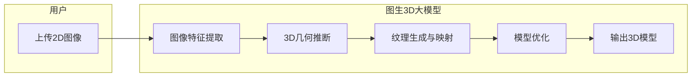

### 3D世界的召唤：图生3D大模型的崛起

传统的3D建模流程漫长且复杂，涉及概念设计、建模、纹理贴图、骨骼绑定、动画制作等多个环节，对专业技能要求高，成本也居高不下。 随着人工智能技术的飞速发展，特别是深度学习在图像识别和生成领域的突破，图生3D（Image-to-3D）技术应运而生，为3D内容创作带来了革命性的变化。 简单来说，图生3D就是利用AI模型，将输入的二维图像直接转换成三维模型。

### 图生3D大模型是什么？

图生3D大模型，顾名思义，是指参数量巨大、基于深度学习的，能够从单张或多张二维图像中推断和生成三维模型的AI系统。这些模型通过学习海量的2D图像与3D模型之间的关联，理解物体的形状、结构、纹理甚至光照信息，从而实现从“平面”到“立体”的跨越。

其基本工作流程可以概括为：

1.  **输入图像分析**：模型首先分析输入的2D图像，提取关键特征，如轮廓、纹理、光影等。
2.  **3D几何推断**：基于学习到的知识，模型推断出物体的三维几何形状。这可能涉及到点云生成、网格构建或神经辐射场（NeRF）等技术。
3.  **纹理生成与映射**：模型为生成的三维几何体赋予表面纹理，使其看起来更加真实。
4.  **模型优化与输出**：对生成的3D模型进行优化，例如平滑表面、修复缺陷，并最终输出为常见的3D模型格式（如OBJ, FBX, GLB等）。

### 主流图生3D大模型横向对比

近年来，国内外涌现出众多优秀的图生3D大模型项目，商业公司和开源社区都在积极贡献。以下是一些备受关注的模型和技术方向：

| 模型/技术代表        | 主要特点                                                                 | 优势                                                              | 不足/挑战                                                         | 代表性厂商/项目                                  |
| -------------------- | ------------------------------------------------------------------------ | ----------------------------------------------------------------- | ----------------------------------------------------------------- | ----------------------------------------------- |
| **TripoSR**          | 基于大规模重建模型（LRM）思想，快速由单图生成带纹理3D网格模型，无需GPU也可运行。 | 生成速度极快（约0.5秒），对硬件要求低，开源。                      | 对复杂细节和纹理的还原度有待提升，可能缺乏3D一致性。                 | Stability AI, VAST                       |
| **Hunyuan3D (腾讯混元)** | 支持文生3D和图生3D，采用两阶段生成方法，可生成高质量3D资产，并提供多种编辑和创作功能。 | 功能丰富，支持多种输入和输出，模型效果较好，已开源。             | 对于特定复杂场景的细节处理仍有进步空间。                               | 腾讯                                     |
| **InstantMesh**      | 快速将平面照片转换为高质量的立体3D模型，号称效果超越同类工具。                 | 生成速度快（约10秒内），模型质量较高。                               | 更多细节和对比数据有待公开。                                         | 腾讯                                        |
| **Meshy AI**         | 提供图生3D、文生3D、纹理生成、动画等多种功能。                         | 功能全面，操作便捷，支持PBR材质。                              | 部分复杂模型的生成质量和稳定性有待提高。                            | Meshy AI                                   |
| **Luma AI**          | 在文生3D和图生3D方面均有涉足，其模型在特定风格（如卡通）上表现较好。           | 在特定风格生成上表现突出。                                          | 图生3D方面相较其文生3D能力有待加强。                             | Luma AI                                         |
| **Trellis**          | 开源项目，支持单图或三视图生成高质量3D模型。                                 | 开源免费，在某些细节还原上有优势。                                    | 人物生成方面仍有不足。                                          | 微软、清华大学等联合发布                        |
| **基于NeRF的技术**   | （如DreamFusion, Magic3D）利用神经辐射场从多视角2D图像重建3D场景。 | 能够生成具有较好几何一致性和真实感的3D场景。                         | 训练和渲染时间可能较长，对高质量多视角数据依赖较高，高分辨率纹理生成仍有挑战。 | Google (DreamFusion), NVIDIA (Magic3D) |
| **其他商业/开源方案** | 包括Kaedim, CSM, Shap-E, Object Drawer等，各有侧重和特色。 | 针对特定应用场景优化，提供不同程度的易用性和功能。                 | 生成质量、速度、成本、易用性等方面各有差异，部分仍处于早期阶段。        | Kaedim, Common Sense Machines, OpenAI, 阿里巴巴等 |

### 图生3D大模型的挑战与展望

尽管图生3D技术取得了显著进展，但仍面临一些挑战：

*   **数据稀缺性**：高质量、大规模、多样化的3D数据集仍然相对匮乏，这限制了模型的学习能力和泛化性。
*   **细节与真实感**：对于复杂物体的精细结构、细致纹理以及真实物理属性（如材质、光照反射）的还原仍有难度。
*   **3D一致性**：从单张或少量图像生成3D模型时，保证视图间的一致性和模型的完整性是一个挑战。
*   **可控性与编辑性**：目前大部分模型生成的结果难以进行精细的后期编辑和调整。
*   **计算资源**：训练和运行大型3D模型通常需要大量的计算资源。

展望未来，随着算法的不断优化、更大规模高质量数据集的构建以及计算能力的提升，图生3D大模型将在以下方面展现巨大潜力：

*   **游戏与影视**：快速生成游戏资产、场景和角色，大幅缩短制作周期，降低成本。
*   **元宇宙与虚拟现实 (VR/AR)**：为构建逼真的虚拟世界提供海量3D内容。
*   **工业设计与制造**：快速将概念草图或产品图片转化为3D模型，加速产品迭代。
*   **电商与营销**：生成商品3D模型，提供更丰富的交互式购物体验。
*   **文化遗产保护**：对文物进行3D重建和数字化存档。
*   **个性化定制**：根据用户照片快速生成个性化的3D形象或物品。

图生3D技术正以前所未有的速度发展，虽然离完美还有距离，但其赋能内容创作的潜力已然显现。 我们可以期待，在不久的将来，AI将使3D内容的创作更加大众化、智能化。

### 个人看法

对于鄙人来说,大量的图/文生3D模型产品将利于独立游戏开发者的开发,以前制作一个游戏资产费时费力 现在只需要拍一张图片就能生成对应的3d建模无疑减轻了大量的负担,同时搭配AI编程,AI音乐,AI绘图等一系列工具,制作独立游戏将不再是梦!

图为使用腾讯混元2.5模型生成的luguanluguanlulushijiandaole与tungtungtungsahur模型

---
### 总结
惊喜再次出现，还是没有总结！图生3D的世界广阔无垠，值得持续探索。
---
#### 相关项目与参考（部分）

*   [TripoSR by Stability AI & VAST](https://github.com/VAST-AI-Research/TripoSR)
*   [Hunyuan3D by Tencent](https://3d.hunyuan.tencent.com/)
*   [Meshy AI](https://www.meshy.ai/)
*   [Luma AI](https://lumalabs.ai/)
*   [Trellis GitHub](https://github.com/microsoft/TRELLIS)
*   [Awesome 3D Generation Papers (学术论文追踪)](https://github.com/justimyhxu/awesome-3D-generation)
